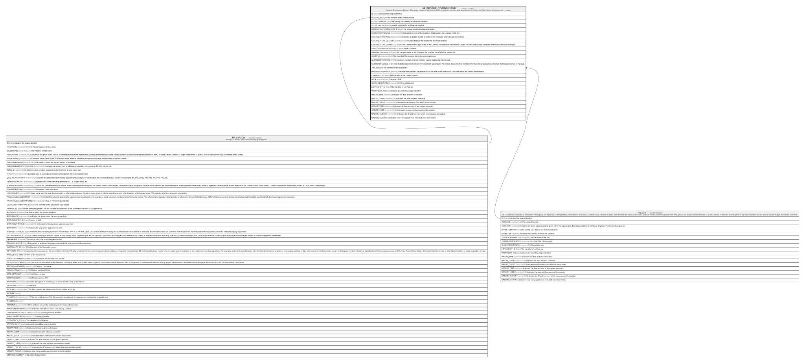

# HR_PREVEMPLOYMENTHISTORY

## Description

Previous Employment History - This entity maintains the history of all the previous personal work experiences, including Job Title, Period, Employer and Location.  

## Columns

| Name | Type | Default | Nullable | Parents | Comment |
| ---- | ---- | ------- | -------- | ------- | ------- |
| ID | bigint |  | false |  | Indicates the unique identifier |
| PERSON_ID | bigint |  | false | [HR_PERSON](HR_PERSON.md) | The Identifier of the Person record. |
| EFFECTIVEFROM | date |  | false |  | The validity start date for an historical situation. |
| EFFECTIVETO | date |  | true |  | The validity end date for an historical situation. |
| REASONFORTERMINATION_ID | bigint |  | true |  | The reason why the Employment ended.  |
| EMPLOYERORGNAME | nvarchar(100) |  | false |  | Indicates the name of the Employer Organisation, for example ACME Inc. |
| ORGANIZATIONNAME | nvarchar(100) |  | true |  | Indicates a specific branch or sector of the Company where the person worked. |
| ORGANIZATIONLOCATION | nvarchar(100) |  | true |  | This field displays the location for  the main contract. |
| ORGANIZATIONCOUNTRY_ID | bigint |  | true |  | The Country of the Legal Entity of the Contract. In case of an International Group, it’s the Country of the Company where the Contract is managed. |
| ORGCOUNTRYSUBDIVISION_ID | bigint |  | true |  | State / Province |
| INDUSTRYSECTOR_ID | bigint |  | true |  | The Industry sector of the Company, for example Manufacturing, Energy etc. |
| JOBTITLE | nvarchar(2000) |  | false |  | The main Job Title covered during the work experience. |
| NUMBEROFREPORTS | int |  | true |  | The maximum number of Direct / Indirect reports had during the contract. |
| NUMBEROFLEVELS | int |  | true |  | In order to better describe the level of responsibility assumed by the person, this is the max number of levels in the organisational structure that this person had to manage. |
| JOB_ID | bigint |  | true | [HR_JOB](HR_JOB.md) | The Identifier of the Job record. |
| BASEREMUNERATION | decimal |  | true |  | The base remuneration the person had at the time of the contract or, if it is still active, the current remuneration. |
| CURRENCY_ID | bigint |  | true |  | The Identifier of the Currency record. |
| NOTE | nvarchar(MAX) |  | true |  | Comment field. |
| SHAREDIDENTIFIER | nvarchar(255) |  | true |  | Shared Identifier |
| LISTAGENCY_ID | bigint |  | true |  | The Identifier of List Agency. |
| WORKFLOW_ID | bigint |  | true |  | Indicates the workflow unique identifier |
| INSERT_TIME | datetime2 | (sysutcdatetime()) | false |  | Indicates the date and time of creation |
| INSERT_USER | nvarchar(100) | (N'MAIN') | false |  | Indicates the user who has created it |
| INSERT_CLIENT | nvarchar(50) | (N'localhost') | false |  | Indicates the IP address from which it was created |
| UPDATE_TIME | datetime2 | (sysutcdatetime()) | false |  | Indicates the date and time of last update operation |
| UPDATE_USER | nvarchar(100) | (N'MAIN') | false |  | Indicates the user who has executed last update |
| UPDATE_CLIENT | nvarchar(50) | (N'localhost') | false |  | Indicates the IP address from which was executed last update |
| UPDATE_COUNT | int | ((0)) | false |  | Indicates how many update was executed since its creation |

## Constraints

| Name | Type | Definition |
| ---- | ---- | ---------- |
| PK_HR_PREVEMPLOYMENTHISTORY | PRIMARY KEY | CLUSTERED, unique, part of a PRIMARY KEY constraint, [ ID ] |
| FK_PERSON_PREVEMPHIST | FOREIGN KEY | FOREIGN KEY(PERSON_ID) REFERENCES HR_PERSON(ID) ON UPDATE NO_ACTION ON DELETE CASCADE |
| FK_PREVEMPHIST_JOB | FOREIGN KEY | FOREIGN KEY(JOB_ID) REFERENCES HR_JOB(ID) ON UPDATE NO_ACTION ON DELETE NO_ACTION |

## Indexes

| Name | Definition |
| ---- | ---------- |
| PK_HR_PREVEMPLOYMENTHISTORY | CLUSTERED, unique, part of a PRIMARY KEY constraint, [ ID ] |

## Relations

---

> Generated by [tbls](https://github.com/k1LoW/tbls)
