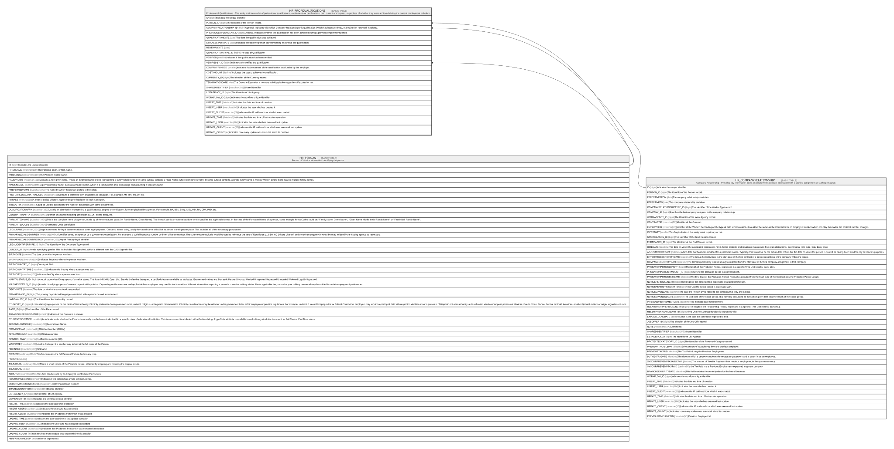

# HR_PROFQUALIFICATIONS

## Description

Professional Qualifications - This entity maintains a list of professional qualifications, entitlements or certifications, both current and expired, regardless of whether they were achieved during the current employment or before.  

## Columns

| Name | Type | Default | Nullable | Parents | Comment |
| ---- | ---- | ------- | -------- | ------- | ------- |
| ID | bigint |  | false |  | Indicates the unique identifier |
| PERSON_ID | bigint |  | false | [HR_PERSON](HR_PERSON.md) | The Identifier of the Person record. |
| COMPANYRELATIONSHIP_ID | bigint |  | true | [HR_COMPANYRELATIONSHIP](HR_COMPANYRELATIONSHIP.md) | Optional. Indicates with which Company Relationship this qualification (which has been achieved, maintained or renewed) is related. |
| PREVIOUSEMPLOYMENT_ID | bigint |  | true |  | Optional. Indicates whether this qualification has been achieved during a previous employment period. |
| QUALIFICATIONDATE | date |  | true |  | The date the qualification was achieved. |
| STUDIESSTARTDATE | date |  | true |  | Indicates the date the person started working to achieve the qualification. |
| RENEWALDATE | date |  | true |  |  |
| QUALIFICATIONTYPE_ID | bigint |  | false |  | The type of Qualification |
| VERIFIED | smallint |  | true |  | Indicates if the qualification has been verified. |
| VERIFIEDBY_ID | bigint |  | true | [HR_PERSON](HR_PERSON.md) | Indicates who verified the qualification. |
| COMPANYFUNDED | smallint |  | true |  | Indicates if achievement of the qualification was funded by the employer. |
| COSTAMOUNT | decimal |  | true |  | Indicates the cost to achieve the qualification. |
| CURRENCY_ID | bigint |  | true |  | The Identifier of the Currency record. |
| TERMINATIONDATE | date |  | true |  | The Date the Expiration is no more valid/applicable regardless if expired or not. |
| SHAREDIDENTIFIER | nvarchar(255) |  | true |  | Shared Identifier |
| LISTAGENCY_ID | bigint |  | true |  | The Identifier of List Agency. |
| WORKFLOW_ID | bigint |  | true |  | Indicates the workflow unique identifier |
| INSERT_TIME | datetime2 | (sysutcdatetime()) | false |  | Indicates the date and time of creation |
| INSERT_USER | nvarchar(100) | (N'MAIN') | false |  | Indicates the user who has created it |
| INSERT_CLIENT | nvarchar(50) | (N'localhost') | false |  | Indicates the IP address from which it was created |
| UPDATE_TIME | datetime2 | (sysutcdatetime()) | false |  | Indicates the date and time of last update operation |
| UPDATE_USER | nvarchar(100) | (N'MAIN') | false |  | Indicates the user who has executed last update |
| UPDATE_CLIENT | nvarchar(50) | (N'localhost') | false |  | Indicates the IP address from which was executed last update |
| UPDATE_COUNT | int | ((0)) | false |  | Indicates how many update was executed since its creation |

## Constraints

| Name | Type | Definition |
| ---- | ---- | ---------- |
| PK_HR_PROFQUALIFICATIONS | PRIMARY KEY | CLUSTERED, unique, part of a PRIMARY KEY constraint, [ ID ] |
| FK_COMPANYREL_PROFQUAL | FOREIGN KEY | FOREIGN KEY(COMPANYRELATIONSHIP_ID) REFERENCES HR_COMPANYRELATIONSHIP(ID) ON UPDATE NO_ACTION ON DELETE NO_ACTION |
| FK_PERSON_PROFQUAL | FOREIGN KEY | FOREIGN KEY(PERSON_ID) REFERENCES HR_PERSON(ID) ON UPDATE NO_ACTION ON DELETE CASCADE |
| FK_PROFQUAL_PERSON | FOREIGN KEY | FOREIGN KEY(VERIFIEDBY_ID) REFERENCES HR_PERSON(ID) ON UPDATE NO_ACTION ON DELETE NO_ACTION |

## Indexes

| Name | Definition |
| ---- | ---------- |
| PK_HR_PROFQUALIFICATIONS | CLUSTERED, unique, part of a PRIMARY KEY constraint, [ ID ] |

## Relations

---

> Generated by [tbls](https://github.com/k1LoW/tbls)
