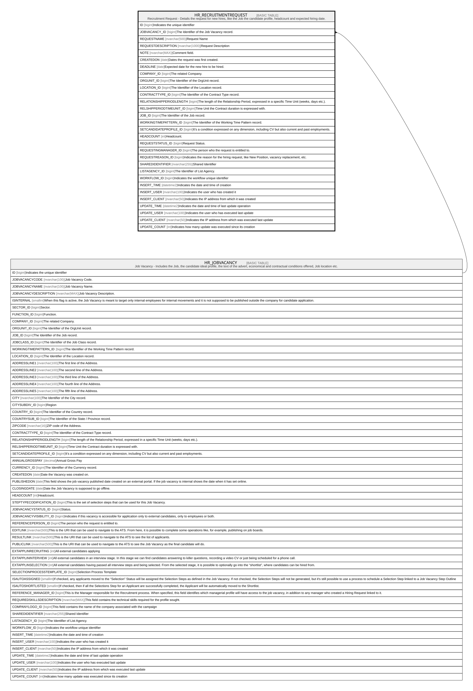

# HR_RECRUITMENTREQUEST

## Description

Recruitment Request - Details the request for new hires, like the Job the candidate profile, headcount and expected hiring date.  

## Columns

| Name | Type | Default | Nullable | Parents | Comment |
| ---- | ---- | ------- | -------- | ------- | ------- |
| ID | bigint |  | false |  | Indicates the unique identifier |
| JOBVACANCY_ID | bigint |  | true | [HR_JOBVACANCY](HR_JOBVACANCY.md) | The Identifier of the Job Vacancy record. |
| REQUESTNAME | nvarchar(500) |  | true |  | Request Name |
| REQUESTDESCRIPTION | nvarchar(1000) |  | true |  | Request Description |
| NOTE | nvarchar(MAX) |  | true |  | Comment field. |
| CREATEDON | date |  | true |  | Dates the request was first created. |
| DEADLINE | date |  | true |  | Expected date for the new hire to be hired. |
| COMPANY_ID | bigint |  | true |  | The related Company. |
| ORGUNIT_ID | bigint |  | true |  | The Identifier of the OrgUnit record. |
| LOCATION_ID | bigint |  | true |  | The Identifier of the Location record. |
| CONTRACTTYPE_ID | bigint |  | true |  | The Identifier of the Contract Type record. |
| RELATIONSHIPPERIODLENGTH | bigint |  | true |  | The length of the Relationship Period, expressed in a specific Time Unit (weeks, days etc.). |
| RELSHIPPERIODTIMEUNIT_ID | bigint |  | true |  | Time Unit the Contract duration is expressed with. |
| JOB_ID | bigint |  | true |  | The Identifier of the Job record. |
| WORKINGTIMEPATTERN_ID | bigint |  | true |  | The Identifier of the Working Time Pattern record. |
| SETCANDIDATEPROFILE_ID | bigint |  | true |  | It’s a condition expressed on any dimension, including CV but also current and past employments. |
| HEADCOUNT | int |  | true |  | Headcount. |
| REQUESTSTATUS_ID | bigint |  | true |  | Request Status. |
| REQUESTINGMANAGER_ID | bigint |  | true |  | The person who the request is entitled to. |
| REQUESTREASON_ID | bigint |  | true |  | Indicates the reason for the hiring request, like New Position, vacancy replacement, etc. |
| SHAREDIDENTIFIER | nvarchar(255) |  | true |  | Shared Identifier |
| LISTAGENCY_ID | bigint |  | true |  | The Identifier of List Agency. |
| WORKFLOW_ID | bigint |  | true |  | Indicates the workflow unique identifier |
| INSERT_TIME | datetime2 |  | false |  | Indicates the date and time of creation |
| INSERT_USER | nvarchar(100) |  | false |  | Indicates the user who has created it |
| INSERT_CLIENT | nvarchar(50) |  | false |  | Indicates the IP address from which it was created |
| UPDATE_TIME | datetime2 |  | false |  | Indicates the date and time of last update operation |
| UPDATE_USER | nvarchar(100) |  | false |  | Indicates the user who has executed last update |
| UPDATE_CLIENT | nvarchar(50) |  | false |  | Indicates the IP address from which was executed last update |
| UPDATE_COUNT | int |  | false |  | Indicates how many update was executed since its creation |

## Constraints

| Name | Type | Definition |
| ---- | ---- | ---------- |
| PK_RECRUITMENTREQUEST | PRIMARY KEY | CLUSTERED, unique, part of a PRIMARY KEY constraint, [ ID ] |
| FK_RECREQUEST_JOBVACANCY | FOREIGN KEY | FOREIGN KEY(JOBVACANCY_ID) REFERENCES HR_JOBVACANCY(ID) ON UPDATE NO_ACTION ON DELETE NO_ACTION |

## Indexes

| Name | Definition |
| ---- | ---------- |
| PK_RECRUITMENTREQUEST | CLUSTERED, unique, part of a PRIMARY KEY constraint, [ ID ] |

## Relations

---

> Generated by [tbls](https://github.com/k1LoW/tbls)
