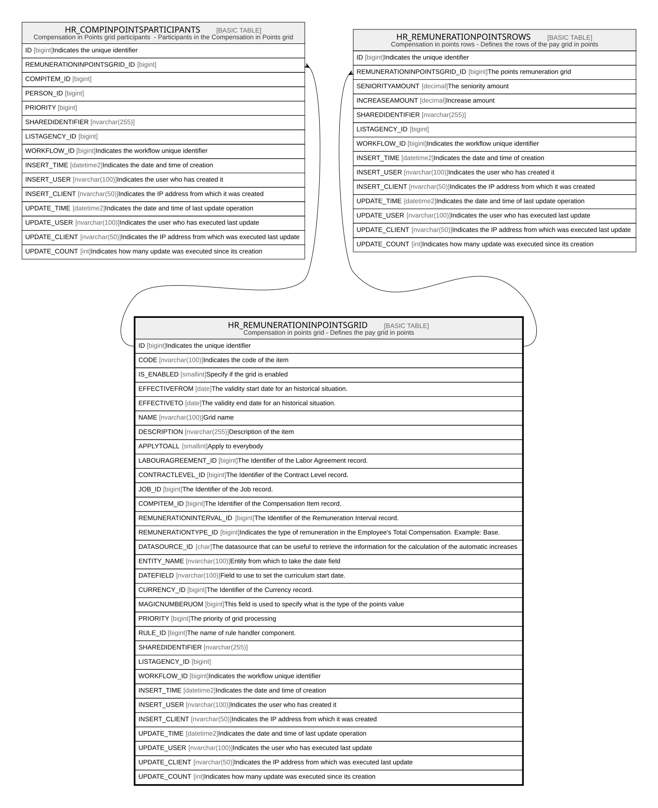

# HR_REMUNERATIONINPOINTSGRID

## Description

Compensation in points grid - Defines the pay grid in points  

## Columns

| Name | Type | Default | Nullable | Children | Comment |
| ---- | ---- | ------- | -------- | -------- | ------- |
| ID | bigint |  | false | [HR_COMPINPOINTSPARTICIPANTS](HR_COMPINPOINTSPARTICIPANTS.md) [HR_REMUNERATIONPOINTSROWS](HR_REMUNERATIONPOINTSROWS.md) | Indicates the unique identifier |
| CODE | nvarchar(100) |  | false |  | Indicates the code of the item |
| IS_ENABLED | smallint |  | true |  | Specify if the grid is enabled |
| EFFECTIVEFROM | date |  | false |  | The validity start date for an historical situation. |
| EFFECTIVETO | date |  | false |  | The validity end date for an historical situation. |
| NAME | nvarchar(100) |  | false |  | Grid name |
| DESCRIPTION | nvarchar(255) |  | true |  | Description of the item |
| APPLYTOALL | smallint |  | true |  | Apply to everybody |
| LABOURAGREEMENT_ID | bigint |  | true |  | The Identifier of the Labor Agreement record. |
| CONTRACTLEVEL_ID | bigint |  | true |  | The Identifier of the Contract Level record. |
| JOB_ID | bigint |  | true |  | The Identifier of the Job record. |
| COMPITEM_ID | bigint |  | true |  | The Identifier of the Compensation Item record. |
| REMUNERATIONINTERVAL_ID | bigint |  | true |  | The Identifier of the Remuneration Interval record. |
| REMUNERATIONTYPE_ID | bigint |  | true |  | Indicates the type of remuneration in the Employee's Total Compensation. Example: Base. |
| DATASOURCE_ID | char |  | true |  | The datasource that can be useful to retrieve the information for the calculation of the automatic increases |
| ENTITY_NAME | nvarchar(100) |  | true |  | Entity from which to take the date field |
| DATEFIELD | nvarchar(100) |  | true |  | Field to use to set the curriculum start date. |
| CURRENCY_ID | bigint |  | true |  | The Identifier of the Currency record. |
| MAGICNUMBERUOM | bigint |  | true |  | This field is used to specify what is the type of the points value |
| PRIORITY | bigint |  | true |  | The priority of grid processing |
| RULE_ID | bigint |  | true |  | The name of rule handler component. |
| SHAREDIDENTIFIER | nvarchar(255) |  | true |  |  |
| LISTAGENCY_ID | bigint |  | true |  |  |
| WORKFLOW_ID | bigint |  | true |  | Indicates the workflow unique identifier |
| INSERT_TIME | datetime2 | (sysutcdatetime()) | false |  | Indicates the date and time of creation |
| INSERT_USER | nvarchar(100) | (N'MAIN') | false |  | Indicates the user who has created it |
| INSERT_CLIENT | nvarchar(50) | (N'localhost') | false |  | Indicates the IP address from which it was created |
| UPDATE_TIME | datetime2 | (sysutcdatetime()) | false |  | Indicates the date and time of last update operation |
| UPDATE_USER | nvarchar(100) | (N'MAIN') | false |  | Indicates the user who has executed last update |
| UPDATE_CLIENT | nvarchar(50) | (N'localhost') | false |  | Indicates the IP address from which was executed last update |
| UPDATE_COUNT | int | ((0)) | false |  | Indicates how many update was executed since its creation |

## Constraints

| Name | Type | Definition |
| ---- | ---- | ---------- |
| PK_REMUNERATIONINPOINTGRID | PRIMARY KEY | CLUSTERED, unique, part of a PRIMARY KEY constraint, [ ID ] |

## Indexes

| Name | Definition |
| ---- | ---------- |
| PK_REMUNERATIONINPOINTGRID | CLUSTERED, unique, part of a PRIMARY KEY constraint, [ ID ] |

## Relations

---

> Generated by [tbls](https://github.com/k1LoW/tbls)
