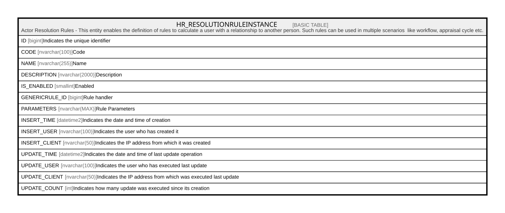

# HR_RESOLUTIONRULEINSTANCE

## Description

Actor Resolution Rules - This entity enables the definition of rules to calculate a user with a relationship to another person. Such rules can be used in multiple scenarios  like workflow, appraisal cycle etc.  

## Columns

| Name | Type | Default | Nullable | Comment |
| ---- | ---- | ------- | -------- | ------- |
| ID | bigint |  | false | Indicates the unique identifier |
| CODE | nvarchar(100) |  | false | Code |
| NAME | nvarchar(255) |  | true | Name |
| DESCRIPTION | nvarchar(2000) |  | true | Description |
| IS_ENABLED | smallint |  | false | Enabled |
| GENERICRULE_ID | bigint |  | false | Rule handler |
| PARAMETERS | nvarchar(MAX) |  | true | Rule Parameters |
| INSERT_TIME | datetime2 |  | false | Indicates the date and time of creation |
| INSERT_USER | nvarchar(100) |  | false | Indicates the user who has created it |
| INSERT_CLIENT | nvarchar(50) |  | false | Indicates the IP address from which it was created |
| UPDATE_TIME | datetime2 |  | false | Indicates the date and time of last update operation |
| UPDATE_USER | nvarchar(100) |  | false | Indicates the user who has executed last update |
| UPDATE_CLIENT | nvarchar(50) |  | false | Indicates the IP address from which was executed last update |
| UPDATE_COUNT | int |  | false | Indicates how many update was executed since its creation |

## Constraints

| Name | Type | Definition |
| ---- | ---- | ---------- |
| PK_HR_GENERALRULES | PRIMARY KEY | CLUSTERED, unique, part of a PRIMARY KEY constraint, [ ID ] |

## Indexes

| Name | Definition |
| ---- | ---------- |
| PK_HR_GENERALRULES | CLUSTERED, unique, part of a PRIMARY KEY constraint, [ ID ] |

## Relations

---

> Generated by [tbls](https://github.com/k1LoW/tbls)
