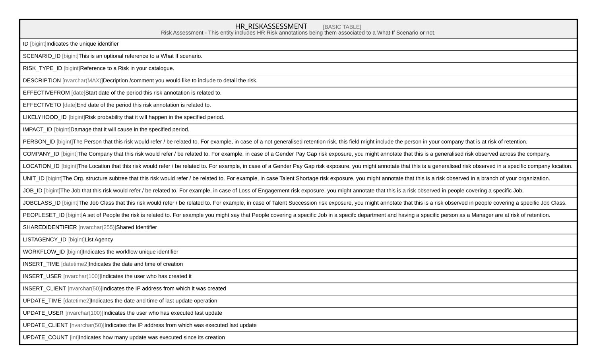

# HR_RISKASSESSMENT

## Description

Risk Assessment - This entity includes HR Risk annotations being them associated to a What If Scenario or not.  

## Columns

| Name | Type | Default | Nullable | Comment |
| ---- | ---- | ------- | -------- | ------- |
| ID | bigint |  | false | Indicates the unique identifier |
| SCENARIO_ID | bigint |  | true | This is an optional reference to a What If scenario. |
| RISK_TYPE_ID | bigint |  | true | Reference to a Risk in your catalogue. |
| DESCRIPTION | nvarchar(MAX) |  | true | Decription /comment you would like to include to detail the risk. |
| EFFECTIVEFROM | date |  | true | Start date of the period this risk annotation is related to. |
| EFFECTIVETO | date |  | true | End date of the period this risk annotation is related to. |
| LIKELYHOOD_ID | bigint |  | true | Risk probability that it will happen in the specified period. |
| IMPACT_ID | bigint |  | true | Damage that it will cause in the specified period. |
| PERSON_ID | bigint |  | true | The Person that this risk would refer / be related to. For example, in case of a not generalised retention risk, this field might include the person in your company that is at risk of retention. |
| COMPANY_ID | bigint |  | true | The Company that this risk would refer / be related to. For example, in case of a Gender Pay Gap risk exposure, you might annotate that this is a generalised risk observed across the company. |
| LOCATION_ID | bigint |  | true | The Location that this risk would refer / be related to. For example, in case of a Gender Pay Gap risk exposure, you might annotate that this is a generalised risk observed in a specific company location. |
| UNIT_ID | bigint |  | true | The Org. structure subtree that this risk would refer / be related to. For example, in case Talent Shortage risk exposure, you might annotate that this is a risk observed in a branch of your organization. |
| JOB_ID | bigint |  | true | The Job that this risk would refer / be related to. For example, in case of Loss of Engagement risk exposure, you might annotate that this is a risk observed in people covering a specific Job. |
| JOBCLASS_ID | bigint |  | true | The Job Class that this risk would refer / be related to. For example, in case of Talent Succession risk exposure, you might annotate that this is a risk observed in people covering a specific Job Class. |
| PEOPLESET_ID | bigint |  | true | A set of People the risk is related to. For example you might say that People covering a specific Job in a specifc department and having a specific person as a Manager are at risk of retention. |
| SHAREDIDENTIFIER | nvarchar(255) |  | true | Shared Identifier |
| LISTAGENCY_ID | bigint |  | true | List Agency |
| WORKFLOW_ID | bigint |  | true | Indicates the workflow unique identifier |
| INSERT_TIME | datetime2 |  | false | Indicates the date and time of creation |
| INSERT_USER | nvarchar(100) |  | false | Indicates the user who has created it |
| INSERT_CLIENT | nvarchar(50) |  | false | Indicates the IP address from which it was created |
| UPDATE_TIME | datetime2 |  | false | Indicates the date and time of last update operation |
| UPDATE_USER | nvarchar(100) |  | false | Indicates the user who has executed last update |
| UPDATE_CLIENT | nvarchar(50) |  | false | Indicates the IP address from which was executed last update |
| UPDATE_COUNT | int |  | false | Indicates how many update was executed since its creation |

## Constraints

| Name | Type | Definition |
| ---- | ---- | ---------- |
| PK_HR_RISKASSESSMENT | PRIMARY KEY | CLUSTERED, unique, part of a PRIMARY KEY constraint, [ ID ] |
| UQ__HR_RISKA__DD5A10B9EA8F9673 | UNIQUE | NONCLUSTERED, unique, part of a UNIQUE constraint, [ EFFECTIVEFROM, SCENARIO_ID, RISK_TYPE_ID, PERSON_ID, COMPANY_ID, LOCATION_ID, UNIT_ID, JOB_ID, JOBCLASS_ID, PEOPLESET_ID ] |

## Indexes

| Name | Definition |
| ---- | ---------- |
| PK_HR_RISKASSESSMENT | CLUSTERED, unique, part of a PRIMARY KEY constraint, [ ID ] |
| UQ__HR_RISKA__DD5A10B9EA8F9673 | NONCLUSTERED, unique, part of a UNIQUE constraint, [ EFFECTIVEFROM, SCENARIO_ID, RISK_TYPE_ID, PERSON_ID, COMPANY_ID, LOCATION_ID, UNIT_ID, JOB_ID, JOBCLASS_ID, PEOPLESET_ID ] |

## Relations

---

> Generated by [tbls](https://github.com/k1LoW/tbls)
