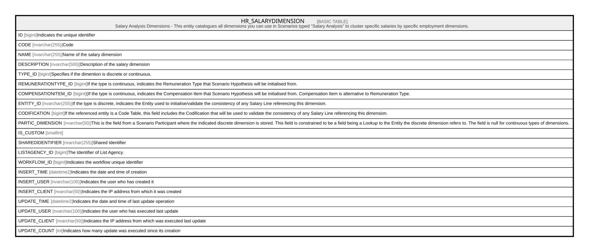

# HR_SALARYDIMENSION

## Description

Salary Analysis Dimensions - This entity catalogues all dimensions you can use in Scenarios typed “Salary Analysis” to cluster specific salaries by specific employment dimensions.  

## Columns

| Name | Type | Default | Nullable | Comment |
| ---- | ---- | ------- | -------- | ------- |
| ID | bigint |  | false | Indicates the unique identifier |
| CODE | nvarchar(255) |  | true | Code |
| NAME | nvarchar(255) |  | true | Name of the salary dimension |
| DESCRIPTION | nvarchar(500) |  | true | Description of the salary dimension |
| TYPE_ID | bigint |  | true | Specifies if the dimention is discrete or continuous. |
| REMUNERATIONTYPE_ID | bigint |  | true | If the type is continuous, indicates the Remuneration Type that Scenario Hypothesis will be initialised from. |
| COMPENSATIONITEM_ID | bigint |  | true | (If the type is continuous, indicates the Compensation Item that Scenario Hypothesis will be initialised from. Compensation Item is alternative to Remuneration Type. |
| ENTITY_ID | nvarchar(255) |  | true | If the type is discrete, indicates the Entity used to initialise/validate the consistency of any Salary Line referencing this dimension. |
| CODIFICATION | bigint |  | true | If the referenced entity is a Code Table, this field includes the Codification that will be used to validate the consistency of any Salary Line referencing this dimension. |
| PARTIC_DIMENSION | nvarchar(50) |  | true | This is the field from a Scenario Participant where the indicated discrete dimension is stored. This field is constrained to be a field being a Lookup to the Entity the discrete dimension refers to. The field is null for continuous types of dimensions. |
| IS_CUSTOM | smallint |  | true |  |
| SHAREDIDENTIFIER | nvarchar(255) |  | true | Shared Identifier |
| LISTAGENCY_ID | bigint |  | true | The Identifier of List Agency. |
| WORKFLOW_ID | bigint |  | true | Indicates the workflow unique identifier |
| INSERT_TIME | datetime2 | (sysutcdatetime()) | false | Indicates the date and time of creation |
| INSERT_USER | nvarchar(100) | (N'MAIN') | false | Indicates the user who has created it |
| INSERT_CLIENT | nvarchar(50) | (N'localhost') | false | Indicates the IP address from which it was created |
| UPDATE_TIME | datetime2 | (sysutcdatetime()) | false | Indicates the date and time of last update operation |
| UPDATE_USER | nvarchar(100) | (N'MAIN') | false | Indicates the user who has executed last update |
| UPDATE_CLIENT | nvarchar(50) | (N'localhost') | false | Indicates the IP address from which was executed last update |
| UPDATE_COUNT | int | ((0)) | false | Indicates how many update was executed since its creation |

## Constraints

| Name | Type | Definition |
| ---- | ---- | ---------- |
| PK_HR_SALARYDIMENSION | PRIMARY KEY | CLUSTERED, unique, part of a PRIMARY KEY constraint, [ ID ] |
| UQ_CODE | UNIQUE | NONCLUSTERED, unique, part of a UNIQUE constraint, [ CODE ] |

## Indexes

| Name | Definition |
| ---- | ---------- |
| PK_HR_SALARYDIMENSION | CLUSTERED, unique, part of a PRIMARY KEY constraint, [ ID ] |
| UQ_CODE | NONCLUSTERED, unique, part of a UNIQUE constraint, [ CODE ] |

## Relations

---

> Generated by [tbls](https://github.com/k1LoW/tbls)
