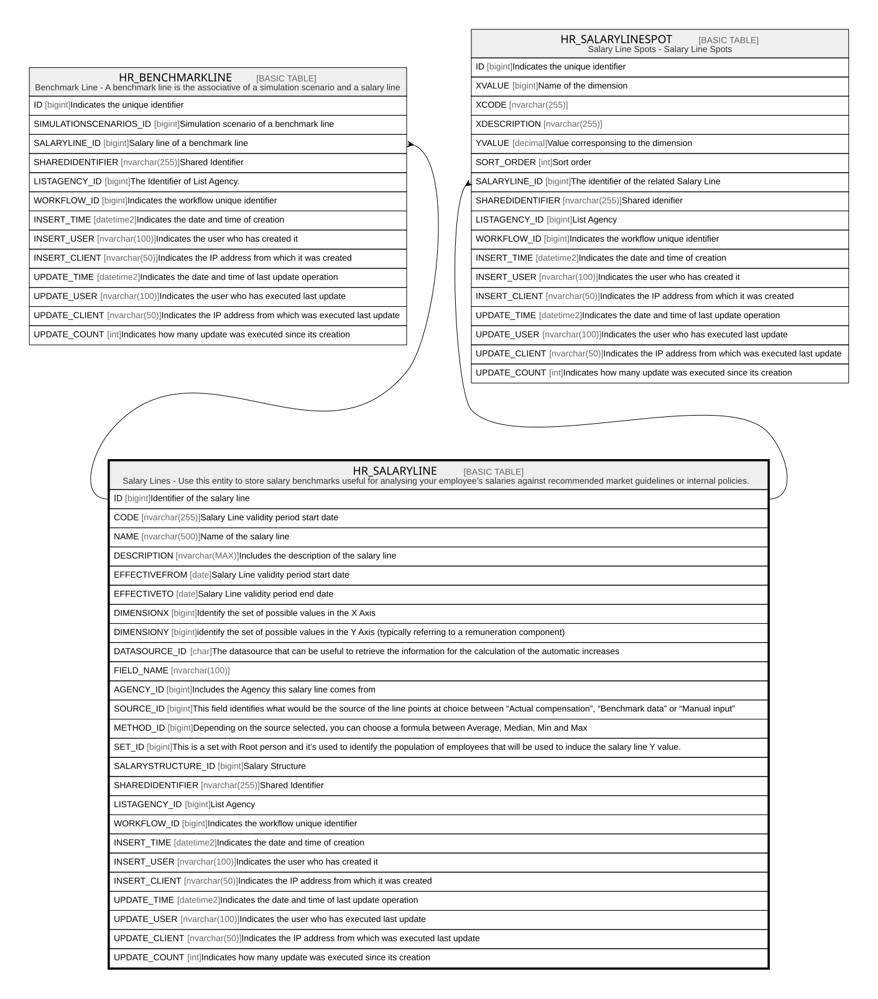

# HR_SALARYLINE

## Description

Salary Lines - Use this entity to store salary benchmarks useful for analysing your employee’s salaries against recommended market guidelines or internal policies.  

## Columns

| Name | Type | Default | Nullable | Children | Comment |
| ---- | ---- | ------- | -------- | -------- | ------- |
| ID | bigint |  | false | [HR_BENCHMARKLINE](HR_BENCHMARKLINE.md) [HR_SALARYLINESPOT](HR_SALARYLINESPOT.md) | Identifier of the salary line |
| CODE | nvarchar(255) |  | false |  | Salary Line validity period start date |
| NAME | nvarchar(500) |  | true |  | Name of the salary line |
| DESCRIPTION | nvarchar(MAX) |  | true |  | Includes the description of the salary line |
| EFFECTIVEFROM | date |  | true |  | Salary Line validity period start date |
| EFFECTIVETO | date |  | true |  | Salary Line validity period end date |
| DIMENSIONX | bigint |  | true |  | Identify the set of possible values in the X Axis |
| DIMENSIONY | bigint |  | true |  | identify the set of possible values in the Y Axis (typically referring to a remuneration component) |
| DATASOURCE_ID | char |  | true |  | The datasource that can be useful to retrieve the information for the calculation of the automatic increases |
| FIELD_NAME | nvarchar(100) |  | true |  |  |
| AGENCY_ID | bigint |  | true |  | Includes the Agency this salary line comes from |
| SOURCE_ID | bigint |  | true |  | This field identifies what would be the source of the line points at choice between “Actual compensation”, “Benchmark data” or “Manual input” |
| METHOD_ID | bigint |  | true |  | Depending on the source selected, you can choose a formula between Average, Median, Min and Max |
| SET_ID | bigint |  | true |  | This is a set with Root person and it’s used to identify the population of employees that will be used to induce the salary line Y value. |
| SALARYSTRUCTURE_ID | bigint |  | true |  | Salary Structure |
| SHAREDIDENTIFIER | nvarchar(255) |  | true |  | Shared Identifier |
| LISTAGENCY_ID | bigint |  | true |  | List Agency |
| WORKFLOW_ID | bigint |  | true |  | Indicates the workflow unique identifier |
| INSERT_TIME | datetime2 | (sysutcdatetime()) | false |  | Indicates the date and time of creation |
| INSERT_USER | nvarchar(100) | (N'MAIN') | false |  | Indicates the user who has created it |
| INSERT_CLIENT | nvarchar(50) | (N'localhost') | false |  | Indicates the IP address from which it was created |
| UPDATE_TIME | datetime2 | (sysutcdatetime()) | false |  | Indicates the date and time of last update operation |
| UPDATE_USER | nvarchar(100) | (N'MAIN') | false |  | Indicates the user who has executed last update |
| UPDATE_CLIENT | nvarchar(50) | (N'localhost') | false |  | Indicates the IP address from which was executed last update |
| UPDATE_COUNT | int | ((0)) | false |  | Indicates how many update was executed since its creation |

## Constraints

| Name | Type | Definition |
| ---- | ---- | ---------- |
| PK_HR_SALARYLINE | PRIMARY KEY | CLUSTERED, unique, part of a PRIMARY KEY constraint, [ ID ] |
| UQ_SALARYLINE | UNIQUE | NONCLUSTERED, unique, part of a UNIQUE constraint, [ CODE ] |

## Indexes

| Name | Definition |
| ---- | ---------- |
| PK_HR_SALARYLINE | CLUSTERED, unique, part of a PRIMARY KEY constraint, [ ID ] |
| UQ_SALARYLINE | NONCLUSTERED, unique, part of a UNIQUE constraint, [ CODE ] |

## Relations

---

> Generated by [tbls](https://github.com/k1LoW/tbls)
