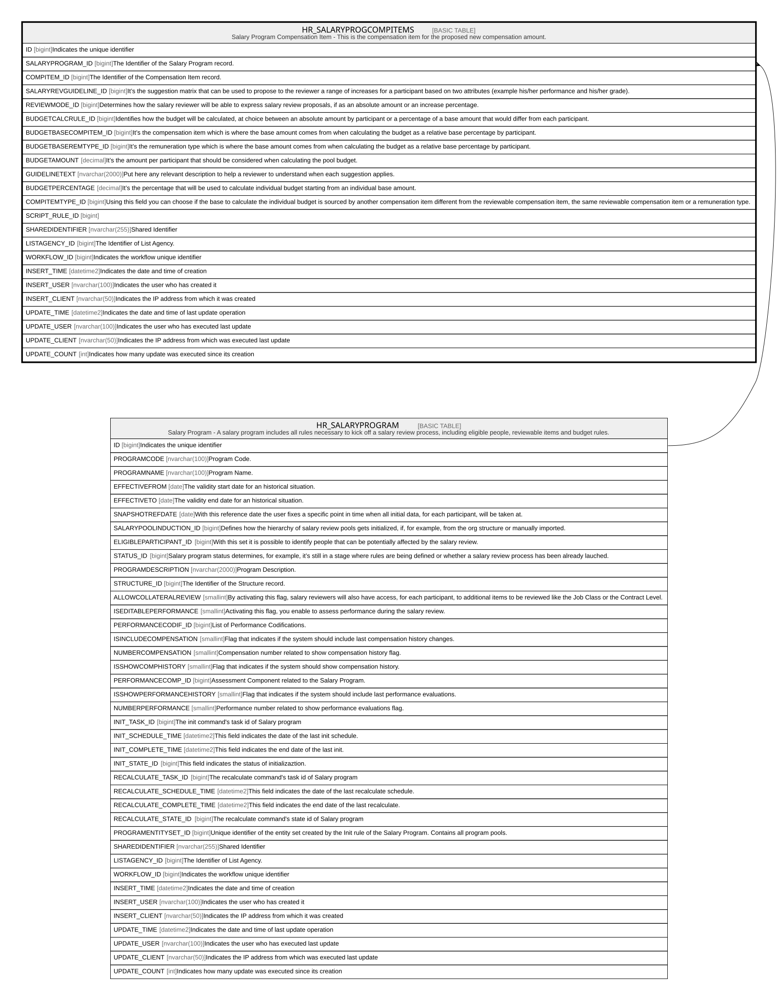

# HR_SALARYPROGCOMPITEMS

## Description

Salary Program Compensation Item - This is the compensation item for the proposed new compensation amount.  

## Columns

| Name | Type | Default | Nullable | Parents | Comment |
| ---- | ---- | ------- | -------- | ------- | ------- |
| ID | bigint |  | false |  | Indicates the unique identifier |
| SALARYPROGRAM_ID | bigint |  | false | [HR_SALARYPROGRAM](HR_SALARYPROGRAM.md) | The Identifier of the Salary Program record. |
| COMPITEM_ID | bigint |  | true |  | The Identifier of the Compensation Item record. |
| SALARYREVGUIDELINE_ID | bigint |  | true |  | It’s the suggestion matrix that can be used to propose to the reviewer a range of increases for a participant based on two attributes (example his/her performance and his/her grade). |
| REVIEWMODE_ID | bigint |  | true |  | Determines how the salary reviewer will be able to express salary review proposals, if as an absolute amount or an increase percentage. |
| BUDGETCALCRULE_ID | bigint |  | true |  | Identifies how the budget will be calculated, at choice between an absolute amount by participant or a percentage of a base amount that would differ from each participant. |
| BUDGETBASECOMPITEM_ID | bigint |  | true |  | It’s the compensation item which is where the base amount comes from when calculating the budget as a relative base percentage by participant. |
| BUDGETBASEREMTYPE_ID | bigint |  | true |  | It’s the remuneration type which is where the base amount comes from when calculating the budget as a relative base percentage by participant. |
| BUDGETAMOUNT | decimal |  | true |  | It’s the amount per participant that should be considered when calculating the pool budget. |
| GUIDELINETEXT | nvarchar(2000) |  | true |  | Put here any relevant description to help a reviewer to understand when each suggestion applies. |
| BUDGETPERCENTAGE | decimal |  | true |  | It’s the percentage that will be used to calculate individual budget starting from an individual base amount. |
| COMPITEMTYPE_ID | bigint |  | true |  | Using this field you can choose if the base to calculate the individual budget is sourced by another compensation item different from the reviewable compensation item, the same reviewable compensation item or a remuneration type. |
| SCRIPT_RULE_ID | bigint |  | true |  |  |
| SHAREDIDENTIFIER | nvarchar(255) |  | true |  | Shared Identifier |
| LISTAGENCY_ID | bigint |  | true |  | The Identifier of List Agency. |
| WORKFLOW_ID | bigint |  | true |  | Indicates the workflow unique identifier |
| INSERT_TIME | datetime2 | (sysutcdatetime()) | false |  | Indicates the date and time of creation |
| INSERT_USER | nvarchar(100) | (N'MAIN') | false |  | Indicates the user who has created it |
| INSERT_CLIENT | nvarchar(50) | (N'localhost') | false |  | Indicates the IP address from which it was created |
| UPDATE_TIME | datetime2 | (sysutcdatetime()) | false |  | Indicates the date and time of last update operation |
| UPDATE_USER | nvarchar(100) | (N'MAIN') | false |  | Indicates the user who has executed last update |
| UPDATE_CLIENT | nvarchar(50) | (N'localhost') | false |  | Indicates the IP address from which was executed last update |
| UPDATE_COUNT | int | ((0)) | false |  | Indicates how many update was executed since its creation |

## Constraints

| Name | Type | Definition |
| ---- | ---- | ---------- |
| PK_SALARYPROGCOMPITEMS | PRIMARY KEY | CLUSTERED, unique, part of a PRIMARY KEY constraint, [ ID ] |
| UQ_SALARYPROGCOMPITEMS | UNIQUE | NONCLUSTERED, unique, part of a UNIQUE constraint, [ SALARYPROGRAM_ID, COMPITEM_ID ] |
| FK_SALPROGCOMPIT_SALARYPROG | FOREIGN KEY | FOREIGN KEY(SALARYPROGRAM_ID) REFERENCES HR_SALARYPROGRAM(ID) ON UPDATE NO_ACTION ON DELETE CASCADE |

## Indexes

| Name | Definition |
| ---- | ---------- |
| PK_SALARYPROGCOMPITEMS | CLUSTERED, unique, part of a PRIMARY KEY constraint, [ ID ] |
| UQ_SALARYPROGCOMPITEMS | NONCLUSTERED, unique, part of a UNIQUE constraint, [ SALARYPROGRAM_ID, COMPITEM_ID ] |

## Relations

---

> Generated by [tbls](https://github.com/k1LoW/tbls)
