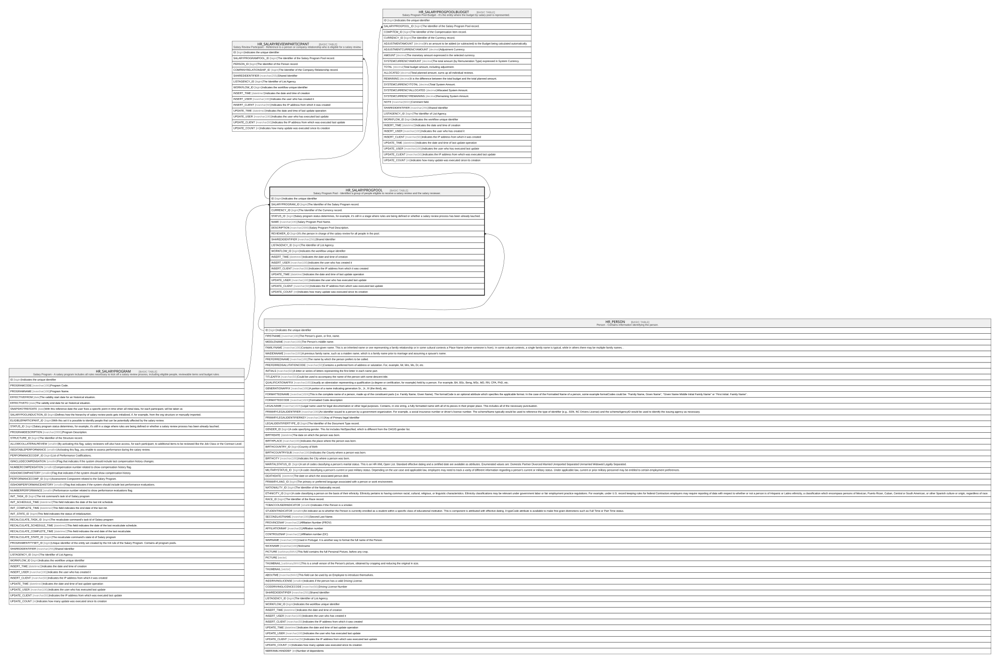

# HR_SALARYPROGPOOL

## Description

Salary Program Pool - Identifies a group of people eligible to receive a salary review and the salary reviewer.  

## Columns

| Name | Type | Default | Nullable | Children | Parents | Comment |
| ---- | ---- | ------- | -------- | -------- | ------- | ------- |
| ID | bigint |  | false | [HR_SALARYREVIEWPARTICIPANT](HR_SALARYREVIEWPARTICIPANT.md) [HR_SALARYPROGPOOLBUDGET](HR_SALARYPROGPOOLBUDGET.md) |  | Indicates the unique identifier |
| SALARYPROGRAM_ID | bigint |  | false |  | [HR_SALARYPROGRAM](HR_SALARYPROGRAM.md) | The Identifier of the Salary Program record. |
| CURRENCY_ID | bigint |  | true |  |  | The Identifier of the Currency record. |
| STATUS_ID | bigint |  | true |  |  | Salary program status determines, for example, it’s still in a stage where rules are being defined or whether a salary review process has been already lauched. |
| NAME | nvarchar(100) |  | true |  |  | Salary Program Pool Name. |
| DESCRIPTION | nvarchar(2000) |  | true |  |  | Salary Program Pool Description. |
| REVIEWER_ID | bigint |  | true |  | [HR_PERSON](HR_PERSON.md) | It’s the person in charge of the salary review for all people in the pool. |
| SHAREDIDENTIFIER | nvarchar(255) |  | true |  |  | Shared Identifier |
| LISTAGENCY_ID | bigint |  | true |  |  | The Identifier of List Agency. |
| WORKFLOW_ID | bigint |  | true |  |  | Indicates the workflow unique identifier |
| INSERT_TIME | datetime2 | (sysutcdatetime()) | false |  |  | Indicates the date and time of creation |
| INSERT_USER | nvarchar(100) | (N'MAIN') | false |  |  | Indicates the user who has created it |
| INSERT_CLIENT | nvarchar(50) | (N'localhost') | false |  |  | Indicates the IP address from which it was created |
| UPDATE_TIME | datetime2 | (sysutcdatetime()) | false |  |  | Indicates the date and time of last update operation |
| UPDATE_USER | nvarchar(100) | (N'MAIN') | false |  |  | Indicates the user who has executed last update |
| UPDATE_CLIENT | nvarchar(50) | (N'localhost') | false |  |  | Indicates the IP address from which was executed last update |
| UPDATE_COUNT | int | ((0)) | false |  |  | Indicates how many update was executed since its creation |

## Constraints

| Name | Type | Definition |
| ---- | ---- | ---------- |
| PK_SALARYPROGPOOL | PRIMARY KEY | CLUSTERED, unique, part of a PRIMARY KEY constraint, [ ID ] |
| UQ_SALARYPROGPOOL | UNIQUE | NONCLUSTERED, unique, part of a UNIQUE constraint, [ SALARYPROGRAM_ID, NAME, REVIEWER_ID ] |
| FK_SALARYPROGPOOL_PERSON | FOREIGN KEY | FOREIGN KEY(REVIEWER_ID) REFERENCES HR_PERSON(ID) ON UPDATE NO_ACTION ON DELETE NO_ACTION |
| FK_SALARYPROGPOOL_SALARYPROG | FOREIGN KEY | FOREIGN KEY(SALARYPROGRAM_ID) REFERENCES HR_SALARYPROGRAM(ID) ON UPDATE NO_ACTION ON DELETE CASCADE |

## Indexes

| Name | Definition |
| ---- | ---------- |
| PK_SALARYPROGPOOL | CLUSTERED, unique, part of a PRIMARY KEY constraint, [ ID ] |
| UQ_SALARYPROGPOOL | NONCLUSTERED, unique, part of a UNIQUE constraint, [ SALARYPROGRAM_ID, NAME, REVIEWER_ID ] |

## Relations

---

> Generated by [tbls](https://github.com/k1LoW/tbls)
