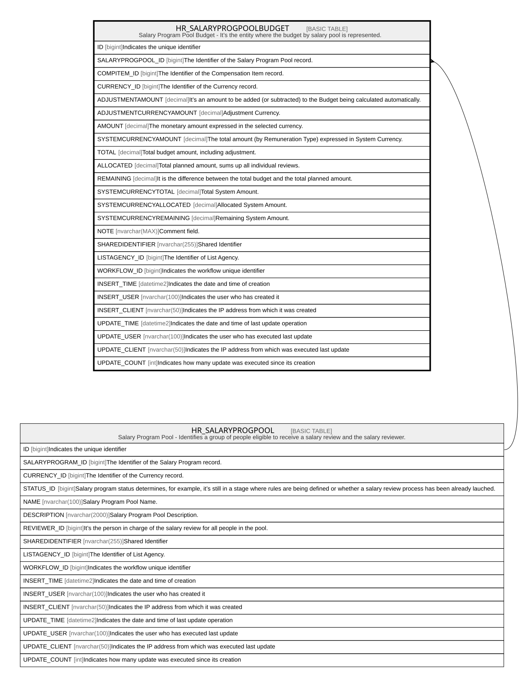

# HR_SALARYPROGPOOLBUDGET

## Description

Salary Program Pool Budget - It’s the entity where the budget by salary pool is represented.  

## Columns

| Name | Type | Default | Nullable | Parents | Comment |
| ---- | ---- | ------- | -------- | ------- | ------- |
| ID | bigint |  | false |  | Indicates the unique identifier |
| SALARYPROGPOOL_ID | bigint |  | false | [HR_SALARYPROGPOOL](HR_SALARYPROGPOOL.md) | The Identifier of the Salary Program Pool record. |
| COMPITEM_ID | bigint |  | true |  | The Identifier of the Compensation Item record. |
| CURRENCY_ID | bigint |  | true |  | The Identifier of the Currency record. |
| ADJUSTMENTAMOUNT | decimal |  | true |  | It’s an amount to be added (or subtracted) to the Budget being calculated automatically. |
| ADJUSTMENTCURRENCYAMOUNT | decimal |  | true |  | Adjustment Currency. |
| AMOUNT | decimal |  | true |  | The monetary amount expressed in the selected currency. |
| SYSTEMCURRENCYAMOUNT | decimal |  | true |  | The total amount (by Remuneration Type) expressed in System Currency. |
| TOTAL | decimal |  | true |  | Total budget amount, including adjustment. |
| ALLOCATED | decimal |  | true |  | Total planned amount, sums up all individual reviews. |
| REMAINING | decimal |  | true |  | It is the difference between the total budget and the total planned amount. |
| SYSTEMCURRENCYTOTAL | decimal |  | true |  | Total System Amount. |
| SYSTEMCURRENCYALLOCATED | decimal |  | true |  | Allocated System Amount. |
| SYSTEMCURRENCYREMAINING | decimal |  | true |  | Remaining System Amount. |
| NOTE | nvarchar(MAX) |  | true |  | Comment field. |
| SHAREDIDENTIFIER | nvarchar(255) |  | true |  | Shared Identifier |
| LISTAGENCY_ID | bigint |  | true |  | The Identifier of List Agency. |
| WORKFLOW_ID | bigint |  | true |  | Indicates the workflow unique identifier |
| INSERT_TIME | datetime2 | (sysutcdatetime()) | false |  | Indicates the date and time of creation |
| INSERT_USER | nvarchar(100) | (N'MAIN') | false |  | Indicates the user who has created it |
| INSERT_CLIENT | nvarchar(50) | (N'localhost') | false |  | Indicates the IP address from which it was created |
| UPDATE_TIME | datetime2 | (sysutcdatetime()) | false |  | Indicates the date and time of last update operation |
| UPDATE_USER | nvarchar(100) | (N'MAIN') | false |  | Indicates the user who has executed last update |
| UPDATE_CLIENT | nvarchar(50) | (N'localhost') | false |  | Indicates the IP address from which was executed last update |
| UPDATE_COUNT | int | ((0)) | false |  | Indicates how many update was executed since its creation |

## Constraints

| Name | Type | Definition |
| ---- | ---- | ---------- |
| PK_SALARYPROGPOOLBUDGET | PRIMARY KEY | CLUSTERED, unique, part of a PRIMARY KEY constraint, [ ID ] |
| UQ_SALARYPROGPOOLBUDGET | UNIQUE | NONCLUSTERED, unique, part of a UNIQUE constraint, [ SALARYPROGPOOL_ID, COMPITEM_ID ] |
| FK_PRPOOLBUD_SALARYPROGPOOL | FOREIGN KEY | FOREIGN KEY(SALARYPROGPOOL_ID) REFERENCES HR_SALARYPROGPOOL(ID) ON UPDATE NO_ACTION ON DELETE CASCADE |

## Indexes

| Name | Definition |
| ---- | ---------- |
| PK_SALARYPROGPOOLBUDGET | CLUSTERED, unique, part of a PRIMARY KEY constraint, [ ID ] |
| UQ_SALARYPROGPOOLBUDGET | NONCLUSTERED, unique, part of a UNIQUE constraint, [ SALARYPROGPOOL_ID, COMPITEM_ID ] |

## Relations

---

> Generated by [tbls](https://github.com/k1LoW/tbls)
