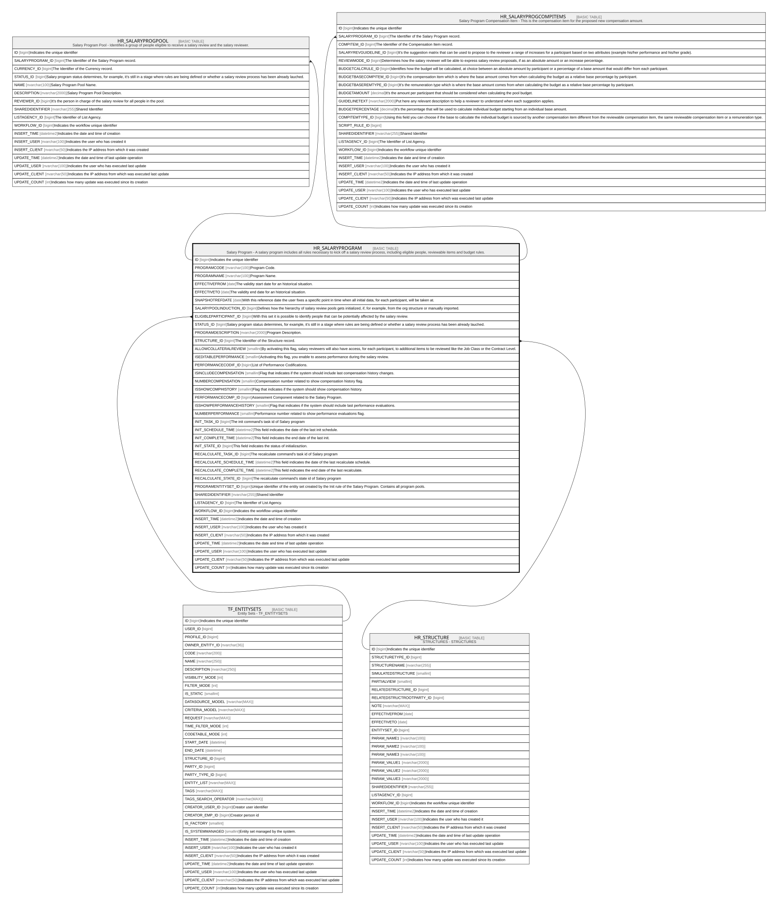

# HR_SALARYPROGRAM

## Description

Salary Program - A salary program includes all rules necessary to kick off a salary review process, including eligible people, reviewable items and budget rules.  

## Columns

| Name | Type | Default | Nullable | Children | Parents | Comment |
| ---- | ---- | ------- | -------- | -------- | ------- | ------- |
| ID | bigint |  | false | [HR_SALARYPROGPOOL](HR_SALARYPROGPOOL.md) [HR_SALARYPROGCOMPITEMS](HR_SALARYPROGCOMPITEMS.md) |  | Indicates the unique identifier |
| PROGRAMCODE | nvarchar(100) |  | false |  |  | Program Code. |
| PROGRAMNAME | nvarchar(100) |  | false |  |  | Program Name. |
| EFFECTIVEFROM | date |  | false |  |  | The validity start date for an historical situation. |
| EFFECTIVETO | date |  | false |  |  | The validity end date for an historical situation. |
| SNAPSHOTREFDATE | date |  | true |  |  | With this reference date the user fixes a specific point in time when all initial data, for each participant, will be taken at.  |
| SALARYPOOLINDUCTION_ID | bigint |  | true |  |  | Defines how the hierarchy of salary review pools gets initialized, if, for example, from the org structure or manually imported. |
| ELIGIBLEPARTICIPANT_ID | bigint |  | true |  | [TF_ENTITYSETS](TF_ENTITYSETS.md) | With this set it is possible to identify people that can be potentially affected by the salary review. |
| STATUS_ID | bigint |  | true |  |  | Salary program status determines, for example, it’s still in a stage where rules are being defined or whether a salary review process has been already lauched. |
| PROGRAMDESCRIPTION | nvarchar(2000) |  | true |  |  | Program Description. |
| STRUCTURE_ID | bigint |  | true |  | [HR_STRUCTURE](HR_STRUCTURE.md) | The Identifier of the Structure record. |
| ALLOWCOLLATERALREVIEW | smallint |  | true |  |  | By activating this flag, salary reviewers will also have access, for each participant, to additional items to be reviewed like the Job Class or the Contract Level. |
| ISEDITABLEPERFORMANCE | smallint |  | true |  |  | Activating this flag, you enable to assess performance during the salary review. |
| PERFORMANCECODIF_ID | bigint |  | true |  |  | List of Performance Codifications. |
| ISINCLUDECOMPENSATION | smallint |  | true |  |  | Flag that indicates if the system should include last compensation history changes. |
| NUMBERCOMPENSATION | smallint |  | true |  |  | Compensation number related to show compensation history flag. |
| ISSHOWCOMPHISTORY | smallint |  | true |  |  | Flag that indicates if the system should show compensation history. |
| PERFORMANCECOMP_ID | bigint |  | true |  |  | Assessment Component related to the Salary Program. |
| ISSHOWPERFORMANCEHISTORY | smallint |  | true |  |  | Flag that indicates if the system should include last performance evaluations. |
| NUMBERPERFORMANCE | smallint |  | true |  |  | Performance number related to show performance evaluations flag. |
| INIT_TASK_ID | bigint |  | true |  |  | The init command's task id of Salary program |
| INIT_SCHEDULE_TIME | datetime2 |  | true |  |  | This field indicates the date of the last init schedule. |
| INIT_COMPLETE_TIME | datetime2 |  | true |  |  | This field indicates the end date of the last init. |
| INIT_STATE_ID | bigint |  | true |  |  | This field indicates the status of initializaztion. |
| RECALCULATE_TASK_ID | bigint |  | true |  |  | The recalculate command's task id of Salary program |
| RECALCULATE_SCHEDULE_TIME | datetime2 |  | true |  |  | This field indicates the date of the last recalculate schedule. |
| RECALCULATE_COMPLETE_TIME | datetime2 |  | true |  |  | This field indicates the end date of the last recalculate. |
| RECALCULATE_STATE_ID | bigint |  | true |  |  | The recalculate command's state id of Salary program |
| PROGRAMENTITYSET_ID | bigint |  | true |  |  | Unique identifier of the entity set created by the Init rule of the Salary Program. Contains all program pools. |
| SHAREDIDENTIFIER | nvarchar(255) |  | true |  |  | Shared Identifier |
| LISTAGENCY_ID | bigint |  | true |  |  | The Identifier of List Agency. |
| WORKFLOW_ID | bigint |  | true |  |  | Indicates the workflow unique identifier |
| INSERT_TIME | datetime2 | (sysutcdatetime()) | false |  |  | Indicates the date and time of creation |
| INSERT_USER | nvarchar(100) | (N'MAIN') | false |  |  | Indicates the user who has created it |
| INSERT_CLIENT | nvarchar(50) | (N'localhost') | false |  |  | Indicates the IP address from which it was created |
| UPDATE_TIME | datetime2 | (sysutcdatetime()) | false |  |  | Indicates the date and time of last update operation |
| UPDATE_USER | nvarchar(100) | (N'MAIN') | false |  |  | Indicates the user who has executed last update |
| UPDATE_CLIENT | nvarchar(50) | (N'localhost') | false |  |  | Indicates the IP address from which was executed last update |
| UPDATE_COUNT | int | ((0)) | false |  |  | Indicates how many update was executed since its creation |

## Constraints

| Name | Type | Definition |
| ---- | ---- | ---------- |
| PK_SALARYPROGRAM | PRIMARY KEY | CLUSTERED, unique, part of a PRIMARY KEY constraint, [ ID ] |
| UQ_SALARYPROGRAM | UNIQUE | NONCLUSTERED, unique, part of a UNIQUE constraint, [ PROGRAMNAME ] |
| FK_SALPROG_ENTSETS | FOREIGN KEY | FOREIGN KEY(ELIGIBLEPARTICIPANT_ID) REFERENCES TF_ENTITYSETS(ID) ON UPDATE NO_ACTION ON DELETE NO_ACTION |
| FK_SALPROG_STRUCT | FOREIGN KEY | FOREIGN KEY(STRUCTURE_ID) REFERENCES HR_STRUCTURE(ID) ON UPDATE NO_ACTION ON DELETE NO_ACTION |

## Indexes

| Name | Definition |
| ---- | ---------- |
| PK_SALARYPROGRAM | CLUSTERED, unique, part of a PRIMARY KEY constraint, [ ID ] |
| UQ_SALARYPROGRAM | NONCLUSTERED, unique, part of a UNIQUE constraint, [ PROGRAMNAME ] |

## Relations

---

> Generated by [tbls](https://github.com/k1LoW/tbls)
