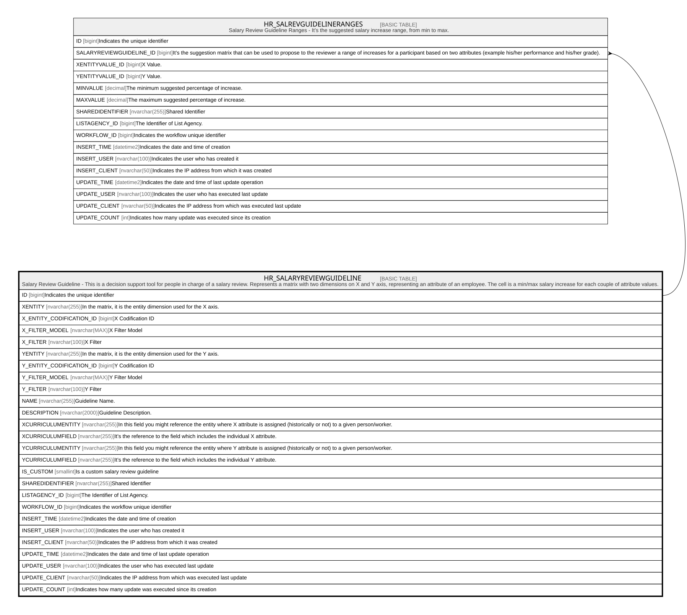

# HR_SALARYREVIEWGUIDELINE

## Description

Salary Review Guideline - This is a decision support tool for people in charge of a salary review. Represents a matrix with two dimensions on X and Y axis, representing an attribute of an employee. The cell is a min/max salary increase for each couple of attribute values.  

## Columns

| Name | Type | Default | Nullable | Children | Comment |
| ---- | ---- | ------- | -------- | -------- | ------- |
| ID | bigint |  | false | [HR_SALREVGUIDELINERANGES](HR_SALREVGUIDELINERANGES.md) | Indicates the unique identifier |
| XENTITY | nvarchar(255) |  | true |  | In the matrix, it is the entity dimension used for the X axis. |
| X_ENTITY_CODIFICATION_ID | bigint |  | true |  | X Codification ID |
| X_FILTER_MODEL | nvarchar(MAX) |  | true |  | X Filter Model |
| X_FILTER | nvarchar(100) |  | true |  | X Filter |
| YENTITY | nvarchar(255) |  | true |  | In the matrix, it is the entity dimension used for the Y axis. |
| Y_ENTITY_CODIFICATION_ID | bigint |  | true |  | Y Codification ID |
| Y_FILTER_MODEL | nvarchar(MAX) |  | true |  | Y Filter Model |
| Y_FILTER | nvarchar(100) |  | true |  | Y Filter |
| NAME | nvarchar(255) |  | true |  | Guideline Name. |
| DESCRIPTION | nvarchar(2000) |  | true |  | Guideline Description. |
| XCURRICULUMENTITY | nvarchar(255) |  | true |  | In this field you might reference the entity where X attribute is assigned (historically or not) to a given person/worker. |
| XCURRICULUMFIELD | nvarchar(255) |  | true |  | It’s the reference to the field which includes the individual X attribute. |
| YCURRICULUMENTITY | nvarchar(255) |  | true |  | In this field you might reference the entity where Y attribute is assigned (historically or not) to a given person/worker. |
| YCURRICULUMFIELD | nvarchar(255) |  | true |  | It’s the reference to the field which includes the individual Y attribute. |
| IS_CUSTOM | smallint |  | true |  | Is a custom salary review guideline |
| SHAREDIDENTIFIER | nvarchar(255) |  | true |  | Shared Identifier |
| LISTAGENCY_ID | bigint |  | true |  | The Identifier of List Agency. |
| WORKFLOW_ID | bigint |  | true |  | Indicates the workflow unique identifier |
| INSERT_TIME | datetime2 | (sysutcdatetime()) | false |  | Indicates the date and time of creation |
| INSERT_USER | nvarchar(100) | (N'MAIN') | false |  | Indicates the user who has created it |
| INSERT_CLIENT | nvarchar(50) | (N'localhost') | false |  | Indicates the IP address from which it was created |
| UPDATE_TIME | datetime2 | (sysutcdatetime()) | false |  | Indicates the date and time of last update operation |
| UPDATE_USER | nvarchar(100) | (N'MAIN') | false |  | Indicates the user who has executed last update |
| UPDATE_CLIENT | nvarchar(50) | (N'localhost') | false |  | Indicates the IP address from which was executed last update |
| UPDATE_COUNT | int | ((0)) | false |  | Indicates how many update was executed since its creation |

## Constraints

| Name | Type | Definition |
| ---- | ---- | ---------- |
| PK_SALARYREVIEWGUIDELINE | PRIMARY KEY | CLUSTERED, unique, part of a PRIMARY KEY constraint, [ ID ] |

## Indexes

| Name | Definition |
| ---- | ---------- |
| PK_SALARYREVIEWGUIDELINE | CLUSTERED, unique, part of a PRIMARY KEY constraint, [ ID ] |

## Relations

---

> Generated by [tbls](https://github.com/k1LoW/tbls)
