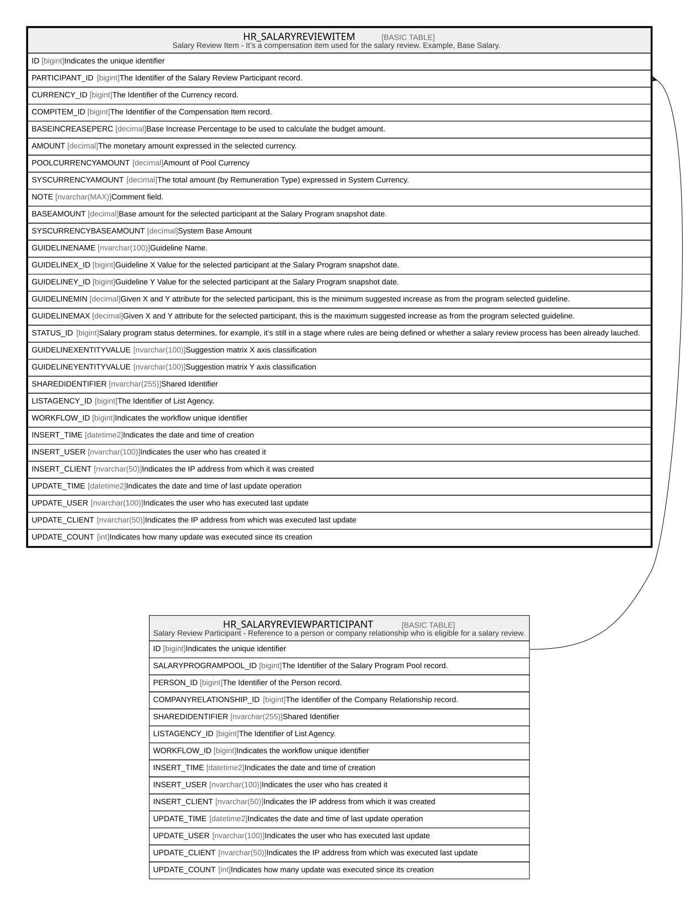

# HR_SALARYREVIEWITEM

## Description

Salary Review Item - It’s a compensation item used for the salary review. Example, Base Salary.  

## Columns

| Name | Type | Default | Nullable | Parents | Comment |
| ---- | ---- | ------- | -------- | ------- | ------- |
| ID | bigint |  | false |  | Indicates the unique identifier |
| PARTICIPANT_ID | bigint |  | false | [HR_SALARYREVIEWPARTICIPANT](HR_SALARYREVIEWPARTICIPANT.md) | The Identifier of the Salary Review Participant record. |
| CURRENCY_ID | bigint |  | true |  | The Identifier of the Currency record. |
| COMPITEM_ID | bigint |  | true |  | The Identifier of the Compensation Item record. |
| BASEINCREASEPERC | decimal |  | true |  | Base Increase Percentage to be used to calculate the budget amount. |
| AMOUNT | decimal |  | true |  | The monetary amount expressed in the selected currency. |
| POOLCURRENCYAMOUNT | decimal |  | true |  | Amount of Pool Currency |
| SYSCURRENCYAMOUNT | decimal |  | true |  | The total amount (by Remuneration Type) expressed in System Currency. |
| NOTE | nvarchar(MAX) |  | true |  | Comment field. |
| BASEAMOUNT | decimal |  | true |  | Base amount for the selected participant at the Salary Program snapshot date. |
| SYSCURRENCYBASEAMOUNT | decimal |  | true |  | System Base Amount |
| GUIDELINENAME | nvarchar(100) |  | true |  | Guideline Name. |
| GUIDELINEX_ID | bigint |  | true |  | Guideline X Value for the selected participant at the Salary Program snapshot date.  |
| GUIDELINEY_ID | bigint |  | true |  | Guideline Y Value for the selected participant at the Salary Program snapshot date. |
| GUIDELINEMIN | decimal |  | true |  | Given X and Y attribute for the selected participant, this is the minimum suggested increase as from the program selected guideline. |
| GUIDELINEMAX | decimal |  | true |  | Given X and Y attribute for the selected participant, this is the maximum suggested increase as from the program selected guideline. |
| STATUS_ID | bigint |  | true |  | Salary program status determines, for example, it’s still in a stage where rules are being defined or whether a salary review process has been already lauched. |
| GUIDELINEXENTITYVALUE | nvarchar(100) |  | true |  | Suggestion matrix X axis classification |
| GUIDELINEYENTITYVALUE | nvarchar(100) |  | true |  | Suggestion matrix Y axis classification |
| SHAREDIDENTIFIER | nvarchar(255) |  | true |  | Shared Identifier |
| LISTAGENCY_ID | bigint |  | true |  | The Identifier of List Agency. |
| WORKFLOW_ID | bigint |  | true |  | Indicates the workflow unique identifier |
| INSERT_TIME | datetime2 | (sysutcdatetime()) | false |  | Indicates the date and time of creation |
| INSERT_USER | nvarchar(100) | (N'MAIN') | false |  | Indicates the user who has created it |
| INSERT_CLIENT | nvarchar(50) | (N'localhost') | false |  | Indicates the IP address from which it was created |
| UPDATE_TIME | datetime2 | (sysutcdatetime()) | false |  | Indicates the date and time of last update operation |
| UPDATE_USER | nvarchar(100) | (N'MAIN') | false |  | Indicates the user who has executed last update |
| UPDATE_CLIENT | nvarchar(50) | (N'localhost') | false |  | Indicates the IP address from which was executed last update |
| UPDATE_COUNT | int | ((0)) | false |  | Indicates how many update was executed since its creation |

## Constraints

| Name | Type | Definition |
| ---- | ---- | ---------- |
| PK_SALARYREVIEWITEM | PRIMARY KEY | CLUSTERED, unique, part of a PRIMARY KEY constraint, [ ID ] |
| UQ_SALARYREVIEWITEM | UNIQUE | NONCLUSTERED, unique, part of a UNIQUE constraint, [ PARTICIPANT_ID, COMPITEM_ID ] |
| FK_SALREVIT_PARTICIP | FOREIGN KEY | FOREIGN KEY(PARTICIPANT_ID) REFERENCES HR_SALARYREVIEWPARTICIPANT(ID) ON UPDATE NO_ACTION ON DELETE CASCADE |

## Indexes

| Name | Definition |
| ---- | ---------- |
| PK_SALARYREVIEWITEM | CLUSTERED, unique, part of a PRIMARY KEY constraint, [ ID ] |
| UQ_SALARYREVIEWITEM | NONCLUSTERED, unique, part of a UNIQUE constraint, [ PARTICIPANT_ID, COMPITEM_ID ] |

## Relations

---

> Generated by [tbls](https://github.com/k1LoW/tbls)
