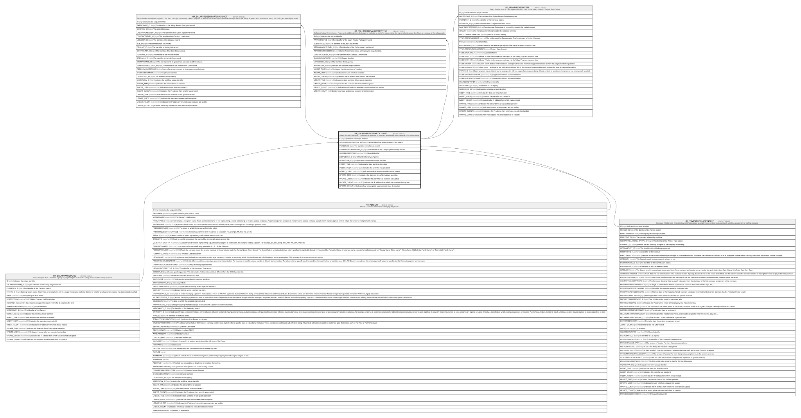

# HR_SALARYREVIEWPARTICIPANT

## Description

Salary Review Participant - Reference to a person or company relationship who is eligible for a salary review.  

## Columns

| Name | Type | Default | Nullable | Children | Parents | Comment |
| ---- | ---- | ------- | -------- | -------- | ------- | ------- |
| ID | bigint |  | false | [HR_SALARYREVIEWPARTSNAPSHOT](HR_SALARYREVIEWPARTSNAPSHOT.md) [HR_COLLATERALSALARYREVITEM](HR_COLLATERALSALARYREVITEM.md) [HR_SALARYREVIEWITEM](HR_SALARYREVIEWITEM.md) |  | Indicates the unique identifier |
| SALARYPROGRAMPOOL_ID | bigint |  | false |  | [HR_SALARYPROGPOOL](HR_SALARYPROGPOOL.md) | The Identifier of the Salary Program Pool record. |
| PERSON_ID | bigint |  | true |  | [HR_PERSON](HR_PERSON.md) | The Identifier of the Person record. |
| COMPANYRELATIONSHIP_ID | bigint |  | true |  | [HR_COMPANYRELATIONSHIP](HR_COMPANYRELATIONSHIP.md) | The Identifier of the Company Relationship record. |
| SHAREDIDENTIFIER | nvarchar(255) |  | true |  |  | Shared Identifier |
| LISTAGENCY_ID | bigint |  | true |  |  | The Identifier of List Agency. |
| WORKFLOW_ID | bigint |  | true |  |  | Indicates the workflow unique identifier |
| INSERT_TIME | datetime2 | (sysutcdatetime()) | false |  |  | Indicates the date and time of creation |
| INSERT_USER | nvarchar(100) | (N'MAIN') | false |  |  | Indicates the user who has created it |
| INSERT_CLIENT | nvarchar(50) | (N'localhost') | false |  |  | Indicates the IP address from which it was created |
| UPDATE_TIME | datetime2 | (sysutcdatetime()) | false |  |  | Indicates the date and time of last update operation |
| UPDATE_USER | nvarchar(100) | (N'MAIN') | false |  |  | Indicates the user who has executed last update |
| UPDATE_CLIENT | nvarchar(50) | (N'localhost') | false |  |  | Indicates the IP address from which was executed last update |
| UPDATE_COUNT | int | ((0)) | false |  |  | Indicates how many update was executed since its creation |

## Constraints

| Name | Type | Definition |
| ---- | ---- | ---------- |
| PK_SALARYREVIEWPARTICIPANT | PRIMARY KEY | CLUSTERED, unique, part of a PRIMARY KEY constraint, [ ID ] |
| UQ_SALREVPARTICIPANT | UNIQUE | NONCLUSTERED, unique, part of a UNIQUE constraint, [ SALARYPROGRAMPOOL_ID, PERSON_ID, COMPANYRELATIONSHIP_ID ] |
| FK_SALREVPAR_COMPREL | FOREIGN KEY | FOREIGN KEY(COMPANYRELATIONSHIP_ID) REFERENCES HR_COMPANYRELATIONSHIP(ID) ON UPDATE NO_ACTION ON DELETE NO_ACTION |
| FK_SALREVPAR_PERSON | FOREIGN KEY | FOREIGN KEY(PERSON_ID) REFERENCES HR_PERSON(ID) ON UPDATE NO_ACTION ON DELETE NO_ACTION |
| FK_SALREVPAR_SALARYPROGPOOL | FOREIGN KEY | FOREIGN KEY(SALARYPROGRAMPOOL_ID) REFERENCES HR_SALARYPROGPOOL(ID) ON UPDATE NO_ACTION ON DELETE CASCADE |

## Indexes

| Name | Definition |
| ---- | ---------- |
| PK_SALARYREVIEWPARTICIPANT | CLUSTERED, unique, part of a PRIMARY KEY constraint, [ ID ] |
| UQ_SALREVPARTICIPANT | NONCLUSTERED, unique, part of a UNIQUE constraint, [ SALARYPROGRAMPOOL_ID, PERSON_ID, COMPANYRELATIONSHIP_ID ] |

## Relations

---

> Generated by [tbls](https://github.com/k1LoW/tbls)
