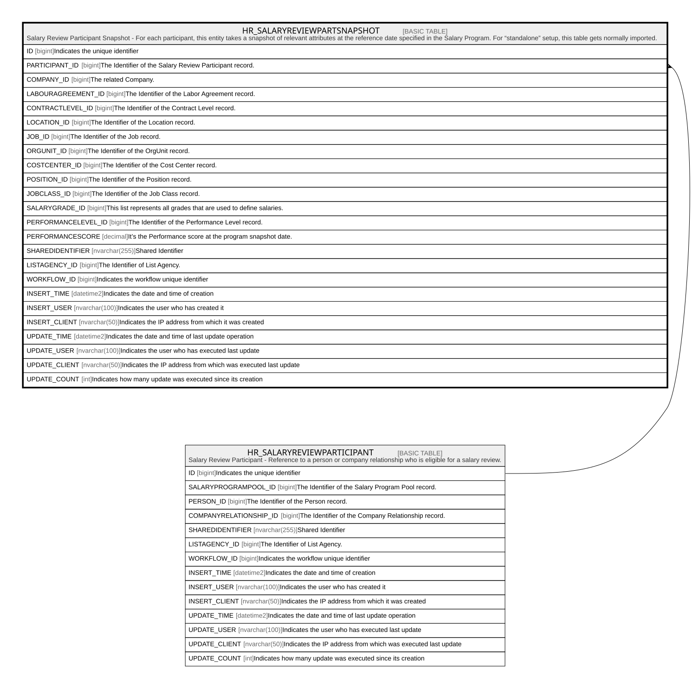

# HR_SALARYREVIEWPARTSNAPSHOT

## Description

Salary Review Participant Snapshot - For each participant, this entity takes a snapshot of relevant attributes at the reference date specified in the Salary Program. For “standalone” setup, this table gets normally imported.  

## Columns

| Name | Type | Default | Nullable | Parents | Comment |
| ---- | ---- | ------- | -------- | ------- | ------- |
| ID | bigint |  | false |  | Indicates the unique identifier |
| PARTICIPANT_ID | bigint |  | false | [HR_SALARYREVIEWPARTICIPANT](HR_SALARYREVIEWPARTICIPANT.md) | The Identifier of the Salary Review Participant record. |
| COMPANY_ID | bigint |  | true |  | The related Company. |
| LABOURAGREEMENT_ID | bigint |  | true |  | The Identifier of the Labor Agreement record. |
| CONTRACTLEVEL_ID | bigint |  | true |  | The Identifier of the Contract Level record. |
| LOCATION_ID | bigint |  | true |  | The Identifier of the Location record. |
| JOB_ID | bigint |  | true |  | The Identifier of the Job record. |
| ORGUNIT_ID | bigint |  | true |  | The Identifier of the OrgUnit record. |
| COSTCENTER_ID | bigint |  | true |  | The Identifier of the Cost Center record. |
| POSITION_ID | bigint |  | true |  | The Identifier of the Position record. |
| JOBCLASS_ID | bigint |  | true |  | The Identifier of the Job Class record. |
| SALARYGRADE_ID | bigint |  | true |  | This list represents all grades that are used to define salaries. |
| PERFORMANCELEVEL_ID | bigint |  | true |  | The Identifier of the Performance Level record. |
| PERFORMANCESCORE | decimal |  | true |  | It’s the Performance score at the program snapshot date. |
| SHAREDIDENTIFIER | nvarchar(255) |  | true |  | Shared Identifier |
| LISTAGENCY_ID | bigint |  | true |  | The Identifier of List Agency. |
| WORKFLOW_ID | bigint |  | true |  | Indicates the workflow unique identifier |
| INSERT_TIME | datetime2 | (sysutcdatetime()) | false |  | Indicates the date and time of creation |
| INSERT_USER | nvarchar(100) | (N'MAIN') | false |  | Indicates the user who has created it |
| INSERT_CLIENT | nvarchar(50) | (N'localhost') | false |  | Indicates the IP address from which it was created |
| UPDATE_TIME | datetime2 | (sysutcdatetime()) | false |  | Indicates the date and time of last update operation |
| UPDATE_USER | nvarchar(100) | (N'MAIN') | false |  | Indicates the user who has executed last update |
| UPDATE_CLIENT | nvarchar(50) | (N'localhost') | false |  | Indicates the IP address from which was executed last update |
| UPDATE_COUNT | int | ((0)) | false |  | Indicates how many update was executed since its creation |

## Constraints

| Name | Type | Definition |
| ---- | ---- | ---------- |
| PK_SALARYREVIEWPARTSNAPSHOT | PRIMARY KEY | CLUSTERED, unique, part of a PRIMARY KEY constraint, [ ID ] |
| UQ_SALREVPARTSNAPSHOT | UNIQUE | NONCLUSTERED, unique, part of a UNIQUE constraint, [ PARTICIPANT_ID ] |
| FK_SRSNAPSHOT_PARTICIP | FOREIGN KEY | FOREIGN KEY(PARTICIPANT_ID) REFERENCES HR_SALARYREVIEWPARTICIPANT(ID) ON UPDATE NO_ACTION ON DELETE CASCADE |

## Indexes

| Name | Definition |
| ---- | ---------- |
| PK_SALARYREVIEWPARTSNAPSHOT | CLUSTERED, unique, part of a PRIMARY KEY constraint, [ ID ] |
| UQ_SALREVPARTSNAPSHOT | NONCLUSTERED, unique, part of a UNIQUE constraint, [ PARTICIPANT_ID ] |

## Relations

---

> Generated by [tbls](https://github.com/k1LoW/tbls)
