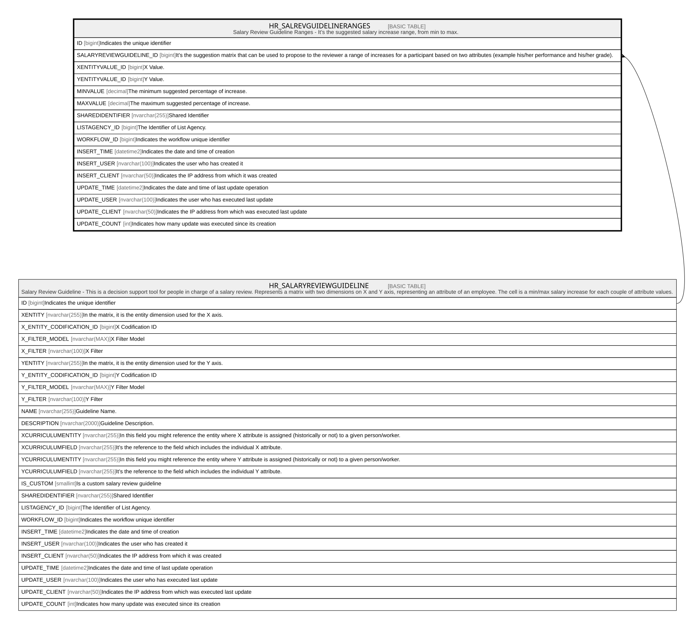

# HR_SALREVGUIDELINERANGES

## Description

Salary Review Guideline Ranges - It’s the suggested salary increase range, from min to max.  

## Columns

| Name | Type | Default | Nullable | Parents | Comment |
| ---- | ---- | ------- | -------- | ------- | ------- |
| ID | bigint |  | false |  | Indicates the unique identifier |
| SALARYREVIEWGUIDELINE_ID | bigint |  | false | [HR_SALARYREVIEWGUIDELINE](HR_SALARYREVIEWGUIDELINE.md) | It’s the suggestion matrix that can be used to propose to the reviewer a range of increases for a participant based on two attributes (example his/her performance and his/her grade). |
| XENTITYVALUE_ID | bigint |  | true |  | X Value. |
| YENTITYVALUE_ID | bigint |  | true |  | Y Value. |
| MINVALUE | decimal |  | true |  | The minimum suggested percentage of increase. |
| MAXVALUE | decimal |  | true |  | The maximum suggested percentage of increase. |
| SHAREDIDENTIFIER | nvarchar(255) |  | true |  | Shared Identifier |
| LISTAGENCY_ID | bigint |  | true |  | The Identifier of List Agency. |
| WORKFLOW_ID | bigint |  | true |  | Indicates the workflow unique identifier |
| INSERT_TIME | datetime2 | (sysutcdatetime()) | false |  | Indicates the date and time of creation |
| INSERT_USER | nvarchar(100) | (N'MAIN') | false |  | Indicates the user who has created it |
| INSERT_CLIENT | nvarchar(50) | (N'localhost') | false |  | Indicates the IP address from which it was created |
| UPDATE_TIME | datetime2 | (sysutcdatetime()) | false |  | Indicates the date and time of last update operation |
| UPDATE_USER | nvarchar(100) | (N'MAIN') | false |  | Indicates the user who has executed last update |
| UPDATE_CLIENT | nvarchar(50) | (N'localhost') | false |  | Indicates the IP address from which was executed last update |
| UPDATE_COUNT | int | ((0)) | false |  | Indicates how many update was executed since its creation |

## Constraints

| Name | Type | Definition |
| ---- | ---- | ---------- |
| PK_SALREVGUIDELINERANGES | PRIMARY KEY | CLUSTERED, unique, part of a PRIMARY KEY constraint, [ ID ] |
| UQ_SALREVGUIDRANGES | UNIQUE | NONCLUSTERED, unique, part of a UNIQUE constraint, [ SALARYREVIEWGUIDELINE_ID, XENTITYVALUE_ID, YENTITYVALUE_ID ] |
| FK_SALREVGUIRE_SALREVGUI | FOREIGN KEY | FOREIGN KEY(SALARYREVIEWGUIDELINE_ID) REFERENCES HR_SALARYREVIEWGUIDELINE(ID) ON UPDATE NO_ACTION ON DELETE CASCADE |

## Indexes

| Name | Definition |
| ---- | ---------- |
| PK_SALREVGUIDELINERANGES | CLUSTERED, unique, part of a PRIMARY KEY constraint, [ ID ] |
| UQ_SALREVGUIDRANGES | NONCLUSTERED, unique, part of a UNIQUE constraint, [ SALARYREVIEWGUIDELINE_ID, XENTITYVALUE_ID, YENTITYVALUE_ID ] |

## Relations

---

> Generated by [tbls](https://github.com/k1LoW/tbls)
