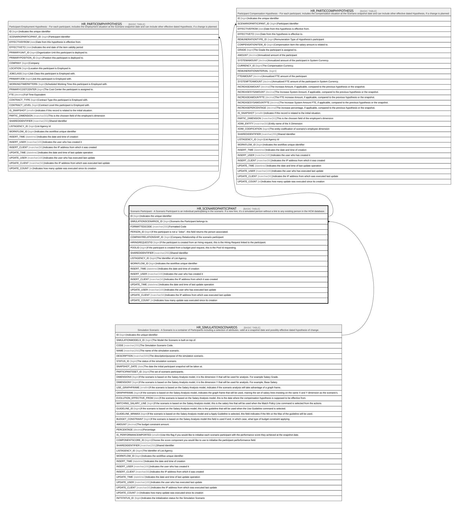

# HR_SCENARIOPARTICIPANT

## Description

Scenario Participant - A Scenario Participant is an individual participating in the scenario. If a new hire, it’s a simulated person without a link to any existing person in the HCM database.  

## Columns

| Name | Type | Default | Nullable | Children | Parents | Comment |
| ---- | ---- | ------- | -------- | -------- | ------- | ------- |
| ID | bigint |  | false | [HR_PARTICEMPHYPOTHESIS](HR_PARTICEMPHYPOTHESIS.md) [HR_PARTICCOMPHYPOTHESIS](HR_PARTICCOMPHYPOTHESIS.md) |  | Indicates the unique identifier |
| SIMULATIONSCENARIOS_ID | bigint |  | false |  | [HR_SIMULATIONSCENARIOS](HR_SIMULATIONSCENARIOS.md) | Scenario the Participant belongs to. |
| FORMATTEDCODE | nvarchar(255) |  | true |  |  | Formatted Code |
| PERSON_ID | bigint |  | true |  |  | If the participant is not a “Joker”, this field returns the person associated. |
| COMPANYRELATIONSHIP_ID | bigint |  | true |  |  | Company Relationship of the scenario participant |
| HIRINGREQUESTID | bigint |  | true |  |  | If the participant is created from an hiring request, this is the Hiring Request linked to the participant. |
| POOLID | bigint |  | true |  |  | If the participant is created from a budget pool request, this is the Pool Id requesting. |
| SHAREDIDENTIFIER | nvarchar(255) |  | true |  |  | Shared Identifier |
| LISTAGENCY_ID | bigint |  | true |  |  | The Identifier of List Agency. |
| WORKFLOW_ID | bigint |  | true |  |  | Indicates the workflow unique identifier |
| INSERT_TIME | datetime2 | (sysutcdatetime()) | false |  |  | Indicates the date and time of creation |
| INSERT_USER | nvarchar(100) | (N'MAIN') | false |  |  | Indicates the user who has created it |
| INSERT_CLIENT | nvarchar(50) | (N'localhost') | false |  |  | Indicates the IP address from which it was created |
| UPDATE_TIME | datetime2 | (sysutcdatetime()) | false |  |  | Indicates the date and time of last update operation |
| UPDATE_USER | nvarchar(100) | (N'MAIN') | false |  |  | Indicates the user who has executed last update |
| UPDATE_CLIENT | nvarchar(50) | (N'localhost') | false |  |  | Indicates the IP address from which was executed last update |
| UPDATE_COUNT | int | ((0)) | false |  |  | Indicates how many update was executed since its creation |

## Constraints

| Name | Type | Definition |
| ---- | ---- | ---------- |
| PK_HR_SCENARIOPARTICIPANT | PRIMARY KEY | CLUSTERED, unique, part of a PRIMARY KEY constraint, [ ID ] |
| FK_SCENPARTIC_SIMSCEN | FOREIGN KEY | FOREIGN KEY(SIMULATIONSCENARIOS_ID) REFERENCES HR_SIMULATIONSCENARIOS(ID) ON UPDATE NO_ACTION ON DELETE CASCADE |

## Indexes

| Name | Definition |
| ---- | ---------- |
| PK_HR_SCENARIOPARTICIPANT | CLUSTERED, unique, part of a PRIMARY KEY constraint, [ ID ] |
| IDX_SCENARIOPARTICIPANT_CR | NONCLUSTERED, [ COMPANYRELATIONSHIP_ID ] |
| IDX_SCENARIOPARTICIPANT_SCEN | NONCLUSTERED, [ SIMULATIONSCENARIOS_ID ] |

## Relations

---

> Generated by [tbls](https://github.com/k1LoW/tbls)
