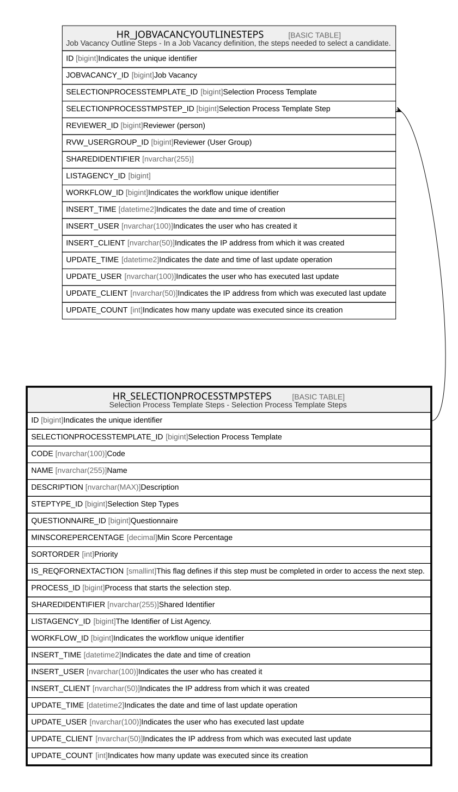

# HR_SELECTIONPROCESSTMPSTEPS

## Description

Selection Process Template Steps - Selection Process Template Steps  

## Columns

| Name | Type | Default | Nullable | Children | Comment |
| ---- | ---- | ------- | -------- | -------- | ------- |
| ID | bigint |  | false | [HR_JOBVACANCYOUTLINESTEPS](HR_JOBVACANCYOUTLINESTEPS.md) | Indicates the unique identifier |
| SELECTIONPROCESSTEMPLATE_ID | bigint |  | false |  | Selection Process Template |
| CODE | nvarchar(100) |  | false |  | Code |
| NAME | nvarchar(255) |  | false |  | Name |
| DESCRIPTION | nvarchar(MAX) |  | true |  | Description |
| STEPTYPE_ID | bigint |  | true |  | Selection Step Types |
| QUESTIONNAIRE_ID | bigint |  | true |  | Questionnaire |
| MINSCOREPERCENTAGE | decimal |  | true |  | Min Score Percentage |
| SORTORDER | int |  | true |  | Priority |
| IS_REQFORNEXTACTION | smallint |  | true |  | This flag defines if this step must be completed in order to access the next step. |
| PROCESS_ID | bigint |  | true |  | Process that starts the selection step. |
| SHAREDIDENTIFIER | nvarchar(255) |  | true |  | Shared Identifier |
| LISTAGENCY_ID | bigint |  | true |  | The Identifier of List Agency. |
| WORKFLOW_ID | bigint |  | true |  | Indicates the workflow unique identifier |
| INSERT_TIME | datetime2 | (sysutcdatetime()) | false |  | Indicates the date and time of creation |
| INSERT_USER | nvarchar(100) |  | false |  | Indicates the user who has created it |
| INSERT_CLIENT | nvarchar(50) | (N'localhost') | false |  | Indicates the IP address from which it was created |
| UPDATE_TIME | datetime2 | (sysutcdatetime()) | false |  | Indicates the date and time of last update operation |
| UPDATE_USER | nvarchar(100) |  | false |  | Indicates the user who has executed last update |
| UPDATE_CLIENT | nvarchar(50) | (N'localhost') | false |  | Indicates the IP address from which was executed last update |
| UPDATE_COUNT | int | ((0)) | false |  | Indicates how many update was executed since its creation |

## Constraints

| Name | Type | Definition |
| ---- | ---- | ---------- |
| PK_SELECTIONPROCESSTMPSTEPS | PRIMARY KEY | CLUSTERED, unique, part of a PRIMARY KEY constraint, [ ID ] |
| UQ_SELECTIONPROCESSTMPSTEPS | UNIQUE | NONCLUSTERED, unique, part of a UNIQUE constraint, [ SELECTIONPROCESSTEMPLATE_ID, CODE ] |

## Indexes

| Name | Definition |
| ---- | ---------- |
| PK_SELECTIONPROCESSTMPSTEPS | CLUSTERED, unique, part of a PRIMARY KEY constraint, [ ID ] |
| UQ_SELECTIONPROCESSTMPSTEPS | NONCLUSTERED, unique, part of a UNIQUE constraint, [ SELECTIONPROCESSTEMPLATE_ID, CODE ] |

## Relations

---

> Generated by [tbls](https://github.com/k1LoW/tbls)
