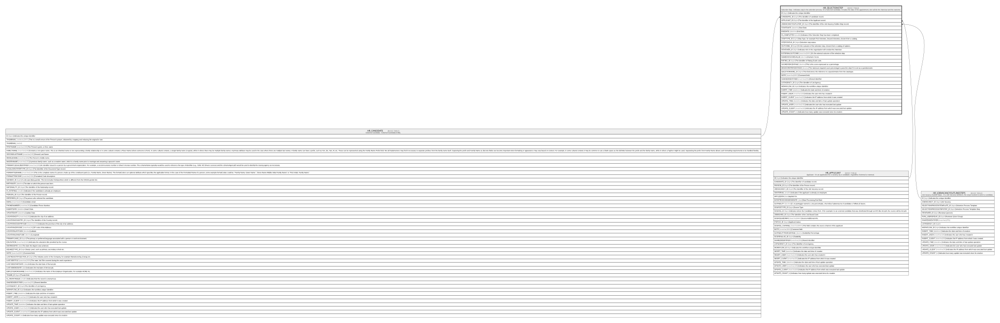

# HR_SELECTIONSTEP

## Description

Selection Step - Indicates step in the selection process, for a selected candidate. Includes the date of the appointment, who will do the interview and the outcome.  

## Columns

| Name | Type | Default | Nullable | Parents | Comment |
| ---- | ---- | ------- | -------- | ------- | ------- |
| ID | bigint |  | false |  | Indicates the unique identifier |
| CANDIDATE_ID | bigint |  | true | [HR_CANDIDATE](HR_CANDIDATE.md) | The identifier of candidate record. |
| APPLICANT_ID | bigint |  | true | [HR_APPLICANT](HR_APPLICANT.md) | The identifier of the Applicant record. |
| JOBVACANCYOUTLSTEP_ID | bigint |  | true | [HR_JOBVACANCYOUTLINESTEPS](HR_JOBVACANCYOUTLINESTEPS.md) | The identifier of the Job Vacancy Outline Step record. |
| STARTDATE | datetime |  | true |  | Start Date |
| ENDDATE | datetime |  | true |  | End Date. |
| IS_COMPLETED | smallint |  | true |  | Indicates if the Selection Step has been completed. |
| STEPTYPE_ID | bigint |  | true |  | Step Type, for example First Interview, Second Interview, chosen from a catalog. |
| STEPSTATUS_ID | bigint |  | true |  | Selection step status. |
| OUTCOME_ID | bigint |  | true |  | It’s the outcome of the selection step, chosen from a catalog of options. |
| REVIEWER_ID | bigint |  | true |  | Indicates who in the organization will conduct the interview. |
| EXTERNALOUTCOME | nvarchar(MAX) |  | true |  | It’s the external outcome of the selection step |
| NUMERICSCOREVALUE | decimal |  | true |  | Numeric Score |
| RATING_ID | bigint |  | true |  | The identifier of Rating Scale code. |
| SCOREPERCENTAGE | decimal |  | true |  | This is the score expressed as a percentage.  |
| MINSCOREPERCENTAGE | decimal |  | true |  | The minimum required score percentage to pass the step if it is set as a questionnaire. |
| QUESTIONNAIRE_ID | bigint |  | true |  | This field stores the reference to a questionnaire from the catalogue. |
| NOTE | nvarchar(MAX) |  | true |  | Comment field. |
| SHAREDIDENTIFIER | nvarchar(255) |  | true |  | Shared Identifier |
| LISTAGENCY_ID | bigint |  | true |  | The Identifier of List Agency. |
| WORKFLOW_ID | bigint |  | true |  | Indicates the workflow unique identifier |
| INSERT_TIME | datetime2 |  | false |  | Indicates the date and time of creation |
| INSERT_USER | nvarchar(100) |  | false |  | Indicates the user who has created it |
| INSERT_CLIENT | nvarchar(50) |  | false |  | Indicates the IP address from which it was created |
| UPDATE_TIME | datetime2 |  | false |  | Indicates the date and time of last update operation |
| UPDATE_USER | nvarchar(100) |  | false |  | Indicates the user who has executed last update |
| UPDATE_CLIENT | nvarchar(50) |  | false |  | Indicates the IP address from which was executed last update |
| UPDATE_COUNT | int |  | false |  | Indicates how many update was executed since its creation |

## Constraints

| Name | Type | Definition |
| ---- | ---- | ---------- |
| PK_SELECTIONSTEP | PRIMARY KEY | CLUSTERED, unique, part of a PRIMARY KEY constraint, [ ID ] |
| FK_SELSTEP_APPLICANT | FOREIGN KEY | FOREIGN KEY(APPLICANT_ID) REFERENCES HR_APPLICANT(ID) ON UPDATE NO_ACTION ON DELETE CASCADE |
| FK_SELSTEP_CANDIDATE | FOREIGN KEY | FOREIGN KEY(CANDIDATE_ID) REFERENCES HR_CANDIDATE(ID) ON UPDATE NO_ACTION ON DELETE NO_ACTION |
| FK_SELSTEP_JOBVACANCYOUTLSTEP | FOREIGN KEY | FOREIGN KEY(JOBVACANCYOUTLSTEP_ID) REFERENCES HR_JOBVACANCYOUTLINESTEPS(ID) ON UPDATE NO_ACTION ON DELETE NO_ACTION |

## Indexes

| Name | Definition |
| ---- | ---------- |
| PK_SELECTIONSTEP | CLUSTERED, unique, part of a PRIMARY KEY constraint, [ ID ] |
| IDX_SELECTIONSTEP_STARTDATE | NONCLUSTERED, [ APPLICANT_ID, STARTDATE, ENDDATE ] |

## Relations

---

> Generated by [tbls](https://github.com/k1LoW/tbls)
