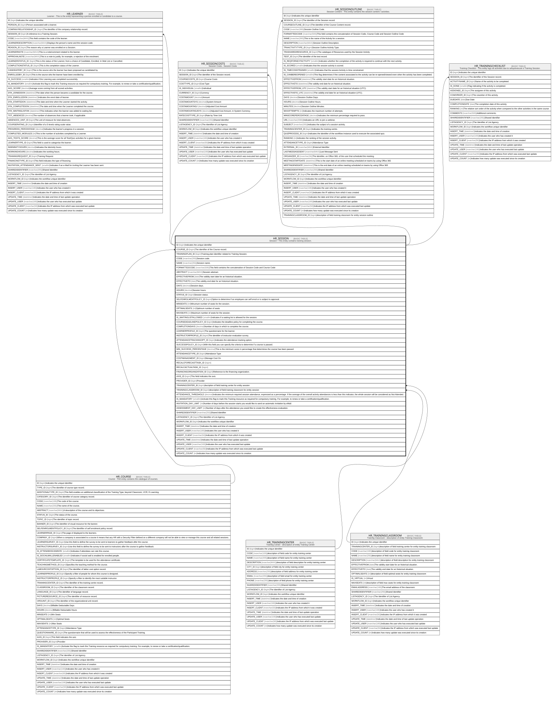

# HR_SESSION

## Description

Session - This entity contains training session.  

## Columns

| Name | Type | Default | Nullable | Children | Parents | Comment |
| ---- | ---- | ------- | -------- | -------- | ------- | ------- |
| ID | bigint |  | false | [HR_LEARNER](HR_LEARNER.md) [HR_SESSIONCOSTS](HR_SESSIONCOSTS.md) [HR_SESSIONOUTLINE](HR_SESSIONOUTLINE.md) [HR_TRAININGCHECKLIST](HR_TRAININGCHECKLIST.md) |  | Indicates the unique identifier |
| COURSE_ID | bigint |  | false |  | [HR_COURSE](HR_COURSE.md) | The identifier of the Course record. |
| TRAININGPLAN_ID | bigint |  | true |  |  | Training plan identifier related to Training Session. |
| CODE | nvarchar(255) |  | false |  |  | Session code. |
| NAME | nvarchar(255) |  | true |  |  | Session name. |
| FORMATTEDCODE | nvarchar(500) |  | false |  |  | This field contains the concatenation of Session Code and Course Code |
| ABSTRACT | nvarchar(MAX) |  | true |  |  | Session abstract. |
| EFFECTIVEFROM | date |  | true |  |  | The validity start date for an historical situation. |
| EFFECTIVETO | date |  | true |  |  | The validity end date for an historical situation. |
| DAYS | decimal |  | true |  |  | Session days. |
| HOURS | decimal |  | true |  |  | Session hours. |
| STATUS_ID | bigint |  | true |  |  | Session status. |
| SELFENROLMENTPOLICY_ID | bigint |  | true |  |  | Option to determine if an employee can self enrol or is subject to approval. |
| MINSEATS | int |  | true |  |  | Minumum number of seats for the session. |
| OPTIMALSEATS | int |  | true |  |  | Optimum number of seats |
| MAXSEATS | int |  | true |  |  | Maximum number of seats for the session. |
| IS_WAITINGLISTALLOWED | smallint |  | true |  |  | Indicates if a waiting list is allowed for the session. |
| COURSEDEADLINEPOLICY_ID | bigint |  | true |  |  | Indicates the deadline policy for completing the course. |
| COMPLETIONDAYS | decimal |  | true |  |  | Number of days in which to complete the course. |
| LEARNERPROFILE_ID | bigint |  | true |  |  | The questionnaire for the learner. |
| INSTRUCTORPROFILE_ID | bigint |  | true |  |  | The identifier of instructor evaluation survey. |
| ATTENDANCETRACKINGOPT_ID | bigint |  | true |  |  | Indicates the attendance tracking option. |
| SUCCESSPOLICY_ID | bigint |  | true |  |  | With this field you can specify the criteria to determine if a course is passed. |
| MIN_SUCCESS_PERCENTAGE | decimal |  | true |  |  | This is the minimum score in percentage that determines the course has been passed. |
| ATTENDANCETYPE_ID | bigint |  | true |  |  | Attendance Type |
| COSTMANAGMENT_ID | bigint |  | true |  |  | Manage Cost On |
| RECALCFORECASTTASK_ID | bigint |  | true |  |  |  |
| RECALCACTUALTASK_ID | bigint |  | true |  |  |  |
| FINANCINGORGANIZATION_ID | bigint |  | true |  |  | Reference to the financing organization. |
| AXIS_ID | bigint |  | true |  |  | This field indicates the axis |
| PROVIDER_ID | bigint |  | true |  |  | Provider |
| TRAININGCENTER_ID | bigint |  | true |  | [HR_TRAININGCENTER](HR_TRAININGCENTER.md) | dscription of field training center for entity session |
| TRAININGCLASSROOM_ID | bigint |  | true |  | [HR_TRAININGCLASSROOM](HR_TRAININGCLASSROOM.md) | description of field training classroom for entity session |
| ATTENDANCE_THRESHOLD | decimal |  | true |  |  | Indicates the minimum required session attendance, expressed as a percentage. If the average of the overall activity attendances is less than this indicator, the whole session will be considered as Not Attended. |
| IS_MANDATORY | smallint |  | true |  |  | Activate this flag to mark this Training resource as required for compulsory training. For example, to renew or take a certification/qualification. |
| INVITATION_DAY_LIMIT | int |  | true |  |  | Number of days before the session starts you would like to send an automatic invitation by eMail. |
| ASSESSMENT_DAY_LIMIT | int |  | true |  |  | Number of days after the attendance you would like to create the effectiveness evaluation. |
| SHAREDIDENTIFIER | nvarchar(255) |  | true |  |  | Shared Identifier |
| LISTAGENCY_ID | bigint |  | true |  |  | The Identifier of List Agency. |
| WORKFLOW_ID | bigint |  | true |  |  | Indicates the workflow unique identifier |
| INSERT_TIME | datetime2 | (sysutcdatetime()) | false |  |  | Indicates the date and time of creation |
| INSERT_USER | nvarchar(100) | (N'MAIN') | false |  |  | Indicates the user who has created it |
| INSERT_CLIENT | nvarchar(50) | (N'localhost') | false |  |  | Indicates the IP address from which it was created |
| UPDATE_TIME | datetime2 | (sysutcdatetime()) | false |  |  | Indicates the date and time of last update operation |
| UPDATE_USER | nvarchar(100) | (N'MAIN') | false |  |  | Indicates the user who has executed last update |
| UPDATE_CLIENT | nvarchar(50) | (N'localhost') | false |  |  | Indicates the IP address from which was executed last update |
| UPDATE_COUNT | int | ((0)) | false |  |  | Indicates how many update was executed since its creation |

## Constraints

| Name | Type | Definition |
| ---- | ---- | ---------- |
| PK_HR_SESSION | PRIMARY KEY | CLUSTERED, unique, part of a PRIMARY KEY constraint, [ ID ] |
| UQ_SESSION | UNIQUE | NONCLUSTERED, unique, part of a UNIQUE constraint, [ COURSE_ID, CODE ] |
| FK_SESSION_COURSE | FOREIGN KEY | FOREIGN KEY(COURSE_ID) REFERENCES HR_COURSE(ID) ON UPDATE NO_ACTION ON DELETE NO_ACTION |
| FK_SESSION_TRACENTER | FOREIGN KEY | FOREIGN KEY(TRAININGCENTER_ID) REFERENCES HR_TRAININGCENTER(ID) ON UPDATE NO_ACTION ON DELETE NO_ACTION |
| FK_SESSION_TRACLASSROOM | FOREIGN KEY | FOREIGN KEY(TRAININGCLASSROOM_ID) REFERENCES HR_TRAININGCLASSROOM(ID) ON UPDATE NO_ACTION ON DELETE NO_ACTION |

## Indexes

| Name | Definition |
| ---- | ---------- |
| PK_HR_SESSION | CLUSTERED, unique, part of a PRIMARY KEY constraint, [ ID ] |
| UQ_SESSION | NONCLUSTERED, unique, part of a UNIQUE constraint, [ COURSE_ID, CODE ] |

## Relations

---

> Generated by [tbls](https://github.com/k1LoW/tbls)
