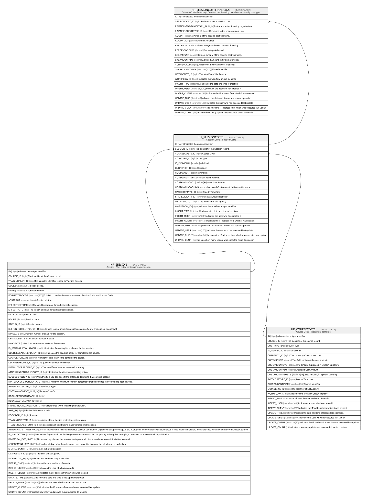

# HR_SESSIONCOSTS

## Description

Session Costs - Session Costs  

## Columns

| Name | Type | Default | Nullable | Children | Parents | Comment |
| ---- | ---- | ------- | -------- | -------- | ------- | ------- |
| ID | bigint |  | false | [HR_SESSIONCOSTFINANCING](HR_SESSIONCOSTFINANCING.md) |  | Indicates the unique identifier |
| SESSION_ID | bigint |  | false |  | [HR_SESSION](HR_SESSION.md) | The identifier of the Session record. |
| COURSECOSTS_ID | bigint |  | true |  | [HR_COURSECOSTS](HR_COURSECOSTS.md) | Course Costs |
| COSTTYPE_ID | bigint |  | false |  |  | Cost Type |
| IS_INDIVIDUAL | smallint |  | true |  |  | Individual |
| CURRENCY_ID | bigint |  | true |  |  | Currency |
| COSTAMOUNT | decimal |  | true |  |  | Amount |
| COSTAMOUNTSYS | decimal |  | true |  |  | System Amount |
| COSTAMOUNTADJ | decimal |  | true |  |  | Adjusted Cost Amount |
| COSTAMOUNTADJSYS | decimal |  | true |  |  |  Adjusted Cost Amount, in System Currency. |
| RATECOSTTYPE_ID | bigint |  | true |  |  | Rate by Time Unit |
| SHAREDIDENTIFIER | nvarchar(255) |  | true |  |  | Shared Identifier |
| LISTAGENCY_ID | bigint |  | true |  |  | The Identifier of List Agency. |
| WORKFLOW_ID | bigint |  | true |  |  | Indicates the workflow unique identifier |
| INSERT_TIME | datetime2 | (sysutcdatetime()) | false |  |  | Indicates the date and time of creation |
| INSERT_USER | nvarchar(100) | (N'MAIN') | false |  |  | Indicates the user who has created it |
| INSERT_CLIENT | nvarchar(50) | (N'localhost') | false |  |  | Indicates the IP address from which it was created |
| UPDATE_TIME | datetime2 | (sysutcdatetime()) | false |  |  | Indicates the date and time of last update operation |
| UPDATE_USER | nvarchar(100) | (N'MAIN') | false |  |  | Indicates the user who has executed last update |
| UPDATE_CLIENT | nvarchar(50) | (N'localhost') | false |  |  | Indicates the IP address from which was executed last update |
| UPDATE_COUNT | int | ((0)) | false |  |  | Indicates how many update was executed since its creation |

## Constraints

| Name | Type | Definition |
| ---- | ---- | ---------- |
| PK_HR_SESSIONCOSTS | PRIMARY KEY | CLUSTERED, unique, part of a PRIMARY KEY constraint, [ ID ] |
| UQ_SESSIONCOSTS | UNIQUE | NONCLUSTERED, unique, part of a UNIQUE constraint, [ SESSION_ID, COSTTYPE_ID ] |
| FK_SESSIONCOSTS_COURSECOSTS | FOREIGN KEY | FOREIGN KEY(COURSECOSTS_ID) REFERENCES HR_COURSECOSTS(ID) ON UPDATE NO_ACTION ON DELETE NO_ACTION |
| FK_SESSIONCOSTS_SESSION | FOREIGN KEY | FOREIGN KEY(SESSION_ID) REFERENCES HR_SESSION(ID) ON UPDATE NO_ACTION ON DELETE CASCADE |

## Indexes

| Name | Definition |
| ---- | ---------- |
| PK_HR_SESSIONCOSTS | CLUSTERED, unique, part of a PRIMARY KEY constraint, [ ID ] |
| UQ_SESSIONCOSTS | NONCLUSTERED, unique, part of a UNIQUE constraint, [ SESSION_ID, COSTTYPE_ID ] |

## Relations

---

> Generated by [tbls](https://github.com/k1LoW/tbls)
