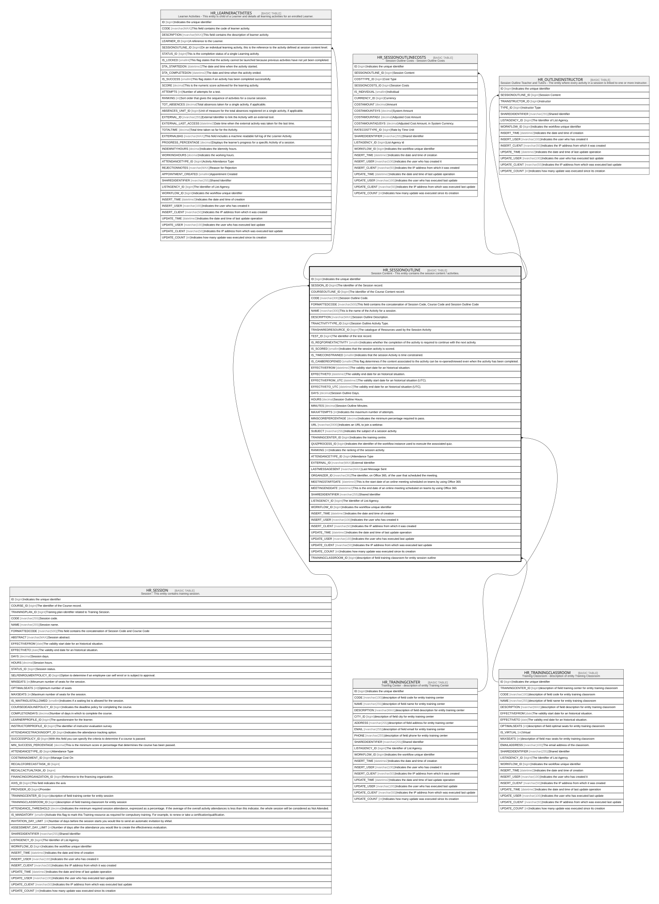

# HR_SESSIONOUTLINE

## Description

Session Content - This entity contains the session content / activities.  

## Columns

| Name | Type | Default | Nullable | Children | Parents | Comment |
| ---- | ---- | ------- | -------- | -------- | ------- | ------- |
| ID | bigint |  | false | [HR_LEARNERACTIVITIES](HR_LEARNERACTIVITIES.md) [HR_SESSIONOUTLINECOSTS](HR_SESSIONOUTLINECOSTS.md) [HR_OUTLINEINSTRUCTOR](HR_OUTLINEINSTRUCTOR.md) |  | Indicates the unique identifier |
| SESSION_ID | bigint |  | false |  | [HR_SESSION](HR_SESSION.md) | The identifier of the Session record. |
| COURSEOUTLINE_ID | bigint |  | true |  |  | The identifier of the Course Content record. |
| CODE | nvarchar(300) |  | false |  |  | Session Outline Code. |
| FORMATTEDCODE | nvarchar(500) |  | true |  |  | This field contains the concatenation of Session Code, Course Code and Session Outline Code |
| NAME | nvarchar(300) |  | false |  |  | This is the name of the Activity for a session. |
| DESCRIPTION | nvarchar(MAX) |  | true |  |  | Session Outline Description. |
| TRAACTIVITYTYPE_ID | bigint |  | true |  |  | Session Outline Activity Type. |
| TRASHAREDRESOURCE_ID | bigint |  | true |  |  | The catalogue of Resources used by the Session Activity |
| TEST_ID | bigint |  | true |  |  | The identifier of the test record. |
| IS_REQFORNEXTACTIVITY | smallint |  | true |  |  | Indicates whether the completion of the activity is required to continue with the next activity. |
| IS_SCORED | smallint |  | true |  |  | Indicates that the session activity is scored. |
| IS_TIMECONSTRAINED | smallint |  | true |  |  | Indicates that the session Activity is time constrained. |
| IS_CANBEREOPENED | smallint |  | true |  |  | This flag determines if the content associated to the activity can be re-opened/viewed even when the activity has been completed. |
| EFFECTIVEFROM | datetime2 |  | true |  |  | The validity start date for an historical situation. |
| EFFECTIVETO | datetime2 |  | true |  |  | The validity end date for an historical situation. |
| EFFECTIVEFROM_UTC | datetime2 |  | true |  |  | The validity start date for an historical situation (UTC). |
| EFFECTIVETO_UTC | datetime2 |  | true |  |  | The validity end date for an historical situation (UTC). |
| DAYS | decimal |  | true |  |  | Session Outline Days. |
| HOURS | decimal |  | true |  |  | Session Outline Hours. |
| MINUTES | decimal |  | true |  |  | Session Outline Minutes. |
| MAXATTEMPTS | int |  | true |  |  | Indicates the maximum number of attempts. |
| MINSCOREPERCENTAGE | decimal |  | true |  |  | Indicates the minimum percentage required to pass. |
| URL | nvarchar(2000) |  | true |  |  | Indicates an URL to join a webinar. |
| SUBJECT | nvarchar(255) |  | true |  |  | Indicates the subject of a session activity. |
| TRAININGCENTER_ID | bigint |  | true |  | [HR_TRAININGCENTER](HR_TRAININGCENTER.md) | Indicates the training centre. |
| QUIZPROCESS_ID | bigint |  | true |  |  | Indicates the identifier of the workflow instance used to execute the associated quiz. |
| RANKING | int |  | true |  |  | Indicates the ranking of the session activity. |
| ATTENDANCETYPE_ID | bigint |  | true |  |  | Attendance Type |
| EXTERNAL_ID | nvarchar(MAX) |  | true |  |  | External Identifier |
| LASTMESSAGESENT | nvarchar(MAX) |  | true |  |  | Last Message Sent |
| ORGANIZER_ID | nvarchar(36) |  | true |  |  | The identifier, on Office 365, of the user that scheduled the meeting. |
| MEETINGSTARTDATE | datetime2 |  | true |  |  | This is the start date of an online meeting scheduled on teams by using Office 365 |
| MEETINGENDDATE | datetime2 |  | true |  |  | This is the end date of an online meeting scheduled on teams by using Office 365 |
| SHAREDIDENTIFIER | nvarchar(255) |  | true |  |  | Shared Identifier |
| LISTAGENCY_ID | bigint |  | true |  |  | The Identifier of List Agency. |
| WORKFLOW_ID | bigint |  | true |  |  | Indicates the workflow unique identifier |
| INSERT_TIME | datetime2 | (sysutcdatetime()) | false |  |  | Indicates the date and time of creation |
| INSERT_USER | nvarchar(100) | (N'MAIN') | false |  |  | Indicates the user who has created it |
| INSERT_CLIENT | nvarchar(50) | (N'localhost') | false |  |  | Indicates the IP address from which it was created |
| UPDATE_TIME | datetime2 | (sysutcdatetime()) | false |  |  | Indicates the date and time of last update operation |
| UPDATE_USER | nvarchar(100) | (N'MAIN') | false |  |  | Indicates the user who has executed last update |
| UPDATE_CLIENT | nvarchar(50) | (N'localhost') | false |  |  | Indicates the IP address from which was executed last update |
| UPDATE_COUNT | int | ((0)) | false |  |  | Indicates how many update was executed since its creation |
| TRAININGCLASSROOM_ID | bigint |  | true |  | [HR_TRAININGCLASSROOM](HR_TRAININGCLASSROOM.md) | description of field training classroom for entity session outline |

## Constraints

| Name | Type | Definition |
| ---- | ---- | ---------- |
| PK_HR_SESSIONOUTLINE | PRIMARY KEY | CLUSTERED, unique, part of a PRIMARY KEY constraint, [ ID ] |
| UQ_SESSIONOUTLINE | UNIQUE | NONCLUSTERED, unique, part of a UNIQUE constraint, [ CODE, SESSION_ID ] |
| FK_SESSOUTLINE_TRACENTER | FOREIGN KEY | FOREIGN KEY(TRAININGCENTER_ID) REFERENCES HR_TRAININGCENTER(ID) ON UPDATE NO_ACTION ON DELETE NO_ACTION |
| FK_SESSOUTLINE_TRACLASS | FOREIGN KEY | FOREIGN KEY(TRAININGCLASSROOM_ID) REFERENCES HR_TRAININGCLASSROOM(ID) ON UPDATE NO_ACTION ON DELETE NO_ACTION |
| FK_SOUTLINE_SESSION | FOREIGN KEY | FOREIGN KEY(SESSION_ID) REFERENCES HR_SESSION(ID) ON UPDATE NO_ACTION ON DELETE CASCADE |

## Indexes

| Name | Definition |
| ---- | ---------- |
| PK_HR_SESSIONOUTLINE | CLUSTERED, unique, part of a PRIMARY KEY constraint, [ ID ] |
| UQ_SESSIONOUTLINE | NONCLUSTERED, unique, part of a UNIQUE constraint, [ CODE, SESSION_ID ] |

## Relations

---

> Generated by [tbls](https://github.com/k1LoW/tbls)
