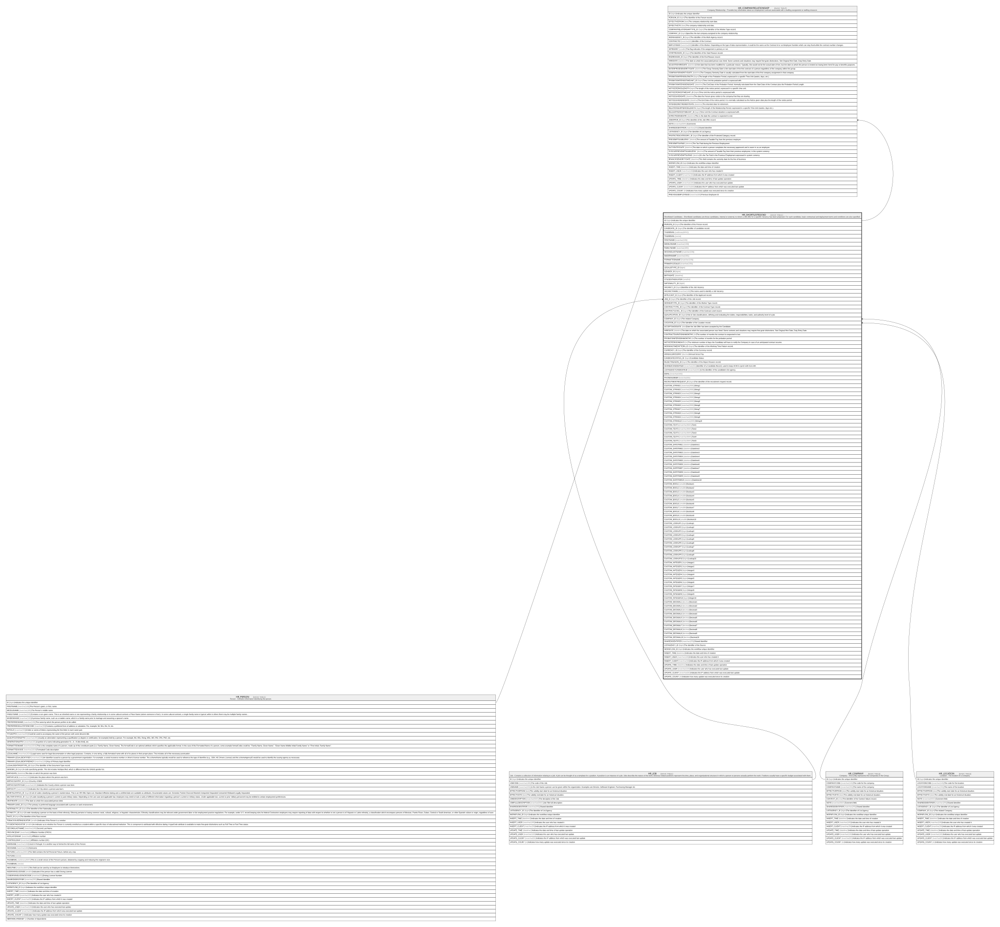

# HR_SHORTLISTEDCND

## Description

Shortlisted Candidates - Shortlisted candidates are those candidates, internal or external, to whom a Job offer for a specific Vacancy has been proposed. For each candidate, basic contractual and deployment terms and conditions are also specified.  

## Columns

| Name | Type | Default | Nullable | Children | Parents | Comment |
| ---- | ---- | ------- | -------- | -------- | ------- | ------- |
| ID | bigint |  | false | [HR_COMPANYRELATIONSHIP](HR_COMPANYRELATIONSHIP.md) |  | Indicates the unique identifier |
| PERSON_ID | bigint |  | true |  | [HR_PERSON](HR_PERSON.md) | The Identifier of the Person record. |
| CANDIDATE_ID | bigint |  | true |  |  | The identifier of candidate record. |
| THUMBNAIL | varbinary(MAX) |  | true |  |  |  |
| THUMBNAIL | vector |  | true |  |  |  |
| FIRSTNAME | nvarchar(100) |  | true |  |  |  |
| MIDDLENAME | nvarchar(100) |  | true |  |  |  |
| FAMILYNAME | nvarchar(100) |  | true |  |  |  |
| SECONDLASTNAME | nvarchar(100) |  | true |  |  |  |
| MAIDENNAME | nvarchar(100) |  | true |  |  |  |
| FORMATTEDNAME | nvarchar(100) |  | true |  |  |  |
| PRIMARYLEGALID | nvarchar(100) |  | true |  |  |  |
| LEGALIDTYPE_ID | bigint |  | true |  |  |  |
| GENDER_ID | bigint |  | true |  |  |  |
| BIRTHDATE | datetime |  | true |  |  |  |
| STUDENTINDICATOR | smallint |  | true |  |  |  |
| NATIONALITY_ID | bigint |  | true |  |  |  |
| VACANCY_ID | bigint |  | true |  |  | Identifier of the Job Vacancy |
| VACANCYNAME | nvarchar(100) |  | true |  |  | The name used to identify a Job Vacancy. |
| APPLICANT_ID | bigint |  | true |  |  | The identifier of the Applicant record. |
| JOB_ID | bigint |  | true |  | [HR_JOB](HR_JOB.md) | The Identifier of the Job record. |
| WORKERTYPE_ID | bigint |  | true |  |  | The identifier of the Worker Type record. |
| CONTRACTTYPE_ID | bigint |  | true |  |  | The Identifier of the Contract Type record. |
| CONTRACTLEVEL_ID | bigint |  | true |  |  | The Identifier of the Contract Level record. |
| QUALIFICATION_ID | bigint |  | true |  |  | A list of Job classifications, defining and evaluating the duties, responsibilities, tasks, and authority level of a job. |
| COMPANY_ID | bigint |  | true |  | [HR_COMPANY](HR_COMPANY.md) | The related Company. |
| LOCATION_ID | bigint |  | true |  | [HR_LOCATION](HR_LOCATION.md) | The Identifier of the Location record. |
| ACCEPTANCEDATE | date |  | true |  |  | Date the Job Offer has been accepted by the Candidate. |
| HIREDATE | datetime |  | true |  |  | The date on which the associated person was hired. Some contexts and situations may require fine-grain distinctions. See Original Hire Date, Duty Entry Date. |
| CONTRACTDURATIONINMONTHS | int |  | true |  |  | The number of months the contract is exepected to last. |
| PROBATIONPERIODINMONTHS | int |  | true |  |  | The number of months for the probation period. |
| NOTICEPERIODINDAYS | int |  | true |  |  | The minimum number of days the Candidate will have to notify the Company in case of an anticipated contract resume. |
| WORKINGTIMEPATTERN_ID | bigint |  | true |  |  | The Identifier of the Working Time Pattern record. |
| CURRENCY_ID | bigint |  | true |  |  | The Identifier of the Currency record. |
| ANNUALGROSSPAY | decimal |  | true |  |  | Annual Gross Pay |
| CANDIDATESTATUS_ID | bigint |  | true |  |  | Candidate Status |
| REJECTREASON_ID | bigint |  | true |  |  | The Identifier of the Reject Reason record. |
| SHAREDCANDIDATEID | nvarchar(255) |  | true |  |  | Identifier of a Candidate Record, used to keep HCM in synch with Core HR. |
| LISTAGENCYCANDIDATEID | nvarchar(255) |  | true |  |  | Is the identifier of the candidate's list agency. |
| EMAIL | nvarchar(100) |  | true |  |  |  |
| PHONENUMBER | nvarchar(30) |  | true |  |  |  |
| RECRUITMENTREQUEST_ID | bigint |  | true |  |  | The identifier of the recruitment request record. |
| CUSTOM_STRING1 | nvarchar(2000) |  | true |  |  | String1 |
| CUSTOM_STRING2 | nvarchar(2000) |  | true |  |  | String2 |
| CUSTOM_STRING3 | nvarchar(2000) |  | true |  |  | String3 |
| CUSTOM_STRING4 | nvarchar(2000) |  | true |  |  | String4 |
| CUSTOM_STRING5 | nvarchar(2000) |  | true |  |  | String5 |
| CUSTOM_STRING6 | nvarchar(2000) |  | true |  |  | String6 |
| CUSTOM_STRING7 | nvarchar(2000) |  | true |  |  | String7 |
| CUSTOM_STRING8 | nvarchar(2000) |  | true |  |  | String8 |
| CUSTOM_STRING9 | nvarchar(2000) |  | true |  |  | String9 |
| CUSTOM_STRING10 | nvarchar(2000) |  | true |  |  | String10 |
| CUSTOM_TEXT1 | nvarchar(MAX) |  | true |  |  | Text1 |
| CUSTOM_TEXT2 | nvarchar(MAX) |  | true |  |  | Text2 |
| CUSTOM_TEXT3 | nvarchar(MAX) |  | true |  |  | Text3 |
| CUSTOM_TEXT4 | nvarchar(MAX) |  | true |  |  | Text4 |
| CUSTOM_TEXT5 | nvarchar(MAX) |  | true |  |  | Text5 |
| CUSTOM_DATETIME1 | datetime |  | true |  |  | Datetime1 |
| CUSTOM_DATETIME2 | datetime |  | true |  |  | Datetime2 |
| CUSTOM_DATETIME3 | datetime |  | true |  |  | Datetime3 |
| CUSTOM_DATETIME4 | datetime |  | true |  |  | Datetime4 |
| CUSTOM_DATETIME5 | datetime |  | true |  |  | Datetime5 |
| CUSTOM_DATETIME6 | datetime |  | true |  |  | Datetime6 |
| CUSTOM_DATETIME7 | datetime |  | true |  |  | Datetime7 |
| CUSTOM_DATETIME8 | datetime |  | true |  |  | Datetime8 |
| CUSTOM_DATETIME9 | datetime |  | true |  |  | Datetime9 |
| CUSTOM_DATETIME10 | datetime |  | true |  |  | Datetime10 |
| CUSTOM_BOOL1 | smallint |  | true |  |  | Boolean1 |
| CUSTOM_BOOL2 | smallint |  | true |  |  | Boolean2 |
| CUSTOM_BOOL3 | smallint |  | true |  |  | Boolean3 |
| CUSTOM_BOOL4 | smallint |  | true |  |  | Boolean4 |
| CUSTOM_BOOL5 | smallint |  | true |  |  | Boolean5 |
| CUSTOM_BOOL6 | smallint |  | true |  |  | Boolean6 |
| CUSTOM_BOOL7 | smallint |  | true |  |  | Boolean7 |
| CUSTOM_BOOL8 | smallint |  | true |  |  | Boolean8 |
| CUSTOM_BOOL9 | smallint |  | true |  |  | Boolean9 |
| CUSTOM_BOOL10 | smallint |  | true |  |  | Boolean10 |
| CUSTOM_LOOKUP1 | bigint |  | true |  |  | Lookup1 |
| CUSTOM_LOOKUP2 | bigint |  | true |  |  | Lookup2 |
| CUSTOM_LOOKUP3 | bigint |  | true |  |  | Lookup3 |
| CUSTOM_LOOKUP4 | bigint |  | true |  |  | Lookup4 |
| CUSTOM_LOOKUP5 | bigint |  | true |  |  | Lookup5 |
| CUSTOM_LOOKUP6 | bigint |  | true |  |  | Lookup6 |
| CUSTOM_LOOKUP7 | bigint |  | true |  |  | Lookup7 |
| CUSTOM_LOOKUP8 | bigint |  | true |  |  | Lookup8 |
| CUSTOM_LOOKUP9 | bigint |  | true |  |  | Lookup9 |
| CUSTOM_LOOKUP10 | bigint |  | true |  |  | Lookup10 |
| CUSTOM_INTEGER1 | bigint |  | true |  |  | Integer1 |
| CUSTOM_INTEGER2 | bigint |  | true |  |  | Integer2 |
| CUSTOM_INTEGER3 | bigint |  | true |  |  | Integer3 |
| CUSTOM_INTEGER4 | bigint |  | true |  |  | Integer4 |
| CUSTOM_INTEGER5 | bigint |  | true |  |  | Integer5 |
| CUSTOM_INTEGER6 | bigint |  | true |  |  | Integer6 |
| CUSTOM_INTEGER7 | bigint |  | true |  |  | Integer7 |
| CUSTOM_INTEGER8 | bigint |  | true |  |  | Integer8 |
| CUSTOM_INTEGER9 | bigint |  | true |  |  | Integer9 |
| CUSTOM_INTEGER10 | bigint |  | true |  |  | Integer10 |
| CUSTOM_DECIMAL1 | decimal |  | true |  |  | Decimal1 |
| CUSTOM_DECIMAL2 | decimal |  | true |  |  | Decimal2 |
| CUSTOM_DECIMAL3 | decimal |  | true |  |  | Decimal3 |
| CUSTOM_DECIMAL4 | decimal |  | true |  |  | Decimal4 |
| CUSTOM_DECIMAL5 | decimal |  | true |  |  | Decimal5 |
| CUSTOM_DECIMAL6 | decimal |  | true |  |  | Decimal6 |
| CUSTOM_DECIMAL7 | decimal |  | true |  |  | Decimal7 |
| CUSTOM_DECIMAL8 | decimal |  | true |  |  | Decimal8 |
| CUSTOM_DECIMAL9 | decimal |  | true |  |  | Decimal9 |
| CUSTOM_DECIMAL10 | decimal |  | true |  |  | Decimal10 |
| SHAREDIDENTIFIER | nvarchar(255) |  | true |  |  | Shared Identifier |
| LISTAGENCY_ID | bigint |  | true |  |  | The identifier of the Source |
| WORKFLOW_ID | bigint |  | true |  |  | Indicates the workflow unique identifier |
| INSERT_TIME | datetime2 | (sysutcdatetime()) | false |  |  | Indicates the date and time of creation |
| INSERT_USER | nvarchar(100) | (N'MAIN') | false |  |  | Indicates the user who has created it |
| INSERT_CLIENT | nvarchar(50) | (N'localhost') | false |  |  | Indicates the IP address from which it was created |
| UPDATE_TIME | datetime2 | (sysutcdatetime()) | false |  |  | Indicates the date and time of last update operation |
| UPDATE_USER | nvarchar(100) | (N'MAIN') | false |  |  | Indicates the user who has executed last update |
| UPDATE_CLIENT | nvarchar(50) | (N'localhost') | false |  |  | Indicates the IP address from which was executed last update |
| UPDATE_COUNT | int | ((0)) | false |  |  | Indicates how many update was executed since its creation |

## Constraints

| Name | Type | Definition |
| ---- | ---- | ---------- |
| PK_HR_SHORTLISTEDCND | PRIMARY KEY | CLUSTERED, unique, part of a PRIMARY KEY constraint, [ ID ] |
| FK_HR_SLISTEDCND_HR_COMPANY | FOREIGN KEY | FOREIGN KEY(COMPANY_ID) REFERENCES HR_COMPANY(ID) ON UPDATE NO_ACTION ON DELETE NO_ACTION |
| FK_HR_SLISTEDCND_HR_JOB | FOREIGN KEY | FOREIGN KEY(JOB_ID) REFERENCES HR_JOB(ID) ON UPDATE NO_ACTION ON DELETE NO_ACTION |
| FK_HR_SLISTEDCND_HR_LOCATION | FOREIGN KEY | FOREIGN KEY(LOCATION_ID) REFERENCES HR_LOCATION(ID) ON UPDATE NO_ACTION ON DELETE NO_ACTION |
| FK_HR_SLISTEDCND_HR_PERSON | FOREIGN KEY | FOREIGN KEY(PERSON_ID) REFERENCES HR_PERSON(ID) ON UPDATE NO_ACTION ON DELETE SET_NULL |

## Indexes

| Name | Definition |
| ---- | ---------- |
| PK_HR_SHORTLISTEDCND | CLUSTERED, unique, part of a PRIMARY KEY constraint, [ ID ] |

## Relations

---

> Generated by [tbls](https://github.com/k1LoW/tbls)
