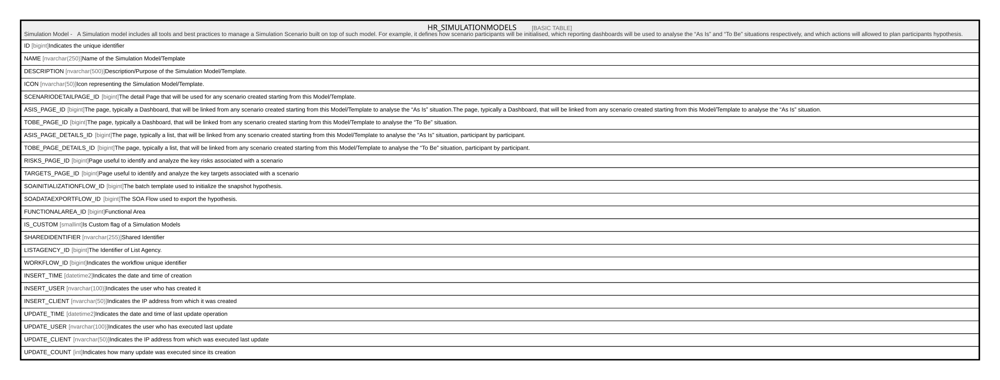

# HR_SIMULATIONMODELS

## Description

Simulation Model -   A Simulation model includes all tools and best practices to manage a Simulation Scenario built on top of such model. For example, it defines how scenario participants will be initialised, which reporting dashboards will be used to analyse the “As Is” and “To Be” situations respectively, and which actions will allowed to plan participants hypothesis.  

## Columns

| Name | Type | Default | Nullable | Comment |
| ---- | ---- | ------- | -------- | ------- |
| ID | bigint |  | false | Indicates the unique identifier |
| NAME | nvarchar(250) |  | true | Name of the Simulation Model/Template |
| DESCRIPTION | nvarchar(500) |  | true | Description/Purpose of the Simulation Model/Template. |
| ICON | nvarchar(50) |  | true | Icon representing the Simulation Model/Template. |
| SCENARIODETAILPAGE_ID | bigint |  | true | The detail Page that will be used for any scenario created starting from this Model/Template. |
| ASIS_PAGE_ID | bigint |  | true | The page, typically a Dashboard, that will be linked from any scenario created starting from this Model/Template to analyse the “As Is” situation.The page, typically a Dashboard, that will be linked from any scenario created starting from this Model/Template to analyse the “As Is” situation. |
| TOBE_PAGE_ID | bigint |  | true | The page, typically a Dashboard, that will be linked from any scenario created starting from this Model/Template to analyse the “To Be” situation. |
| ASIS_PAGE_DETAILS_ID | bigint |  | true | The page, typically a list, that will be linked from any scenario created starting from this Model/Template to analyse the “As Is” situation, participant by participant. |
| TOBE_PAGE_DETAILS_ID | bigint |  | true | The page, typically a list, that will be linked from any scenario created starting from this Model/Template to analyse the “To Be” situation, participant by participant. |
| RISKS_PAGE_ID | bigint |  | true | Page useful to identify and analyze the key risks associated with a scenario |
| TARGETS_PAGE_ID | bigint |  | true | Page useful to identify and analyze the key targets associated with a scenario |
| SOAINITIALIZATIONFLOW_ID | bigint |  | true | The batch template used to initialize the snapshot hypothesis. |
| SOADATAEXPORTFLOW_ID | bigint |  | true | The SOA Flow used to export the hypothesis. |
| FUNCTIONALAREA_ID | bigint |  | true | Functional Area |
| IS_CUSTOM | smallint |  | true | Is Custom flag of a Simulation Models |
| SHAREDIDENTIFIER | nvarchar(255) |  | true | Shared Identifier |
| LISTAGENCY_ID | bigint |  | true | The Identifier of List Agency. |
| WORKFLOW_ID | bigint |  | true | Indicates the workflow unique identifier |
| INSERT_TIME | datetime2 |  | false | Indicates the date and time of creation |
| INSERT_USER | nvarchar(100) |  | false | Indicates the user who has created it |
| INSERT_CLIENT | nvarchar(50) |  | false | Indicates the IP address from which it was created |
| UPDATE_TIME | datetime2 |  | false | Indicates the date and time of last update operation |
| UPDATE_USER | nvarchar(100) |  | false | Indicates the user who has executed last update |
| UPDATE_CLIENT | nvarchar(50) |  | false | Indicates the IP address from which was executed last update |
| UPDATE_COUNT | int |  | false | Indicates how many update was executed since its creation |

## Constraints

| Name | Type | Definition |
| ---- | ---- | ---------- |
| PK_HR_SIMULATIONMODELS | PRIMARY KEY | CLUSTERED, unique, part of a PRIMARY KEY constraint, [ ID ] |

## Indexes

| Name | Definition |
| ---- | ---------- |
| PK_HR_SIMULATIONMODELS | CLUSTERED, unique, part of a PRIMARY KEY constraint, [ ID ] |

## Relations

---

> Generated by [tbls](https://github.com/k1LoW/tbls)
