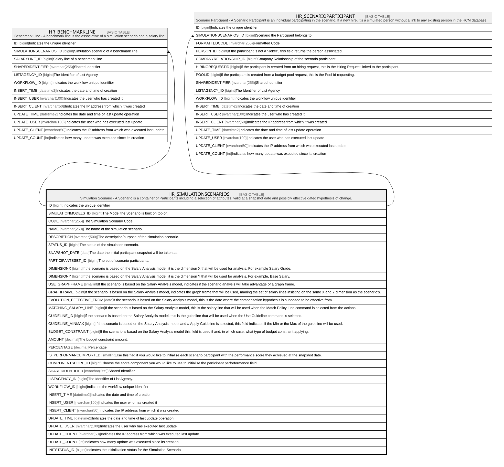

# HR_SIMULATIONSCENARIOS

## Description

Simulation Scenario - A Scenario is a container of Participants including a selection of attributes, valid at a snapshot date and possibly effective dated hypothesis of change.  

## Columns

| Name | Type | Default | Nullable | Children | Comment |
| ---- | ---- | ------- | -------- | -------- | ------- |
| ID | bigint |  | false | [HR_BENCHMARKLINE](HR_BENCHMARKLINE.md) [HR_SCENARIOPARTICIPANT](HR_SCENARIOPARTICIPANT.md) | Indicates the unique identifier |
| SIMULATIONMODELS_ID | bigint |  | false |  | The Model the Scenario is built on top of. |
| CODE | nvarchar(255) |  | false |  | The Simulation Scenario Code. |
| NAME | nvarchar(250) |  | true |  | The name of the simulation scenario. |
| DESCRIPTION | nvarchar(500) |  | true |  | The description/purpose of the simulation scenario. |
| STATUS_ID | bigint |  | true |  | The status of the simulation scenario. |
| SNAPSHOT_DATE | date |  | true |  | The date the initial participant snapshot will be taken at. |
| PARTICIPANTSSET_ID | bigint |  | true |  | The set of scenario participants. |
| DIMENSIONX | bigint |  | true |  | If the scenario is based on the Salary Analysis model, it is the dimension X that will be used for analysis. For example Salary Grade. |
| DIMENSIONY | bigint |  | true |  | If the scenario is based on the Salary Analysis model, it is the dimension Y that will be used for analysis. For example, Base Salary. |
| USE_GRAPHFRAME | smallint |  | true |  | If the scenario is based on the Salary Analysis model, indicates if the scenario analysis will take advantage of a graph frame. |
| GRAPHFRAME | bigint |  | true |  | If the scenario is based on the Salary Analysis model, indicates the graph frame that will be used, maning the set of salary lines insisting on the same X and Y dimension as the scenario’s. |
| EVOLUTION_EFFECTIVE_FROM | date |  | true |  | If the scenario is based on the Salary Analysis model, this is the date where the compensation hypothesis is supposed to be effective from. |
| MATCHING_SALARY_LINE | bigint |  | true |  | If the scenario is based on the Salary Analysis model, this is the salary line that will be used when the Match Policy Line command is selected from the actions. |
| GUIDELINE_ID | bigint |  | true |  | If the scenario is based on the Salary Analysis model, this is the guideline that will be used when the Use Guideline command is selected. |
| GUIDELINE_MINMAX | bigint |  | true |  | If the scenario is based on the Salary Analysis model and a Apply Guideline is selected, this field indicates if the Min or the Max of the guideline will be used. |
| BUDGET_CONSTRAINT | bigint |  | true |  | If the scenario is based on the Salary Analysis model this field is used if and, in which case, what type of budget constraint applying. |
| AMOUNT | decimal |  | true |  | The budget constraint amount. |
| PERCENTAGE | decimal |  | true |  | Percentage |
| IS_PERFORMANCEIMPORTED | smallint |  | true |  | Use this flag if you would like to initialise each scenario participant with the performance score they achieved at the snapshot date. |
| COMPONENTSCORE_ID | bigint |  | true |  | Choose the score component you would like to use to initialise the participant perforformance field. |
| SHAREDIDENTIFIER | nvarchar(255) |  | true |  | Shared Identifier |
| LISTAGENCY_ID | bigint |  | true |  | The Identifier of List Agency. |
| WORKFLOW_ID | bigint |  | true |  | Indicates the workflow unique identifier |
| INSERT_TIME | datetime2 |  | false |  | Indicates the date and time of creation |
| INSERT_USER | nvarchar(100) |  | false |  | Indicates the user who has created it |
| INSERT_CLIENT | nvarchar(50) |  | false |  | Indicates the IP address from which it was created |
| UPDATE_TIME | datetime2 |  | false |  | Indicates the date and time of last update operation |
| UPDATE_USER | nvarchar(100) |  | false |  | Indicates the user who has executed last update |
| UPDATE_CLIENT | nvarchar(50) |  | false |  | Indicates the IP address from which was executed last update |
| UPDATE_COUNT | int |  | false |  | Indicates how many update was executed since its creation |
| INITSTATUS_ID | bigint |  | true |  | Indicates the initialization status for the Simulation Scenario |

## Constraints

| Name | Type | Definition |
| ---- | ---- | ---------- |
| PK_HR_SIMULATIONSCENARIOS | PRIMARY KEY | CLUSTERED, unique, part of a PRIMARY KEY constraint, [ ID ] |
| UQ_SIMSCENARIO | UNIQUE | NONCLUSTERED, unique, part of a UNIQUE constraint, [ CODE ] |

## Indexes

| Name | Definition |
| ---- | ---------- |
| PK_HR_SIMULATIONSCENARIOS | CLUSTERED, unique, part of a PRIMARY KEY constraint, [ ID ] |
| UQ_SIMSCENARIO | NONCLUSTERED, unique, part of a UNIQUE constraint, [ CODE ] |
| IDX_SIMULATIONSCENARIOS_DIMX | NONCLUSTERED, [ DIMENSIONX ] |
| IDX_SIMULATIONSCENARIOS_DIMY | NONCLUSTERED, [ DIMENSIONY ] |

## Relations

---

> Generated by [tbls](https://github.com/k1LoW/tbls)
