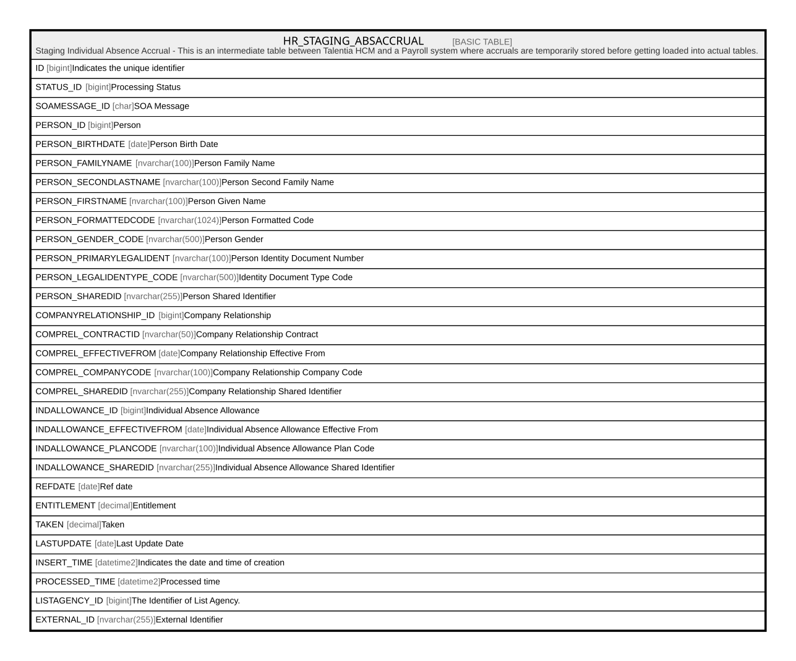

# HR_STAGING_ABSACCRUAL

## Description

Staging Individual Absence Accrual - This is an intermediate table between Talentia HCM and a Payroll system where accruals are temporarily stored before getting loaded into actual tables.  

## Columns

| Name | Type | Default | Nullable | Comment |
| ---- | ---- | ------- | -------- | ------- |
| ID | bigint |  | false | Indicates the unique identifier |
| STATUS_ID | bigint |  | true | Processing Status |
| SOAMESSAGE_ID | char |  | true | SOA Message |
| PERSON_ID | bigint |  | true | Person |
| PERSON_BIRTHDATE | date |  | true | Person Birth Date |
| PERSON_FAMILYNAME | nvarchar(100) |  | true | Person Family Name |
| PERSON_SECONDLASTNAME | nvarchar(100) |  | true | Person Second Family Name |
| PERSON_FIRSTNAME | nvarchar(100) |  | true | Person Given Name |
| PERSON_FORMATTEDCODE | nvarchar(1024) |  | true | Person Formatted Code |
| PERSON_GENDER_CODE | nvarchar(500) |  | true | Person Gender |
| PERSON_PRIMARYLEGALIDENT | nvarchar(100) |  | true | Person Identity Document Number |
| PERSON_LEGALIDENTYPE_CODE | nvarchar(500) |  | true | Identity Document Type Code |
| PERSON_SHAREDID | nvarchar(255) |  | true | Person Shared Identifier |
| COMPANYRELATIONSHIP_ID | bigint |  | true | Company Relationship |
| COMPREL_CONTRACTID | nvarchar(50) |  | true | Company Relationship Contract |
| COMPREL_EFFECTIVEFROM | date |  | true | Company Relationship Effective From |
| COMPREL_COMPANYCODE | nvarchar(100) |  | true | Company Relationship Company Code |
| COMPREL_SHAREDID | nvarchar(255) |  | true | Company Relationship Shared Identifier |
| INDALLOWANCE_ID | bigint |  | true | Individual Absence Allowance |
| INDALLOWANCE_EFFECTIVEFROM | date |  | true | Individual Absence Allowance Effective From |
| INDALLOWANCE_PLANCODE | nvarchar(100) |  | true | Individual Absence Allowance Plan Code |
| INDALLOWANCE_SHAREDID | nvarchar(255) |  | true | Individual Absence Allowance Shared Identifier |
| REFDATE | date |  | true | Ref date |
| ENTITLEMENT | decimal |  | true | Entitlement |
| TAKEN | decimal |  | true | Taken |
| LASTUPDATE | date |  | true | Last Update Date |
| INSERT_TIME | datetime2 | (sysutcdatetime()) | false | Indicates the date and time of creation |
| PROCESSED_TIME | datetime2 |  | true | Processed time |
| LISTAGENCY_ID | bigint |  | true | The Identifier of List Agency. |
| EXTERNAL_ID | nvarchar(255) |  | true | External Identifier |

## Constraints

| Name | Type | Definition |
| ---- | ---- | ---------- |
| PK_HR_STAGING_ABSACCRUAL | PRIMARY KEY | CLUSTERED, unique, part of a PRIMARY KEY constraint, [ ID ] |

## Indexes

| Name | Definition |
| ---- | ---------- |
| PK_HR_STAGING_ABSACCRUAL | CLUSTERED, unique, part of a PRIMARY KEY constraint, [ ID ] |

## Relations

---

> Generated by [tbls](https://github.com/k1LoW/tbls)
