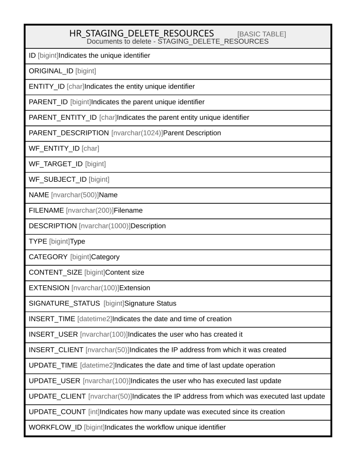

# HR_STAGING_DELETE_RESOURCES

## Description

Documents to delete - STAGING_DELETE_RESOURCES  

## Columns

| Name | Type | Default | Nullable | Comment |
| ---- | ---- | ------- | -------- | ------- |
| ID | bigint |  | false | Indicates the unique identifier |
| ORIGINAL_ID | bigint |  | false |  |
| ENTITY_ID | char |  | false | Indicates the entity unique identifier |
| PARENT_ID | bigint |  | false | Indicates the parent unique identifier |
| PARENT_ENTITY_ID | char |  | false | Indicates the parent entity unique identifier |
| PARENT_DESCRIPTION | nvarchar(1024) |  | true | Parent Description |
| WF_ENTITY_ID | char |  | true |  |
| WF_TARGET_ID | bigint |  | true |  |
| WF_SUBJECT_ID | bigint |  | true |  |
| NAME | nvarchar(500) |  | true | Name |
| FILENAME | nvarchar(200) |  | true | Filename |
| DESCRIPTION | nvarchar(1000) |  | false | Description |
| TYPE | bigint |  | true | Type |
| CATEGORY | bigint |  | true | Category |
| CONTENT_SIZE | bigint |  | true | Content size |
| EXTENSION | nvarchar(100) |  | true | Extension |
| SIGNATURE_STATUS | bigint | ((0)) | false | Signature Status |
| INSERT_TIME | datetime2 | (sysutcdatetime()) | false | Indicates the date and time of creation |
| INSERT_USER | nvarchar(100) | (N'MAIN') | false | Indicates the user who has created it |
| INSERT_CLIENT | nvarchar(50) | (N'localhost') | false | Indicates the IP address from which it was created |
| UPDATE_TIME | datetime2 | (sysutcdatetime()) | false | Indicates the date and time of last update operation |
| UPDATE_USER | nvarchar(100) | (N'MAIN') | false | Indicates the user who has executed last update |
| UPDATE_CLIENT | nvarchar(50) | (N'localhost') | false | Indicates the IP address from which was executed last update |
| UPDATE_COUNT | int | ((0)) | false | Indicates how many update was executed since its creation |
| WORKFLOW_ID | bigint |  | true | Indicates the workflow unique identifier |

## Constraints

| Name | Type | Definition |
| ---- | ---- | ---------- |
| PK_STAGING_DELETE_RESOURCES | PRIMARY KEY | CLUSTERED, unique, part of a PRIMARY KEY constraint, [ ID ] |

## Indexes

| Name | Definition |
| ---- | ---------- |
| PK_STAGING_DELETE_RESOURCES | CLUSTERED, unique, part of a PRIMARY KEY constraint, [ ID ] |

## Relations

---

> Generated by [tbls](https://github.com/k1LoW/tbls)
