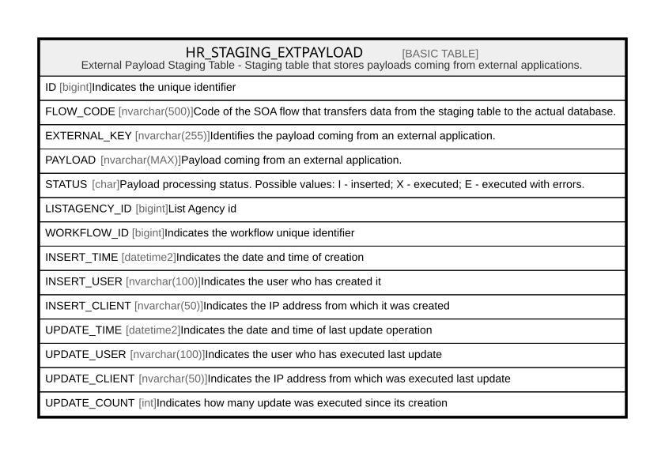

# HR_STAGING_EXTPAYLOAD

## Description

External Payload Staging Table - Staging table that stores payloads coming from external applications.  

## Columns

| Name | Type | Default | Nullable | Comment |
| ---- | ---- | ------- | -------- | ------- |
| ID | bigint |  | false | Indicates the unique identifier |
| FLOW_CODE | nvarchar(500) |  | false | Code of the SOA flow that transfers data from the staging table to the actual database. |
| EXTERNAL_KEY | nvarchar(255) |  | true | Identifies the payload coming from an external application. |
| PAYLOAD | nvarchar(MAX) |  | true | Payload coming from an external application. |
| STATUS | char |  | true | Payload processing status. Possible values: I - inserted; X - executed; E - executed with errors. |
| LISTAGENCY_ID | bigint |  | true | List Agency id |
| WORKFLOW_ID | bigint |  | true | Indicates the workflow unique identifier |
| INSERT_TIME | datetime2 | (sysutcdatetime()) | false | Indicates the date and time of creation |
| INSERT_USER | nvarchar(100) | (N'MAIN') | false | Indicates the user who has created it |
| INSERT_CLIENT | nvarchar(50) | (N'localhost') | false | Indicates the IP address from which it was created |
| UPDATE_TIME | datetime2 | (sysutcdatetime()) | false | Indicates the date and time of last update operation |
| UPDATE_USER | nvarchar(100) | (N'MAIN') | false | Indicates the user who has executed last update |
| UPDATE_CLIENT | nvarchar(50) | (N'localhost') | false | Indicates the IP address from which was executed last update |
| UPDATE_COUNT | int | ((0)) | false | Indicates how many update was executed since its creation |

## Constraints

| Name | Type | Definition |
| ---- | ---- | ---------- |
| PK_STAGING_EXTPAYLOAD | PRIMARY KEY | CLUSTERED, unique, part of a PRIMARY KEY constraint, [ ID ] |

## Indexes

| Name | Definition |
| ---- | ---------- |
| PK_STAGING_EXTPAYLOAD | CLUSTERED, unique, part of a PRIMARY KEY constraint, [ ID ] |
| IDX_EXTPAYLOAD_SOA_STATUS | NONCLUSTERED, [ FLOW_CODE, STATUS ] |
| IDX_EXTPL_UPDATE_TIME | NONCLUSTERED, [ UPDATE_TIME ] |

## Relations

---

> Generated by [tbls](https://github.com/k1LoW/tbls)
