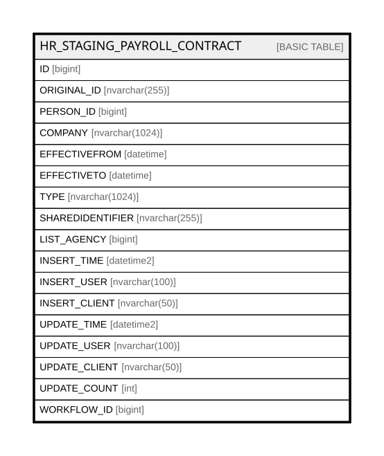

# HR_STAGING_PAYROLL_CONTRACT

## Columns

| Name | Type | Default | Nullable | Comment |
| ---- | ---- | ------- | -------- | ------- |
| ID | bigint |  | false |  |
| ORIGINAL_ID | nvarchar(255) |  | true |  |
| PERSON_ID | bigint |  | false |  |
| COMPANY | nvarchar(1024) |  | true |  |
| EFFECTIVEFROM | datetime |  | true |  |
| EFFECTIVETO | datetime |  | true |  |
| TYPE | nvarchar(1024) |  | true |  |
| SHAREDIDENTIFIER | nvarchar(255) |  | true |  |
| LIST_AGENCY | bigint |  | true |  |
| INSERT_TIME | datetime2 | (sysutcdatetime()) | false |  |
| INSERT_USER | nvarchar(100) | (N'MAIN') | false |  |
| INSERT_CLIENT | nvarchar(50) | (N'localhost') | false |  |
| UPDATE_TIME | datetime2 | (sysutcdatetime()) | false |  |
| UPDATE_USER | nvarchar(100) | (N'MAIN') | false |  |
| UPDATE_CLIENT | nvarchar(50) | (N'localhost') | false |  |
| UPDATE_COUNT | int | ((0)) | false |  |
| WORKFLOW_ID | bigint |  | true |  |

## Constraints

| Name | Type | Definition |
| ---- | ---- | ---------- |
| PK_STAGING_PAYROLL_CONTRACT | PRIMARY KEY | CLUSTERED, unique, part of a PRIMARY KEY constraint, [ ID ] |

## Indexes

| Name | Definition |
| ---- | ---------- |
| PK_STAGING_PAYROLL_CONTRACT | CLUSTERED, unique, part of a PRIMARY KEY constraint, [ ID ] |

## Relations

---

> Generated by [tbls](https://github.com/k1LoW/tbls)
