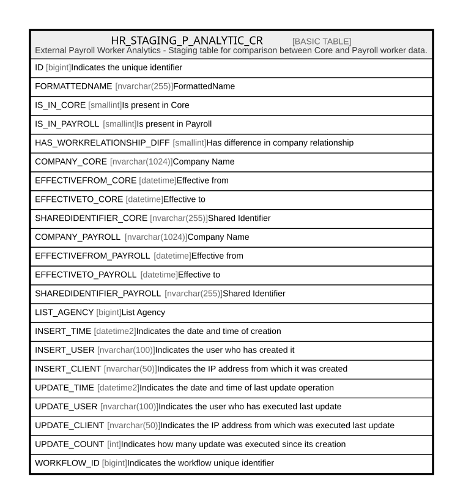

# HR_STAGING_P_ANALYTIC_CR

## Description

External Payroll Worker Analytics - Staging table for comparison between Core and Payroll worker data.  

## Columns

| Name | Type | Default | Nullable | Comment |
| ---- | ---- | ------- | -------- | ------- |
| ID | bigint |  | false | Indicates the unique identifier |
| FORMATTEDNAME | nvarchar(255) |  | false | FormattedName |
| IS_IN_CORE | smallint |  | true | Is present in Core |
| IS_IN_PAYROLL | smallint |  | true | Is present in Payroll |
| HAS_WORKRELATIONSHIP_DIFF | smallint |  | true | Has difference in company relationship |
| COMPANY_CORE | nvarchar(1024) |  | true | Company Name |
| EFFECTIVEFROM_CORE | datetime |  | true | Effective from |
| EFFECTIVETO_CORE | datetime |  | true | Effective to |
| SHAREDIDENTIFIER_CORE | nvarchar(255) |  | true | Shared Identifier |
| COMPANY_PAYROLL | nvarchar(1024) |  | true | Company Name |
| EFFECTIVEFROM_PAYROLL | datetime |  | true | Effective from |
| EFFECTIVETO_PAYROLL | datetime |  | true | Effective to |
| SHAREDIDENTIFIER_PAYROLL | nvarchar(255) |  | true | Shared Identifier |
| LIST_AGENCY | bigint |  | true | List Agency |
| INSERT_TIME | datetime2 | (sysutcdatetime()) | false | Indicates the date and time of creation |
| INSERT_USER | nvarchar(100) | (N'MAIN') | false | Indicates the user who has created it |
| INSERT_CLIENT | nvarchar(50) | (N'localhost') | false | Indicates the IP address from which it was created |
| UPDATE_TIME | datetime2 | (sysutcdatetime()) | false | Indicates the date and time of last update operation |
| UPDATE_USER | nvarchar(100) | (N'MAIN') | false | Indicates the user who has executed last update |
| UPDATE_CLIENT | nvarchar(50) | (N'localhost') | false | Indicates the IP address from which was executed last update |
| UPDATE_COUNT | int | ((0)) | false | Indicates how many update was executed since its creation |
| WORKFLOW_ID | bigint |  | true | Indicates the workflow unique identifier |

## Constraints

| Name | Type | Definition |
| ---- | ---- | ---------- |
| PK_STAGING_PAYROLL_ANALYTIC_CR | PRIMARY KEY | CLUSTERED, unique, part of a PRIMARY KEY constraint, [ ID ] |

## Indexes

| Name | Definition |
| ---- | ---------- |
| PK_STAGING_PAYROLL_ANALYTIC_CR | CLUSTERED, unique, part of a PRIMARY KEY constraint, [ ID ] |

## Relations

---

> Generated by [tbls](https://github.com/k1LoW/tbls)
