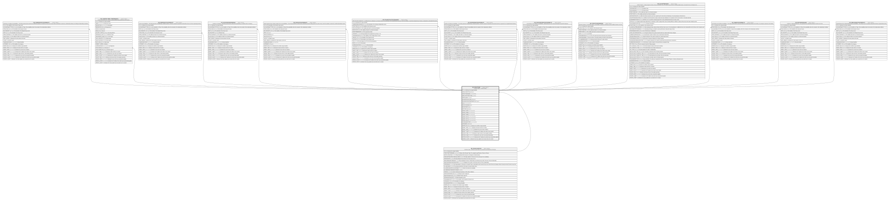

# HR_STRUCTURE

## Description

STRUCTURES - STRUCTURES  

## Columns

| Name | Type | Default | Nullable | Children | Parents | Comment |
| ---- | ---- | ------- | -------- | -------- | ------- | ------- |
| ID | bigint |  | false | [HR_COMPANYACCOUNTABILITY](HR_COMPANYACCOUNTABILITY.md) [HR_CHARTER_PRINT_PREFERENCES](HR_CHARTER_PRINT_PREFERENCES.md) [HR_PERSONACCOUNTABILITY](HR_PERSONACCOUNTABILITY.md) [HR_LOCATIONSINCOMPANY](HR_LOCATIONSINCOMPANY.md) [HR_POOLACCOUNTABILITY](HR_POOLACCOUNTABILITY.md) [HR_OTHERSTRUCTASSIGNMENT](HR_OTHERSTRUCTASSIGNMENT.md) [HR_POSITIONACCOUNTABILITY](HR_POSITIONACCOUNTABILITY.md) [HR_COSTCENTERACCOUNTABILITY](HR_COSTCENTERACCOUNTABILITY.md) [HR_STRUCTUREVERSIONS](HR_STRUCTUREVERSIONS.md) [HR_SALARYPROGRAM](HR_SALARYPROGRAM.md) [HR_JOBACCOUNTABILITY](HR_JOBACCOUNTABILITY.md) [HR_POSITIONSINUNIT](HR_POSITIONSINUNIT.md) [HR_ORGUNITACCOUNTABILITY](HR_ORGUNITACCOUNTABILITY.md) |  | Indicates the unique identifier |
| STRUCTURETYPE_ID | bigint |  | true |  | [HR_STRUCTURETYPE](HR_STRUCTURETYPE.md) |  |
| STRUCTURENAME | nvarchar(255) |  | true |  |  |  |
| SIMULATEDSTRUCTURE | smallint | ((0)) | true |  |  |  |
| PARTIALVIEW | smallint | ((0)) | true |  |  |  |
| RELATEDSTRUCTURE_ID | bigint |  | true |  |  |  |
| RELATEDSTRUCTROOTPARTY_ID | bigint |  | true |  |  |  |
| NOTE | nvarchar(MAX) |  | true |  |  |  |
| EFFECTIVEFROM | date |  | false |  |  |  |
| EFFECTIVETO | date |  | true |  |  |  |
| ENTITYSET_ID | bigint |  | true |  |  |  |
| PARAM_NAME1 | nvarchar(100) |  | true |  |  |  |
| PARAM_NAME2 | nvarchar(100) |  | true |  |  |  |
| PARAM_NAME3 | nvarchar(100) |  | true |  |  |  |
| PARAM_VALUE1 | nvarchar(2000) |  | true |  |  |  |
| PARAM_VALUE2 | nvarchar(2000) |  | true |  |  |  |
| PARAM_VALUE3 | nvarchar(2000) |  | true |  |  |  |
| SHAREDIDENTIFIER | nvarchar(255) |  | true |  |  |  |
| LISTAGENCY_ID | bigint |  | true |  |  |  |
| WORKFLOW_ID | bigint |  | true |  |  | Indicates the workflow unique identifier |
| INSERT_TIME | datetime2 | (sysutcdatetime()) | false |  |  | Indicates the date and time of creation |
| INSERT_USER | nvarchar(100) | (N'MAIN') | false |  |  | Indicates the user who has created it |
| INSERT_CLIENT | nvarchar(50) | (N'localhost') | false |  |  | Indicates the IP address from which it was created |
| UPDATE_TIME | datetime2 | (sysutcdatetime()) | false |  |  | Indicates the date and time of last update operation |
| UPDATE_USER | nvarchar(100) | (N'MAIN') | false |  |  | Indicates the user who has executed last update |
| UPDATE_CLIENT | nvarchar(50) | (N'localhost') | false |  |  | Indicates the IP address from which was executed last update |
| UPDATE_COUNT | int | ((0)) | false |  |  | Indicates how many update was executed since its creation |

## Constraints

| Name | Type | Definition |
| ---- | ---- | ---------- |
| PK_STRUCTURE | PRIMARY KEY | CLUSTERED, unique, part of a PRIMARY KEY constraint, [ ID ] |
| FK_STRUCT_STRUCTURETYPE | FOREIGN KEY | FOREIGN KEY(STRUCTURETYPE_ID) REFERENCES HR_STRUCTURETYPE(ID) ON UPDATE NO_ACTION ON DELETE NO_ACTION |

## Indexes

| Name | Definition |
| ---- | ---------- |
| PK_STRUCTURE | CLUSTERED, unique, part of a PRIMARY KEY constraint, [ ID ] |
| IDX_STRUCTURE | NONCLUSTERED, unique, [ STRUCTURETYPE_ID, STRUCTURENAME ] |

## Relations

---

> Generated by [tbls](https://github.com/k1LoW/tbls)
