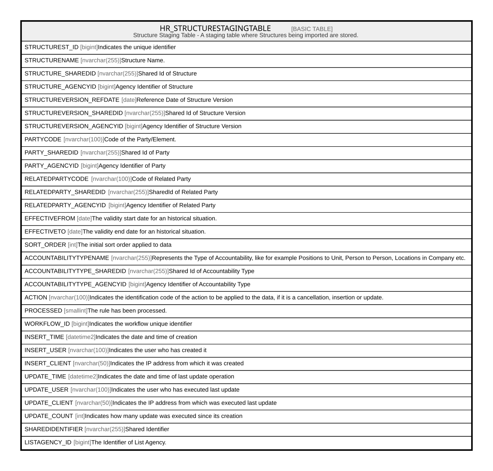

# HR_STRUCTURESTAGINGTABLE

## Description

Structure Staging Table - A staging table where Structures being imported are stored.  

## Columns

| Name | Type | Default | Nullable | Comment |
| ---- | ---- | ------- | -------- | ------- |
| STRUCTUREST_ID | bigint |  | false | Indicates the unique identifier |
| STRUCTURENAME | nvarchar(255) |  | true | Structure Name. |
| STRUCTURE_SHAREDID | nvarchar(255) |  | true | Shared Id of Structure |
| STRUCTURE_AGENCYID | bigint |  | true | Agency Identifier of Structure |
| STRUCTUREVERSION_REFDATE | date |  | true | Reference Date of Structure Version |
| STRUCTUREVERSION_SHAREDID | nvarchar(255) |  | true | Shared Id of Structure Version |
| STRUCTUREVERSION_AGENCYID | bigint |  | true | Agency Identifier of Structure Version |
| PARTYCODE | nvarchar(100) |  | true | Code of the Party/Element. |
| PARTY_SHAREDID | nvarchar(255) |  | true | Shared Id of Party |
| PARTY_AGENCYID | bigint |  | true | Agency Identifier of Party |
| RELATEDPARTYCODE | nvarchar(100) |  | true | Code of Related Party |
| RELATEDPARTY_SHAREDID | nvarchar(255) |  | true | SharedId of Related Party |
| RELATEDPARTY_AGENCYID | bigint |  | true | Agency Identifier of Related Party |
| EFFECTIVEFROM | date |  | true | The validity start date for an historical situation. |
| EFFECTIVETO | date |  | true | The validity end date for an historical situation. |
| SORT_ORDER | int |  | true | The initial sort order applied to data |
| ACCOUNTABILITYTYPENAME | nvarchar(255) |  | true | Represents the Type of Accountability, like for example Positions to Unit, Person to Person, Locations in Company etc. |
| ACCOUNTABILITYTYPE_SHAREDID | nvarchar(255) |  | true | Shared Id of Accountability Type |
| ACCOUNTABILITYTYPE_AGENCYID | bigint |  | true | Agency Identifier of Accountability Type |
| ACTION | nvarchar(100) |  | true | Indicates the identification code of the action to be applied to the data, if it is a cancellation, insertion or update. |
| PROCESSED | smallint | ((0)) | true | The rule has been processed. |
| WORKFLOW_ID | bigint |  | true | Indicates the workflow unique identifier |
| INSERT_TIME | datetime2 | (sysutcdatetime()) | false | Indicates the date and time of creation |
| INSERT_USER | nvarchar(100) | (N'MAIN') | false | Indicates the user who has created it |
| INSERT_CLIENT | nvarchar(50) | (N'localhost') | false | Indicates the IP address from which it was created |
| UPDATE_TIME | datetime2 | (sysutcdatetime()) | false | Indicates the date and time of last update operation |
| UPDATE_USER | nvarchar(100) | (N'MAIN') | false | Indicates the user who has executed last update |
| UPDATE_CLIENT | nvarchar(50) | (N'localhost') | false | Indicates the IP address from which was executed last update |
| UPDATE_COUNT | int | ((0)) | false | Indicates how many update was executed since its creation |
| SHAREDIDENTIFIER | nvarchar(255) |  | true | Shared Identifier |
| LISTAGENCY_ID | bigint |  | true | The Identifier of List Agency. |

## Constraints

| Name | Type | Definition |
| ---- | ---- | ---------- |
| PK_STRUCTUREST | PRIMARY KEY | CLUSTERED, unique, part of a PRIMARY KEY constraint, [ STRUCTUREST_ID ] |

## Indexes

| Name | Definition |
| ---- | ---------- |
| PK_STRUCTUREST | CLUSTERED, unique, part of a PRIMARY KEY constraint, [ STRUCTUREST_ID ] |

## Relations

---

> Generated by [tbls](https://github.com/k1LoW/tbls)
