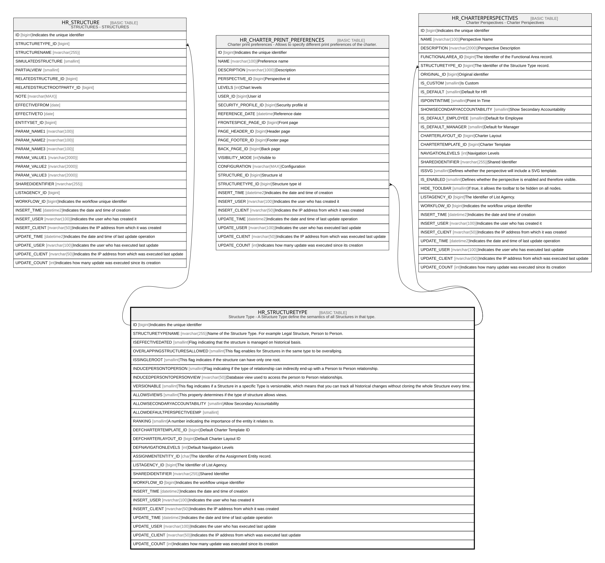

# HR_STRUCTURETYPE

## Description

Structure Type - A Structure Type define the semantics of all Structures in that type.  

## Columns

| Name | Type | Default | Nullable | Children | Comment |
| ---- | ---- | ------- | -------- | -------- | ------- |
| ID | bigint |  | false | [HR_STRUCTURE](HR_STRUCTURE.md) [HR_CHARTER_PRINT_PREFERENCES](HR_CHARTER_PRINT_PREFERENCES.md) [HR_CHARTERPERSPECTIVES](HR_CHARTERPERSPECTIVES.md) | Indicates the unique identifier |
| STRUCTURETYPENAME | nvarchar(255) |  | false |  | Name of the Structure Type. For example Legal Structure, Person to Person. |
| ISEFFECTIVEDATED | smallint |  | false |  | Flag indicating that the structure is managed on historical basis. |
| OVERLAPPINGSTRUCTURESALLOWED | smallint |  | true |  | This flag enables for Structures in the same type to be overallping. |
| ISSINGLEROOT | smallint |  | true |  | This flag indicates if the structure can have only one root. |
| INDUCEPERSONTOPERSON | smallint |  | true |  | Flag indicating if the type of relationship can indirectly end-up with a Person to Person relationship. |
| INDUCEDPERSONTOPERSONVIEW | nvarchar(50) |  | true |  | Database view used to access the person to Person relationships. |
| VERSIONABLE | smallint |  | true |  | This flag indicates if a Structure in a specific Type is versionable, which means that you can track all historical changes without cloning the whole Structure every time. |
| ALLOWSVIEWS | smallint |  | true |  | This property determines if the type of structure allows views. |
| ALLOWSECONDARYACCOUNTABILITY | smallint |  | true |  | Allow Secondary Accountability |
| ALLOWDEFAULTPERSPECTIVEEMP | smallint |  | true |  |  |
| RANKING | smallint |  | true |  | A number indicating the importance of the entity it relates to. |
| DEFCHARTERTEMPLATE_ID | bigint |  | true |  | Default Charter Template ID |
| DEFCHARTERLAYOUT_ID | bigint |  | true |  | Default Charter Layout ID |
| DEFNAVIGATIONLEVELS | int |  | true |  | Default Navigation Levels  |
| ASSIGNMENTENTITY_ID | char |  | true |  | The Identifier of the Assignment Entity record. |
| LISTAGENCY_ID | bigint |  | true |  | The Identifier of List Agency. |
| SHAREDIDENTIFIER | nvarchar(255) |  | true |  | Shared Identifier |
| WORKFLOW_ID | bigint |  | true |  | Indicates the workflow unique identifier |
| INSERT_TIME | datetime2 | (sysutcdatetime()) | false |  | Indicates the date and time of creation |
| INSERT_USER | nvarchar(100) | (N'MAIN') | false |  | Indicates the user who has created it |
| INSERT_CLIENT | nvarchar(50) | (N'localhost') | false |  | Indicates the IP address from which it was created |
| UPDATE_TIME | datetime2 | (sysutcdatetime()) | false |  | Indicates the date and time of last update operation |
| UPDATE_USER | nvarchar(100) | (N'MAIN') | false |  | Indicates the user who has executed last update |
| UPDATE_CLIENT | nvarchar(50) | (N'localhost') | false |  | Indicates the IP address from which was executed last update |
| UPDATE_COUNT | int | ((0)) | false |  | Indicates how many update was executed since its creation |

## Constraints

| Name | Type | Definition |
| ---- | ---- | ---------- |
| PK_STRUCTURETYPE | PRIMARY KEY | CLUSTERED, unique, part of a PRIMARY KEY constraint, [ ID ] |

## Indexes

| Name | Definition |
| ---- | ---------- |
| PK_STRUCTURETYPE | CLUSTERED, unique, part of a PRIMARY KEY constraint, [ ID ] |
| IDX_STRUCTURETYPEINDEX | NONCLUSTERED, unique, [ STRUCTURETYPENAME ] |

## Relations

---

> Generated by [tbls](https://github.com/k1LoW/tbls)
