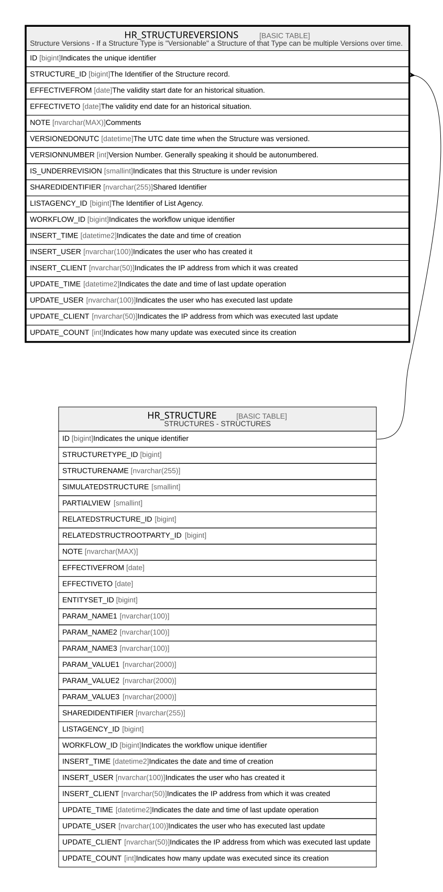

# HR_STRUCTUREVERSIONS

## Description

Structure Versions - If a Structure Type is "Versionable" a Structure of that Type can be multiple Versions over time.  

## Columns

| Name | Type | Default | Nullable | Parents | Comment |
| ---- | ---- | ------- | -------- | ------- | ------- |
| ID | bigint |  | false |  | Indicates the unique identifier |
| STRUCTURE_ID | bigint |  | false | [HR_STRUCTURE](HR_STRUCTURE.md) | The Identifier of the Structure record. |
| EFFECTIVEFROM | date |  | false |  | The validity start date for an historical situation. |
| EFFECTIVETO | date |  | true |  | The validity end date for an historical situation. |
| NOTE | nvarchar(MAX) |  | true |  | Comments |
| VERSIONEDONUTC | datetime |  | false |  | The UTC date time when the Structure was versioned. |
| VERSIONNUMBER | int |  | true |  | Version Number. Generally speaking it should be autonumbered. |
| IS_UNDERREVISION | smallint |  | true |  | Indicates that this Structure is under revision |
| SHAREDIDENTIFIER | nvarchar(255) |  | true |  | Shared Identifier |
| LISTAGENCY_ID | bigint |  | true |  | The Identifier of List Agency. |
| WORKFLOW_ID | bigint |  | true |  | Indicates the workflow unique identifier |
| INSERT_TIME | datetime2 | (sysutcdatetime()) | false |  | Indicates the date and time of creation |
| INSERT_USER | nvarchar(100) | (N'MAIN') | false |  | Indicates the user who has created it |
| INSERT_CLIENT | nvarchar(50) | (N'localhost') | false |  | Indicates the IP address from which it was created |
| UPDATE_TIME | datetime2 | (sysutcdatetime()) | false |  | Indicates the date and time of last update operation |
| UPDATE_USER | nvarchar(100) | (N'MAIN') | false |  | Indicates the user who has executed last update |
| UPDATE_CLIENT | nvarchar(50) | (N'localhost') | false |  | Indicates the IP address from which was executed last update |
| UPDATE_COUNT | int | ((0)) | false |  | Indicates how many update was executed since its creation |

## Constraints

| Name | Type | Definition |
| ---- | ---- | ---------- |
| PK_STRUCTUREVERSIONS | PRIMARY KEY | CLUSTERED, unique, part of a PRIMARY KEY constraint, [ ID ] |
| FK_STRUCTUREVERSIONS_STRUCTURE | FOREIGN KEY | FOREIGN KEY(STRUCTURE_ID) REFERENCES HR_STRUCTURE(ID) ON UPDATE NO_ACTION ON DELETE CASCADE |

## Indexes

| Name | Definition |
| ---- | ---------- |
| PK_STRUCTUREVERSIONS | CLUSTERED, unique, part of a PRIMARY KEY constraint, [ ID ] |
| IDX_STRUCTUREVER_STRUIDEFF | NONCLUSTERED, unique, [ STRUCTURE_ID, EFFECTIVEFROM ] |

## Relations

---

> Generated by [tbls](https://github.com/k1LoW/tbls)
