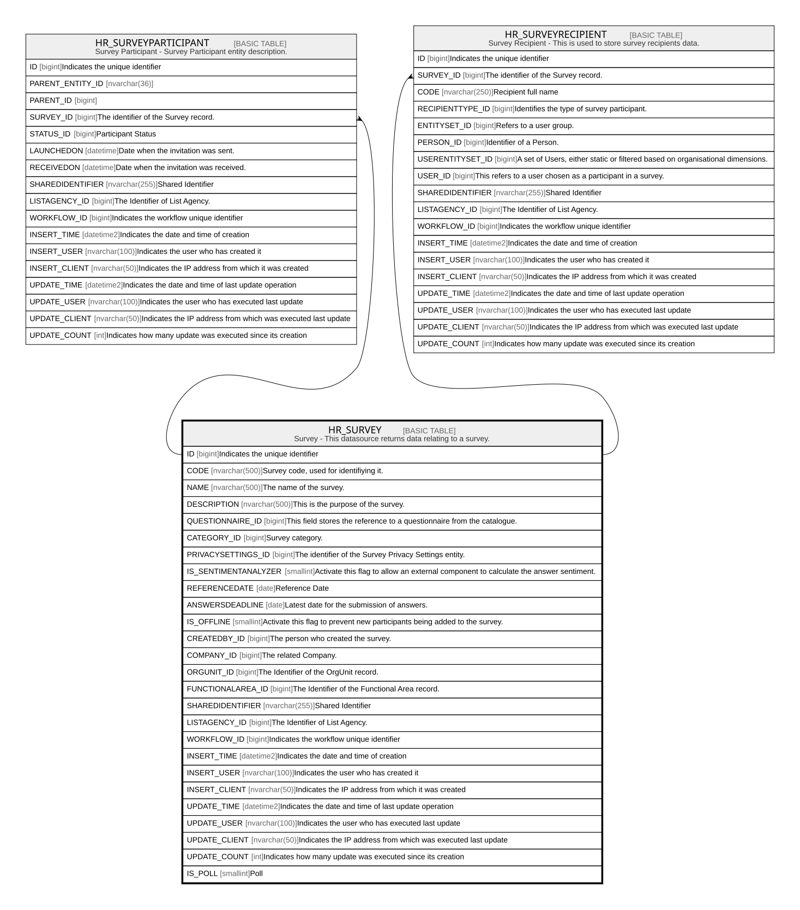

# HR_SURVEY

## Description

Survey - This datasource returns data relating to a survey.  

## Columns

| Name | Type | Default | Nullable | Children | Comment |
| ---- | ---- | ------- | -------- | -------- | ------- |
| ID | bigint |  | false | [HR_SURVEYPARTICIPANT](HR_SURVEYPARTICIPANT.md) [HR_SURVEYRECIPIENT](HR_SURVEYRECIPIENT.md) | Indicates the unique identifier |
| CODE | nvarchar(500) |  | true |  | Survey code, used for identifiying it. |
| NAME | nvarchar(500) |  | true |  | The name of the survey. |
| DESCRIPTION | nvarchar(500) |  | true |  | This is the purpose of the survey. |
| QUESTIONNAIRE_ID | bigint |  | true |  | This field stores the reference to a questionnaire from the catalogue. |
| CATEGORY_ID | bigint |  | true |  | Survey category. |
| PRIVACYSETTINGS_ID | bigint |  | true |  | The identifier of the Survey Privacy Settings entity. |
| IS_SENTIMENTANALYZER | smallint |  | true |  | Activate this flag to allow an external component to calculate the answer sentiment. |
| REFERENCEDATE | date |  | true |  | Reference Date |
| ANSWERSDEADLINE | date |  | true |  | Latest date for the submission of answers. |
| IS_OFFLINE | smallint |  | true |  | Activate this flag to prevent new participants being added to the survey. |
| CREATEDBY_ID | bigint |  | true |  | The person who created the survey. |
| COMPANY_ID | bigint |  | true |  | The related Company. |
| ORGUNIT_ID | bigint |  | true |  | The Identifier of the OrgUnit record. |
| FUNCTIONALAREA_ID | bigint |  | true |  | The Identifier of the Functional Area record. |
| SHAREDIDENTIFIER | nvarchar(255) |  | true |  | Shared Identifier |
| LISTAGENCY_ID | bigint |  | true |  | The Identifier of List Agency. |
| WORKFLOW_ID | bigint |  | true |  | Indicates the workflow unique identifier |
| INSERT_TIME | datetime2 | (sysutcdatetime()) | false |  | Indicates the date and time of creation |
| INSERT_USER | nvarchar(100) | (N'MAIN') | false |  | Indicates the user who has created it |
| INSERT_CLIENT | nvarchar(50) | (N'localhost') | false |  | Indicates the IP address from which it was created |
| UPDATE_TIME | datetime2 | (sysutcdatetime()) | false |  | Indicates the date and time of last update operation |
| UPDATE_USER | nvarchar(100) | (N'MAIN') | false |  | Indicates the user who has executed last update |
| UPDATE_CLIENT | nvarchar(50) | (N'localhost') | false |  | Indicates the IP address from which was executed last update |
| UPDATE_COUNT | int | ((0)) | false |  | Indicates how many update was executed since its creation |
| IS_POLL | smallint |  | true |  | Poll |

## Constraints

| Name | Type | Definition |
| ---- | ---- | ---------- |
| PK_HR_SURVEY | PRIMARY KEY | CLUSTERED, unique, part of a PRIMARY KEY constraint, [ ID ] |
| UQ_SURVEY | UNIQUE | NONCLUSTERED, unique, part of a UNIQUE constraint, [ CODE ] |

## Indexes

| Name | Definition |
| ---- | ---------- |
| PK_HR_SURVEY | CLUSTERED, unique, part of a PRIMARY KEY constraint, [ ID ] |
| UQ_SURVEY | NONCLUSTERED, unique, part of a UNIQUE constraint, [ CODE ] |

## Relations

---

> Generated by [tbls](https://github.com/k1LoW/tbls)
