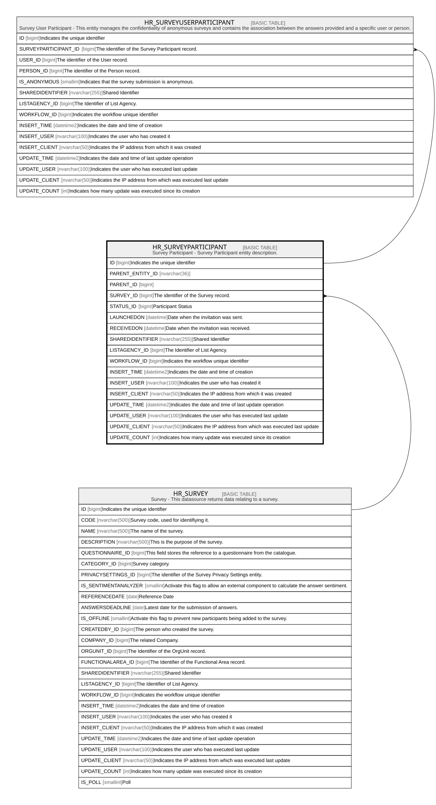

# HR_SURVEYPARTICIPANT

## Description

Survey Participant - Survey Participant entity description.  

## Columns

| Name | Type | Default | Nullable | Children | Parents | Comment |
| ---- | ---- | ------- | -------- | -------- | ------- | ------- |
| ID | bigint |  | false | [HR_SURVEYUSERPARTICIPANT](HR_SURVEYUSERPARTICIPANT.md) |  | Indicates the unique identifier |
| PARENT_ENTITY_ID | nvarchar(36) |  | true |  |  |  |
| PARENT_ID | bigint |  | true |  |  |  |
| SURVEY_ID | bigint |  | false |  | [HR_SURVEY](HR_SURVEY.md) | The identifier of the Survey record. |
| STATUS_ID | bigint |  | true |  |  | Participant Status |
| LAUNCHEDON | datetime |  | true |  |  | Date when the invitation was sent. |
| RECEIVEDON | datetime |  | true |  |  | Date when the invitation was received. |
| SHAREDIDENTIFIER | nvarchar(255) |  | true |  |  | Shared Identifier |
| LISTAGENCY_ID | bigint |  | true |  |  | The Identifier of List Agency. |
| WORKFLOW_ID | bigint |  | true |  |  | Indicates the workflow unique identifier |
| INSERT_TIME | datetime2 |  | false |  |  | Indicates the date and time of creation |
| INSERT_USER | nvarchar(100) |  | false |  |  | Indicates the user who has created it |
| INSERT_CLIENT | nvarchar(50) |  | false |  |  | Indicates the IP address from which it was created |
| UPDATE_TIME | datetime2 |  | false |  |  | Indicates the date and time of last update operation |
| UPDATE_USER | nvarchar(100) |  | false |  |  | Indicates the user who has executed last update |
| UPDATE_CLIENT | nvarchar(50) |  | false |  |  | Indicates the IP address from which was executed last update |
| UPDATE_COUNT | int |  | false |  |  | Indicates how many update was executed since its creation |

## Constraints

| Name | Type | Definition |
| ---- | ---- | ---------- |
| PK_HR_SURVEYPARTICIPANT | PRIMARY KEY | CLUSTERED, unique, part of a PRIMARY KEY constraint, [ ID ] |
| FK_SURVPART_SURVEY | FOREIGN KEY | FOREIGN KEY(SURVEY_ID) REFERENCES HR_SURVEY(ID) ON UPDATE NO_ACTION ON DELETE NO_ACTION |

## Indexes

| Name | Definition |
| ---- | ---------- |
| PK_HR_SURVEYPARTICIPANT | CLUSTERED, unique, part of a PRIMARY KEY constraint, [ ID ] |

## Triggers

| Name | Definition |
| ---- | ---------- |
| DELETESURVEYQUESTIONNAIRES | -- Talentia Software - All right reserved -- Type: TRIGGER                  Name: DELETESURVEYQUESTIONNAIRES -- Date: 09-04-2026 07:27:59 (UTC) --  -- ChangeLogId: 00000000-0000-0000-0000-000000000000 -- ChangeSetId: 332f49b3-4222-4062-9f6e-2e8bc2e710fd -- Original file name: C:\repos\Talentia-Software\hcm-core/DB/ProductDB/EDM\Schema\Triggers\DELETESURVEYQUESTIONNAIRES.xml   CREATE TRIGGER DELETESURVEYQUESTIONNAIRES ON HR_SURVEYPARTICIPANT AFTER DELETE AS BEGIN     SET NOCOUNT ON;     DELETE TF_QSTRT_QUESTIONNAIRES     FROM DELETED D     WHERE TF_QSTRT_QUESTIONNAIRES.QSTRT_PARENT_ID = D.ID 	AND TF_QSTRT_QUESTIONNAIRES.QSTRT_PARENT_ENTITY_ID = '81a4a877-2ee1-401c-9eb4-bba1b9530680' END   |

## Relations

---

> Generated by [tbls](https://github.com/k1LoW/tbls)
