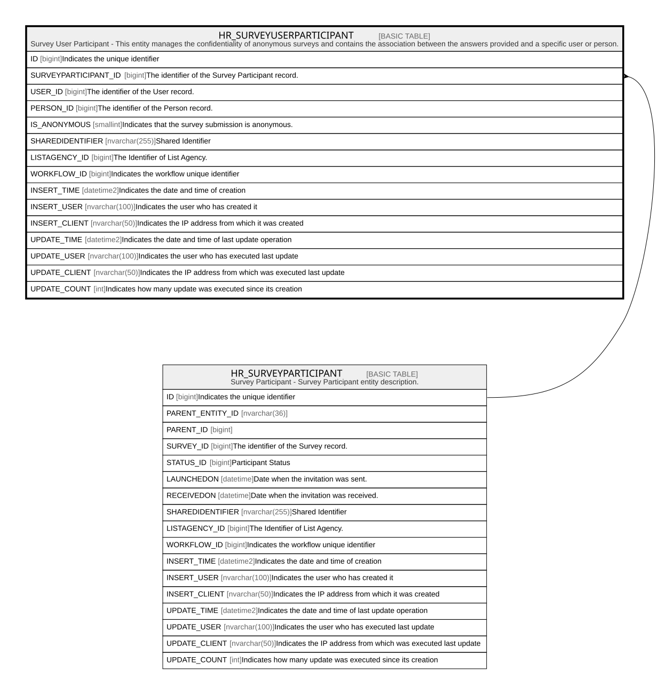

# HR_SURVEYUSERPARTICIPANT

## Description

Survey User Participant - This entity manages the confidentiality of anonymous surveys and contains the association between the answers provided and a specific user or person.  

## Columns

| Name | Type | Default | Nullable | Parents | Comment |
| ---- | ---- | ------- | -------- | ------- | ------- |
| ID | bigint |  | false |  | Indicates the unique identifier |
| SURVEYPARTICIPANT_ID | bigint |  | false | [HR_SURVEYPARTICIPANT](HR_SURVEYPARTICIPANT.md) | The identifier of the Survey Participant record. |
| USER_ID | bigint |  | true |  | The identifier of the User record. |
| PERSON_ID | bigint |  | true |  | The identifier of the Person record. |
| IS_ANONYMOUS | smallint |  | true |  | Indicates that the survey submission is anonymous. |
| SHAREDIDENTIFIER | nvarchar(255) |  | true |  | Shared Identifier |
| LISTAGENCY_ID | bigint |  | true |  | The Identifier of List Agency. |
| WORKFLOW_ID | bigint |  | true |  | Indicates the workflow unique identifier |
| INSERT_TIME | datetime2 |  | false |  | Indicates the date and time of creation |
| INSERT_USER | nvarchar(100) |  | false |  | Indicates the user who has created it |
| INSERT_CLIENT | nvarchar(50) |  | false |  | Indicates the IP address from which it was created |
| UPDATE_TIME | datetime2 |  | false |  | Indicates the date and time of last update operation |
| UPDATE_USER | nvarchar(100) |  | false |  | Indicates the user who has executed last update |
| UPDATE_CLIENT | nvarchar(50) |  | false |  | Indicates the IP address from which was executed last update |
| UPDATE_COUNT | int |  | false |  | Indicates how many update was executed since its creation |

## Constraints

| Name | Type | Definition |
| ---- | ---- | ---------- |
| PK_HR_SURVEYUSERPARTICIPANT | PRIMARY KEY | CLUSTERED, unique, part of a PRIMARY KEY constraint, [ ID ] |
| FK_SURVUSERPART_SURVEYPART | FOREIGN KEY | FOREIGN KEY(SURVEYPARTICIPANT_ID) REFERENCES HR_SURVEYPARTICIPANT(ID) ON UPDATE NO_ACTION ON DELETE CASCADE |

## Indexes

| Name | Definition |
| ---- | ---------- |
| PK_HR_SURVEYUSERPARTICIPANT | CLUSTERED, unique, part of a PRIMARY KEY constraint, [ ID ] |

## Relations

---

> Generated by [tbls](https://github.com/k1LoW/tbls)
