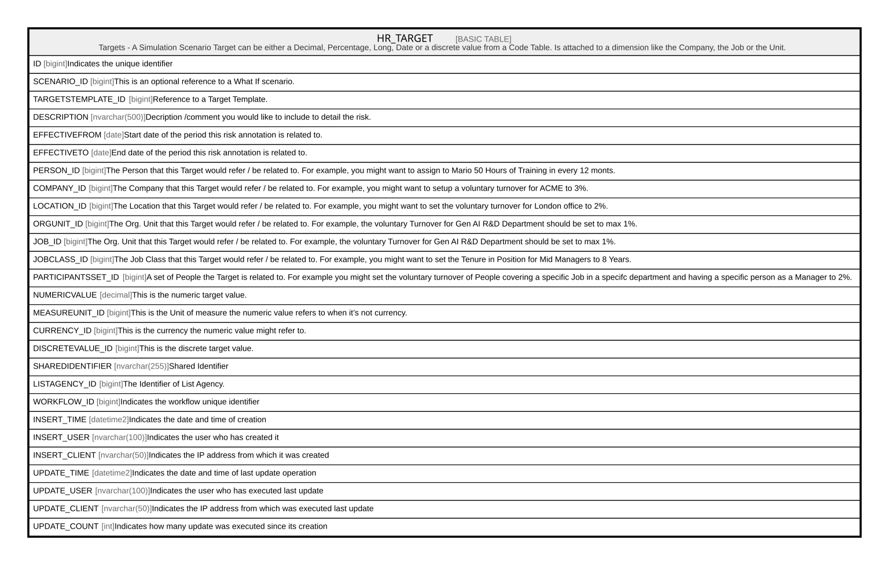

# HR_TARGET

## Description

Targets - A Simulation Scenario Target can be either a Decimal, Percentage, Long, Date or a discrete value from a Code Table. Is attached to a dimension like the Company, the Job or the Unit.  

## Columns

| Name | Type | Default | Nullable | Comment |
| ---- | ---- | ------- | -------- | ------- |
| ID | bigint |  | false | Indicates the unique identifier |
| SCENARIO_ID | bigint |  | true | This is an optional reference to a What If scenario. |
| TARGETSTEMPLATE_ID | bigint |  | true | Reference to a Target Template. |
| DESCRIPTION | nvarchar(500) |  | true | Decription /comment you would like to include to detail the risk. |
| EFFECTIVEFROM | date |  | true | Start date of the period this risk annotation is related to. |
| EFFECTIVETO | date |  | true | End date of the period this risk annotation is related to. |
| PERSON_ID | bigint |  | true | The Person that this Target would refer / be related to. For example, you might want to assign to Mario 50 Hours of Training in every 12 monts. |
| COMPANY_ID | bigint |  | true | The Company that this Target would refer / be related to. For example, you might want to setup a voluntary turnover for ACME to 3%. |
| LOCATION_ID | bigint |  | true | The Location that this Target would refer / be related to. For example, you might want to set the voluntary turnover for London office to 2%. |
| ORGUNIT_ID | bigint |  | true | The Org. Unit that this Target would refer / be related to. For example, the voluntary Turnover for Gen AI R&D Department should be set to max 1%. |
| JOB_ID | bigint |  | true | The Org. Unit that this Target would refer / be related to. For example, the voluntary Turnover for Gen AI R&D Department should be set to max 1%. |
| JOBCLASS_ID | bigint |  | true | The Job Class that this Target would refer / be related to. For example, you might want to set the Tenure in Position for Mid Managers to 8 Years. |
| PARTICIPANTSSET_ID | bigint |  | true | A set of People the Target is related to. For example you might set the voluntary turnover of People covering a specific Job in a specifc department and having a specific person as a Manager to 2%. |
| NUMERICVALUE | decimal |  | true | This is the numeric target value. |
| MEASUREUNIT_ID | bigint |  | true | This is the Unit of measure the numeric value refers to when it’s not currency. |
| CURRENCY_ID | bigint |  | true | This is the currency the numeric value might refer to. |
| DISCRETEVALUE_ID | bigint |  | true | This is the discrete target value. |
| SHAREDIDENTIFIER | nvarchar(255) |  | true | Shared Identifier |
| LISTAGENCY_ID | bigint |  | true | The Identifier of List Agency. |
| WORKFLOW_ID | bigint |  | true | Indicates the workflow unique identifier |
| INSERT_TIME | datetime2 | (sysutcdatetime()) | false | Indicates the date and time of creation |
| INSERT_USER | nvarchar(100) | (N'MAIN') | false | Indicates the user who has created it |
| INSERT_CLIENT | nvarchar(50) | (N'localhost') | false | Indicates the IP address from which it was created |
| UPDATE_TIME | datetime2 | (sysutcdatetime()) | false | Indicates the date and time of last update operation |
| UPDATE_USER | nvarchar(100) | (N'MAIN') | false | Indicates the user who has executed last update |
| UPDATE_CLIENT | nvarchar(50) | (N'localhost') | false | Indicates the IP address from which was executed last update |
| UPDATE_COUNT | int | ((0)) | false | Indicates how many update was executed since its creation |

## Constraints

| Name | Type | Definition |
| ---- | ---- | ---------- |
| PK_HR_TARGET | PRIMARY KEY | CLUSTERED, unique, part of a PRIMARY KEY constraint, [ ID ] |
| UQ_HR_TARGET | UNIQUE | NONCLUSTERED, unique, part of a UNIQUE constraint, [ TARGETSTEMPLATE_ID, EFFECTIVEFROM, PERSON_ID, COMPANY_ID, LOCATION_ID, JOB_ID, JOBCLASS_ID, ORGUNIT_ID, PARTICIPANTSSET_ID, SCENARIO_ID ] |

## Indexes

| Name | Definition |
| ---- | ---------- |
| PK_HR_TARGET | CLUSTERED, unique, part of a PRIMARY KEY constraint, [ ID ] |
| UQ_HR_TARGET | NONCLUSTERED, unique, part of a UNIQUE constraint, [ TARGETSTEMPLATE_ID, EFFECTIVEFROM, PERSON_ID, COMPANY_ID, LOCATION_ID, JOB_ID, JOBCLASS_ID, ORGUNIT_ID, PARTICIPANTSSET_ID, SCENARIO_ID ] |

## Relations

---

> Generated by [tbls](https://github.com/k1LoW/tbls)
