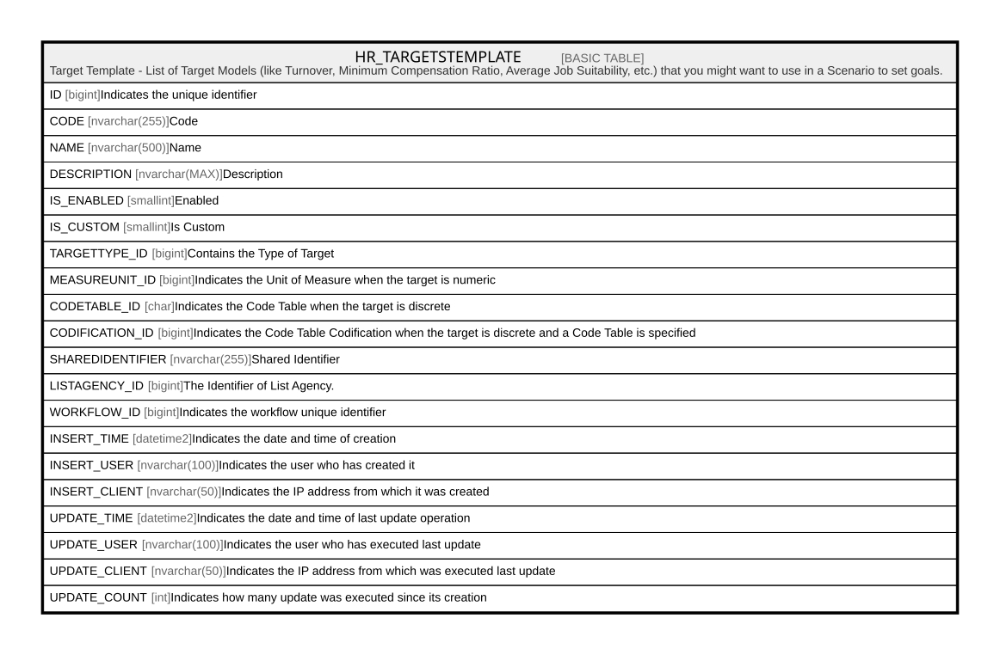

# HR_TARGETSTEMPLATE

## Description

Target Template - List of Target Models (like Turnover, Minimum Compensation Ratio, Average Job Suitability, etc.) that you might want to use in a Scenario to set goals.  

## Columns

| Name | Type | Default | Nullable | Comment |
| ---- | ---- | ------- | -------- | ------- |
| ID | bigint |  | false | Indicates the unique identifier |
| CODE | nvarchar(255) |  | false | Code |
| NAME | nvarchar(500) |  | true | Name |
| DESCRIPTION | nvarchar(MAX) |  | true | Description |
| IS_ENABLED | smallint |  | true | Enabled |
| IS_CUSTOM | smallint |  | true | Is Custom |
| TARGETTYPE_ID | bigint |  | true | Contains the Type of Target |
| MEASUREUNIT_ID | bigint |  | true | Indicates the Unit of Measure when the target is numeric |
| CODETABLE_ID | char |  | true | Indicates the Code Table when the target is discrete |
| CODIFICATION_ID | bigint |  | true | Indicates the Code Table Codification when the target is discrete and a Code Table is specified |
| SHAREDIDENTIFIER | nvarchar(255) |  | true | Shared Identifier |
| LISTAGENCY_ID | bigint |  | true | The Identifier of List Agency. |
| WORKFLOW_ID | bigint |  | true | Indicates the workflow unique identifier |
| INSERT_TIME | datetime2 | (sysutcdatetime()) | false | Indicates the date and time of creation |
| INSERT_USER | nvarchar(100) | (N'MAIN') | false | Indicates the user who has created it |
| INSERT_CLIENT | nvarchar(50) | (N'localhost') | false | Indicates the IP address from which it was created |
| UPDATE_TIME | datetime2 | (sysutcdatetime()) | false | Indicates the date and time of last update operation |
| UPDATE_USER | nvarchar(100) | (N'MAIN') | false | Indicates the user who has executed last update |
| UPDATE_CLIENT | nvarchar(50) | (N'localhost') | false | Indicates the IP address from which was executed last update |
| UPDATE_COUNT | int | ((0)) | false | Indicates how many update was executed since its creation |

## Constraints

| Name | Type | Definition |
| ---- | ---- | ---------- |
| PK_HR_TARGETSTEMPLATE | PRIMARY KEY | CLUSTERED, unique, part of a PRIMARY KEY constraint, [ ID ] |

## Indexes

| Name | Definition |
| ---- | ---------- |
| PK_HR_TARGETSTEMPLATE | CLUSTERED, unique, part of a PRIMARY KEY constraint, [ ID ] |

## Relations

---

> Generated by [tbls](https://github.com/k1LoW/tbls)
