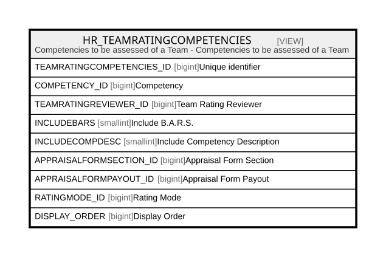

# HR_TEAMRATINGCOMPETENCIES

## Description

Competencies to be assessed of a Team - Competencies to be assessed of a Team  


<details>
<summary><strong>Table Definition</strong></summary>

```sql
-- Talentia Software - All right reserved
-- Type: VIEW                     Name: HR_TEAMRATINGCOMPETENCIES
-- Date: 09-04-2026 07:27:59 (UTC)
-- 
-- ChangeLogId: 00000000-0000-0000-0000-000000000000
-- ChangeSetId: 8833ae8a-5965-48c1-a7ad-d9e546a9b46a
-- Original file name: C:\repos\Talentia-Software\hcm-core/DB/ProductDB/EDM\Schema\Views\HR_TEAMRATINGCOMPETENCIES.xml


CREATE VIEW [HR_TEAMRATINGCOMPETENCIES]
 ( TEAMRATINGCOMPETENCIES_ID, COMPETENCY_ID, TEAMRATINGREVIEWER_ID, INCLUDEBARS, INCLUDECOMPDESC, APPRAISALFORMSECTION_ID, APPRAISALFORMPAYOUT_ID, RATINGMODE_ID, DISPLAY_ORDER ) 
 AS 
( SELECT MIN(HR_APPRCOMPSECROW.ID), HR_COMPGRIDROW.COMPETENCY_ID, HR_TEAMRATINGREVIEWER.ID AS TEAMRATINGREVIEWER_ID, HR_APPRAISALFORMSECTION.INCLUDEBARS as INCLUDEBARS, 
HR_APPRAISALFORMSECTION.INCLUDECOMPDESC as INCLUDECOMPDESC, HR_APPRAISALFORMSECTION.ID as APPRAISALFORMSECTION_ID, HR_APPRAISALFORMPAYOUT.ID as APPRAISALFORMPAYOUT_ID,
HR_APPRAISALFORMSECTION.RATINGMODE_ID as RATINGMODE_ID, HR_COMPGRIDROW.RANKING as DISPLAY_ORDER
FROM HR_TEAMRATINGREVIEWER
INNER JOIN HR_APPRAISALCYCLE ON (HR_TEAMRATINGREVIEWER.APPRAISALCYCLE_ID=HR_APPRAISALCYCLE.ID)
INNER JOIN HR_APPRAISALFORMSECTION ON (HR_APPRAISALFORMSECTION.APPRAISALFORM_ID=HR_APPRAISALCYCLE.APPRAISALFORM_ID)
INNER JOIN HR_COMPGRID ON (HR_APPRAISALFORMSECTION.COMPGRID_ID=HR_COMPGRID.ID)
INNER JOIN HR_COMPGRIDROW ON (HR_COMPGRID.ID=HR_COMPGRIDROW.COMPGRID_ID)
INNER JOIN HR_APPRAISALREVIEW on ((HR_TEAMRATINGREVIEWER.PERSON_ID = HR_APPRAISALREVIEW.REVIEWER_ID or HR_TEAMRATINGREVIEWER.USERGROUP_ID = HR_APPRAISALREVIEW.USERGROUP_ID)
                                    and HR_APPRAISALREVIEW.SOURCEAPPRAISALCYCLE_ID = HR_TEAMRATINGREVIEWER.APPRAISALCYCLE_ID)
LEFT OUTER JOIN HR_APPRAISALFORMPAYOUT ON HR_APPRAISALFORMPAYOUT.APPRAISALFORM_ID = HR_APPRAISALREVIEW.APPRAISALFORM_ID
INNER JOIN HR_APPRAISALSECTION ON (HR_APPRAISALREVIEW.ID = HR_APPRAISALSECTION.APPRAISALREVIEW_ID)
INNER JOIN HR_APPRCOMPSECROW ON (HR_APPRCOMPSECROW.COMPGRIDROW_ID = HR_COMPGRIDROW.ID AND HR_APPRCOMPSECROW.APPRAISALSECTION_ID = HR_APPRAISALSECTION .ID)
WHERE HR_APPRAISALFORMSECTION.APPRFORMSECTIONTYPE_ID = 1140001
     AND HR_APPRAISALFORMSECTION.COMPETENCIESTYPE_ID = 1157218
GROUP BY HR_COMPGRIDROW.COMPETENCY_ID, HR_TEAMRATINGREVIEWER.ID, HR_APPRAISALFORMSECTION.INCLUDEBARS, 
HR_APPRAISALFORMSECTION.INCLUDECOMPDESC, HR_APPRAISALFORMSECTION.ID, HR_APPRAISALFORMPAYOUT.ID, HR_APPRAISALFORMSECTION.RATINGMODE_ID, HR_COMPGRIDROW.RANKING )

```

</details>

## Columns

| Name | Type | Default | Nullable | Comment |
| ---- | ---- | ------- | -------- | ------- |
| TEAMRATINGCOMPETENCIES_ID | bigint |  | true | Unique identifier |
| COMPETENCY_ID | bigint |  | true | Competency |
| TEAMRATINGREVIEWER_ID | bigint |  | false | Team Rating Reviewer |
| INCLUDEBARS | smallint |  | true | Include B.A.R.S. |
| INCLUDECOMPDESC | smallint |  | true | Include Competency Description |
| APPRAISALFORMSECTION_ID | bigint |  | false | Appraisal Form Section |
| APPRAISALFORMPAYOUT_ID | bigint |  | true | Appraisal Form Payout |
| RATINGMODE_ID | bigint |  | true | Rating Mode |
| DISPLAY_ORDER | bigint |  | true | Display Order |

## Referenced Tables

| Name | Columns | Comment | Type |
| ---- | ------- | ------- | ---- |
| [HR_TEAMRATINGREVIEWER](HR_TEAMRATINGREVIEWER.md) | 15 | Team Rating Reviewer - This entity records the reviewer for each group of an appraisal cycle.<br /> | BASIC TABLE |
| [HR_APPRAISALCYCLE](HR_APPRAISALCYCLE.md) | 36 | Appraisal Cycle - This Entity allows defining a container of Appraisals that make sense on a specific period for a given employee set.<br /> | BASIC TABLE |
| [HR_APPRAISALFORMSECTION](HR_APPRAISALFORMSECTION.md) | 83 | Appraisal Form Section - This entity contains the section definition within an appraisal form.<br /> | BASIC TABLE |
| [HR_COMPGRID](HR_COMPGRID.md) | 21 | Competency Grid - Defines a list of competencies and, optionally, enables a weight to be associated.<br /> | BASIC TABLE |
| [HR_COMPGRIDROW](HR_COMPGRIDROW.md) | 18 | Competency Grid Row - This represents the link between Competencies and Grid.<br /> | BASIC TABLE |
| [HR_APPRAISALREVIEW](HR_APPRAISALREVIEW.md) | 43 | Appraisal Review - This entity stores the history of all individual appraisals.<br /> | BASIC TABLE |
| [HR_APPRAISALFORMPAYOUT](HR_APPRAISALFORMPAYOUT.md) | 23 | Appraisal Form Payout - This entity contains the payout configuration associated with an appraisal form.<br /> | BASIC TABLE |
| [HR_APPRAISALSECTION](HR_APPRAISALSECTION.md) | 52 | Appraisal Review Section - This entity represents a section of an individual appraisal review, where the section scores are recorded.<br /> | BASIC TABLE |
| [HR_APPRCOMPSECROW](HR_APPRCOMPSECROW.md) | 25 | Appraisal Competency Section Row - This entity represents a single competency review.<br /> | BASIC TABLE |

## Relations



---

> Generated by [tbls](https://github.com/k1LoW/tbls)
