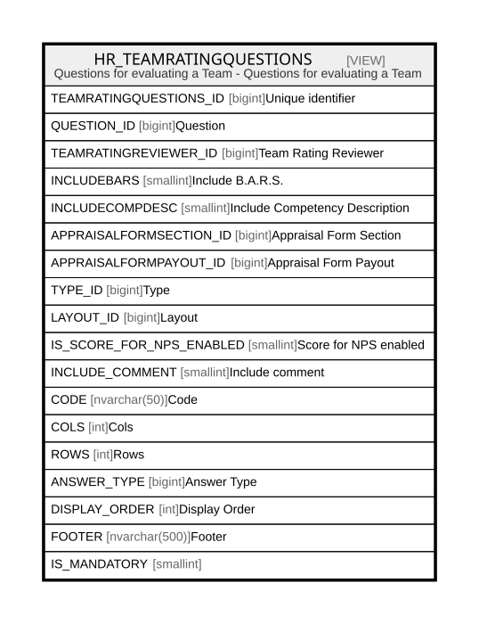

# HR_TEAMRATINGQUESTIONS

## Description

Questions for evaluating a Team - Questions for evaluating a Team  


<details>
<summary><strong>Table Definition</strong></summary>

```sql
-- Talentia Software - All right reserved
-- Type: VIEW                     Name: HR_TEAMRATINGQUESTIONS
-- Date: 09-04-2026 07:27:59 (UTC)
-- 
-- ChangeLogId: 00000000-0000-0000-0000-000000000000
-- ChangeSetId: 5d0761f7-5540-4c07-aba8-03f84a913f5a
-- Original file name: C:\repos\Talentia-Software\hcm-core/DB/ProductDB/EDM\Schema\Views\HR_TEAMRATINGQUESTIONS.xml


CREATE VIEW [HR_TEAMRATINGQUESTIONS]
 ( TEAMRATINGQUESTIONS_ID, QUESTION_ID, TEAMRATINGREVIEWER_ID, INCLUDEBARS, INCLUDECOMPDESC, APPRAISALFORMSECTION_ID, APPRAISALFORMPAYOUT_ID, TYPE_ID, LAYOUT_ID, IS_SCORE_FOR_NPS_ENABLED, INCLUDE_COMMENT, CODE, COLS, ROWS, ANSWER_TYPE, DISPLAY_ORDER, FOOTER, IS_MANDATORY ) 
 AS 
( SELECT MIN(TF_QSTRT_ANSWERS.ID) AS TEAMRATINGQUESTIONS_ID, TF_QSTRT_ANSWERS.QUESTION_ID, HR_TEAMRATINGREVIEWER.ID AS TEAMRATINGREVIEWER_ID, HR_APPRAISALFORMSECTION.INCLUDEBARS as INCLUDEBARS,
					HR_APPRAISALFORMSECTION.INCLUDECOMPDESC as INCLUDECOMPDESC, HR_APPRAISALFORMSECTION.ID as APPRAISALFORMSECTION_ID, HR_APPRAISALFORMPAYOUT.ID as APPRAISALFORMPAYOUT_ID,
					TF_QST_QUESTIONS.TYPE_ID as TYPE_ID, TF_QST_QUESTIONS.LAYOUT_ID AS LAYOUT_ID, TF_QST_QUESTIONS.IS_SCORE_FOR_NPS_ENABLED AS IS_SCORE_FOR_NPS_ENABLED, TF_QST_QUESTIONS.INCLUDE_COMMENT AS INCLUDE_COMMENT, TF_QST_QUESTIONTYPE_LAYOUTS.CODE as CODE,
					TF_QST_QUESTIONTYPE_LAYOUTS.COLS as COLS, TF_QST_QUESTIONTYPE_LAYOUTS.ROWS as ROWS, TF_QST_QUESTIONS.ANSWER_TYPE as ANSWER_TYPE, TF_QST_QUESTIONS.DISPLAY_ORDER as DISPLAY_ORDER,
					TF_QST_QUESTIONS.FOOTER as FOOTER, TF_QST_QUESTIONS.IS_MANDATORY as IS_MANDATORY
					FROM HR_TEAMRATINGREVIEWER
					INNER JOIN HR_APPRAISALCYCLE ON (HR_TEAMRATINGREVIEWER.APPRAISALCYCLE_ID=HR_APPRAISALCYCLE.ID)
					INNER JOIN HR_APPRAISALFORMSECTION ON (HR_APPRAISALFORMSECTION.APPRAISALFORM_ID=HR_APPRAISALCYCLE.APPRAISALFORM_ID)
					INNER JOIN TF_QST_QUESTIONS ON (HR_APPRAISALFORMSECTION.QUESTIONNAIRE_ID=TF_QST_QUESTIONS.QUESTIONNAIRE_ID)
					INNER JOIN HR_APPRAISALREVIEW on ((HR_TEAMRATINGREVIEWER.PERSON_ID = HR_APPRAISALREVIEW.REVIEWER_ID or HR_TEAMRATINGREVIEWER.USERGROUP_ID = HR_APPRAISALREVIEW.USERGROUP_ID)
					and HR_APPRAISALREVIEW.SOURCEAPPRAISALCYCLE_ID = HR_TEAMRATINGREVIEWER.APPRAISALCYCLE_ID)
					LEFT OUTER JOIN HR_APPRAISALFORMPAYOUT ON HR_APPRAISALFORMPAYOUT.APPRAISALFORM_ID = HR_APPRAISALREVIEW.APPRAISALFORM_ID
					INNER JOIN HR_APPRAISALSECTION ON (HR_APPRAISALREVIEW.ID = HR_APPRAISALSECTION.APPRAISALREVIEW_ID)
					inner join TF_QSTRT_QUESTIONNAIRES ON (TF_QSTRT_QUESTIONNAIRES.QSTRT_PARENT_ID=HR_APPRAISALSECTION.ID)
					inner join TF_QSTRT_ANSWERS on (TF_QSTRT_ANSWERS.QSTRT_ID=TF_QSTRT_QUESTIONNAIRES.ID
					AND TF_QSTRT_ANSWERS.QUESTION_ID= TF_QST_QUESTIONS.ID )
					left outer join TF_QST_QUESTIONTYPE_LAYOUTS on (TF_QST_QUESTIONTYPE_LAYOUTS.ID=TF_QST_QUESTIONS.LAYOUT_ID)
					WHERE HR_APPRAISALFORMSECTION.APPRFORMSECTIONTYPE_ID = 1419643
					GROUP BY TF_QSTRT_ANSWERS.QUESTION_ID, HR_TEAMRATINGREVIEWER.ID, HR_APPRAISALFORMSECTION.INCLUDEBARS,
					HR_APPRAISALFORMSECTION.INCLUDECOMPDESC, HR_APPRAISALFORMSECTION.ID, HR_APPRAISALFORMPAYOUT.ID, TF_QST_QUESTIONS.TYPE_ID, TF_QST_QUESTIONS.LAYOUT_ID, TF_QST_QUESTIONS.IS_SCORE_FOR_NPS_ENABLED,
					TF_QST_QUESTIONS.INCLUDE_COMMENT, TF_QST_QUESTIONTYPE_LAYOUTS.CODE , TF_QST_QUESTIONTYPE_LAYOUTS.COLS, TF_QST_QUESTIONTYPE_LAYOUTS.ROWS, TF_QST_QUESTIONS.ANSWER_TYPE,
					TF_QST_QUESTIONS.DISPLAY_ORDER, TF_QST_QUESTIONS.FOOTER, TF_QST_QUESTIONS.IS_MANDATORY )

```

</details>

## Columns

| Name | Type | Default | Nullable | Comment |
| ---- | ---- | ------- | -------- | ------- |
| TEAMRATINGQUESTIONS_ID | bigint |  | true | Unique identifier |
| QUESTION_ID | bigint |  | false | Question |
| TEAMRATINGREVIEWER_ID | bigint |  | false | Team Rating Reviewer |
| INCLUDEBARS | smallint |  | true | Include B.A.R.S. |
| INCLUDECOMPDESC | smallint |  | true | Include Competency Description |
| APPRAISALFORMSECTION_ID | bigint |  | false | Appraisal Form Section |
| APPRAISALFORMPAYOUT_ID | bigint |  | true | Appraisal Form Payout |
| TYPE_ID | bigint |  | false | Type |
| LAYOUT_ID | bigint |  | true | Layout |
| IS_SCORE_FOR_NPS_ENABLED | smallint |  | false | Score for NPS enabled |
| INCLUDE_COMMENT | smallint |  | false | Include comment |
| CODE | nvarchar(50) |  | true | Code |
| COLS | int |  | true | Cols |
| ROWS | int |  | true | Rows |
| ANSWER_TYPE | bigint |  | false | Answer Type |
| DISPLAY_ORDER | int |  | false | Display Order |
| FOOTER | nvarchar(500) |  | true | Footer |
| IS_MANDATORY | smallint |  | false |  |

## Referenced Tables

| Name | Columns | Comment | Type |
| ---- | ------- | ------- | ---- |
| [HR_TEAMRATINGREVIEWER](HR_TEAMRATINGREVIEWER.md) | 15 | Team Rating Reviewer - This entity records the reviewer for each group of an appraisal cycle.<br /> | BASIC TABLE |
| [HR_APPRAISALCYCLE](HR_APPRAISALCYCLE.md) | 36 | Appraisal Cycle - This Entity allows defining a container of Appraisals that make sense on a specific period for a given employee set.<br /> | BASIC TABLE |
| [HR_APPRAISALFORMSECTION](HR_APPRAISALFORMSECTION.md) | 83 | Appraisal Form Section - This entity contains the section definition within an appraisal form.<br /> | BASIC TABLE |
| [TF_QST_QUESTIONS](TF_QST_QUESTIONS.md) | 37 | Questions Definitions - Questions Definitions<br /> | BASIC TABLE |
| [HR_APPRAISALREVIEW](HR_APPRAISALREVIEW.md) | 43 | Appraisal Review - This entity stores the history of all individual appraisals.<br /> | BASIC TABLE |
| [HR_APPRAISALFORMPAYOUT](HR_APPRAISALFORMPAYOUT.md) | 23 | Appraisal Form Payout - This entity contains the payout configuration associated with an appraisal form.<br /> | BASIC TABLE |
| [HR_APPRAISALSECTION](HR_APPRAISALSECTION.md) | 52 | Appraisal Review Section - This entity represents a section of an individual appraisal review, where the section scores are recorded.<br /> | BASIC TABLE |
| [TF_QSTRT_QUESTIONNAIRES](TF_QSTRT_QUESTIONNAIRES.md) | 19 | Questionnaires - Questionnaires<br /> | BASIC TABLE |
| [TF_QSTRT_ANSWERS](TF_QSTRT_ANSWERS.md) | 18 | Questions - Questions<br /> | BASIC TABLE |
| [TF_QST_QUESTIONTYPE_LAYOUTS](TF_QST_QUESTIONTYPE_LAYOUTS.md) | 15 | Question type layouts - Question type layouts<br /> | BASIC TABLE |

## Relations



---

> Generated by [tbls](https://github.com/k1LoW/tbls)
