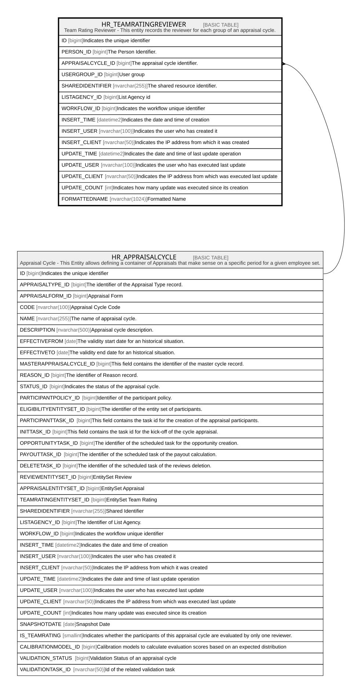

# HR_TEAMRATINGREVIEWER

## Description

Team Rating Reviewer - This entity records the reviewer for each group of an appraisal cycle.  

## Columns

| Name | Type | Default | Nullable | Parents | Comment |
| ---- | ---- | ------- | -------- | ------- | ------- |
| ID | bigint |  | false |  | Indicates the unique identifier |
| PERSON_ID | bigint |  | true |  | The Person Identifier. |
| APPRAISALCYCLE_ID | bigint |  | true | [HR_APPRAISALCYCLE](HR_APPRAISALCYCLE.md) | The appraisal cycle identifier. |
| USERGROUP_ID | bigint |  | true |  | User group |
| SHAREDIDENTIFIER | nvarchar(255) |  | true |  | The shared resource identifier. |
| LISTAGENCY_ID | bigint |  | true |  | List Agency id |
| WORKFLOW_ID | bigint |  | true |  | Indicates the workflow unique identifier |
| INSERT_TIME | datetime2 | (sysutcdatetime()) | false |  | Indicates the date and time of creation |
| INSERT_USER | nvarchar(100) | (N'MAIN') | false |  | Indicates the user who has created it |
| INSERT_CLIENT | nvarchar(50) | (N'localhost') | false |  | Indicates the IP address from which it was created |
| UPDATE_TIME | datetime2 | (sysutcdatetime()) | false |  | Indicates the date and time of last update operation |
| UPDATE_USER | nvarchar(100) | (N'MAIN') | false |  | Indicates the user who has executed last update |
| UPDATE_CLIENT | nvarchar(50) | (N'localhost') | false |  | Indicates the IP address from which was executed last update |
| UPDATE_COUNT | int | ((0)) | false |  | Indicates how many update was executed since its creation |
| FORMATTEDNAME | nvarchar(1024) |  | true |  | Formatted Name |

## Constraints

| Name | Type | Definition |
| ---- | ---- | ---------- |
| PK_HR_TEAMRATINGREVIEWER | PRIMARY KEY | CLUSTERED, unique, part of a PRIMARY KEY constraint, [ ID ] |
| UQ_TEAMRATINGREVIEWER | UNIQUE | NONCLUSTERED, unique, part of a UNIQUE constraint, [ PERSON_ID, APPRAISALCYCLE_ID, USERGROUP_ID ] |
| FK_TEAMRATREV_APPRCYCLE | FOREIGN KEY | FOREIGN KEY(APPRAISALCYCLE_ID) REFERENCES HR_APPRAISALCYCLE(ID) ON UPDATE NO_ACTION ON DELETE CASCADE |

## Indexes

| Name | Definition |
| ---- | ---------- |
| PK_HR_TEAMRATINGREVIEWER | CLUSTERED, unique, part of a PRIMARY KEY constraint, [ ID ] |
| UQ_TEAMRATINGREVIEWER | NONCLUSTERED, unique, part of a UNIQUE constraint, [ PERSON_ID, APPRAISALCYCLE_ID, USERGROUP_ID ] |

## Relations

---

> Generated by [tbls](https://github.com/k1LoW/tbls)
