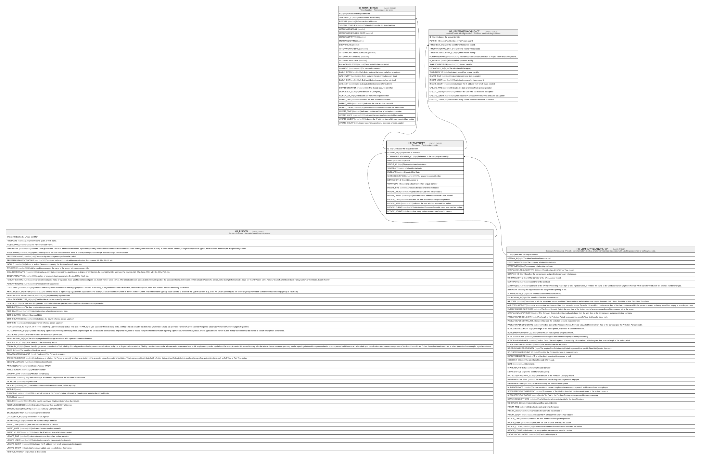

# HR_TIMESHEET

## Description

Timesheet - The timesheet entity.  

## Columns

| Name | Type | Default | Nullable | Children | Parents | Comment |
| ---- | ---- | ------- | -------- | -------- | ------- | ------- |
| ID | bigint |  | false | [HR_TIMESHEETDAY](HR_TIMESHEETDAY.md) [HR_PREFTIMETRACKINGACT](HR_PREFTIMETRACKINGACT.md) |  | Indicates the unique identifier |
| PERSON_ID | bigint |  | true |  | [HR_PERSON](HR_PERSON.md) | Identifier of a Person. |
| COMPANYRELATIONSHIP_ID | bigint |  | true |  | [HR_COMPANYRELATIONSHIP](HR_COMPANYRELATIONSHIP.md) | Reference to the company relationship. |
| NAME | nvarchar(500) |  | true |  |  | Name |
| STATUS_ID | bigint |  | true |  |  | Displays the timesheet status. |
| STARTDATE | datetime |  | true |  |  | Schedule start date |
| ENDDATE | datetime |  | true |  |  | Expected End Date |
| SHAREDIDENTIFIER | nvarchar(255) |  | true |  |  | The shared resource identifier. |
| LISTAGENCY_ID | bigint |  | true |  |  | List Agency id |
| WORKFLOW_ID | bigint |  | true |  |  | Indicates the workflow unique identifier |
| INSERT_TIME | datetime2 | (sysutcdatetime()) | false |  |  | Indicates the date and time of creation |
| INSERT_USER | nvarchar(100) | (N'MAIN') | false |  |  | Indicates the user who has created it |
| INSERT_CLIENT | nvarchar(50) | (N'localhost') | false |  |  | Indicates the IP address from which it was created |
| UPDATE_TIME | datetime2 | (sysutcdatetime()) | false |  |  | Indicates the date and time of last update operation |
| UPDATE_USER | nvarchar(100) | (N'MAIN') | false |  |  | Indicates the user who has executed last update |
| UPDATE_CLIENT | nvarchar(50) | (N'localhost') | false |  |  | Indicates the IP address from which was executed last update |
| UPDATE_COUNT | int | ((0)) | false |  |  | Indicates how many update was executed since its creation |

## Constraints

| Name | Type | Definition |
| ---- | ---- | ---------- |
| PK_HR_TIMESHEET | PRIMARY KEY | CLUSTERED, unique, part of a PRIMARY KEY constraint, [ ID ] |
| UQ_TIMESHEET | UNIQUE | NONCLUSTERED, unique, part of a UNIQUE constraint, [ COMPANYRELATIONSHIP_ID, STARTDATE ] |
| FK_TIMESHEET_COMPANYREL | FOREIGN KEY | FOREIGN KEY(COMPANYRELATIONSHIP_ID) REFERENCES HR_COMPANYRELATIONSHIP(ID) ON UPDATE NO_ACTION ON DELETE NO_ACTION |
| FK_TIMESHEET_PERSON | FOREIGN KEY | FOREIGN KEY(PERSON_ID) REFERENCES HR_PERSON(ID) ON UPDATE NO_ACTION ON DELETE NO_ACTION |

## Indexes

| Name | Definition |
| ---- | ---------- |
| PK_HR_TIMESHEET | CLUSTERED, unique, part of a PRIMARY KEY constraint, [ ID ] |
| UQ_TIMESHEET | NONCLUSTERED, unique, part of a UNIQUE constraint, [ COMPANYRELATIONSHIP_ID, STARTDATE ] |

## Relations

---

> Generated by [tbls](https://github.com/k1LoW/tbls)
