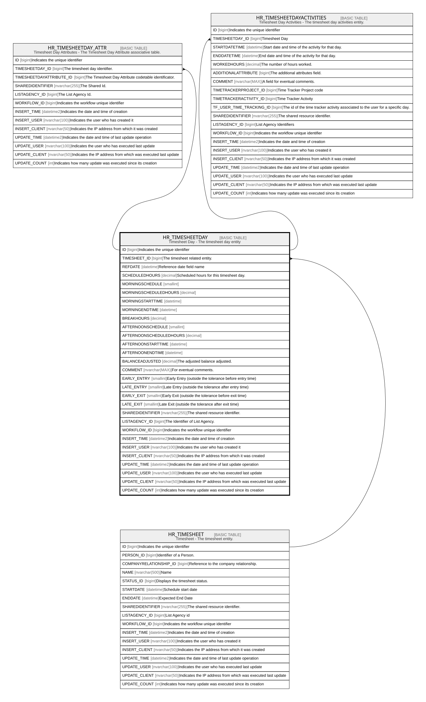

# HR_TIMESHEETDAY

## Description

Timesheet Day - The timesheet day entity  

## Columns

| Name | Type | Default | Nullable | Children | Parents | Comment |
| ---- | ---- | ------- | -------- | -------- | ------- | ------- |
| ID | bigint |  | false | [HR_TIMESHEETDAY_ATTR](HR_TIMESHEETDAY_ATTR.md) [HR_TIMESHEETDAYACTIVITIES](HR_TIMESHEETDAYACTIVITIES.md) |  | Indicates the unique identifier |
| TIMESHEET_ID | bigint |  | false |  | [HR_TIMESHEET](HR_TIMESHEET.md) | The timesheet related entity. |
| REFDATE | datetime |  | true |  |  | Reference date field name |
| SCHEDULEDHOURS | decimal |  | true |  |  | Scheduled hours for this timesheet day. |
| MORNINGSCHEDULE | smallint |  | true |  |  |  |
| MORNINGSCHEDULEDHOURS | decimal |  | true |  |  |  |
| MORNINGSTARTTIME | datetime |  | true |  |  |  |
| MORNINGENDTIME | datetime |  | true |  |  |  |
| BREAKHOURS | decimal |  | true |  |  |  |
| AFTERNOONSCHEDULE | smallint |  | true |  |  |  |
| AFTERNOONSCHEDULEDHOURS | decimal |  | true |  |  |  |
| AFTERNOONSTARTTIME | datetime |  | true |  |  |  |
| AFTERNOONENDTIME | datetime |  | true |  |  |  |
| BALANCEADJUSTED | decimal |  | true |  |  | The adjusted balance adjusted. |
| COMMENT | nvarchar(MAX) |  | true |  |  | For eventual comments. |
| EARLY_ENTRY | smallint |  | true |  |  | Early Entry (outside the tolerance before entry time)  |
| LATE_ENTRY | smallint |  | true |  |  | Late Entry (outside the tolerance after entry time) |
| EARLY_EXIT | smallint |  | true |  |  | Early Exit (outside the tolerance before exit time) |
| LATE_EXIT | smallint |  | true |  |  | Late Exit (outside the tolerance after exit time) |
| SHAREDIDENTIFIER | nvarchar(255) |  | true |  |  | The shared resource identifier. |
| LISTAGENCY_ID | bigint |  | true |  |  | The Identifier of List Agency. |
| WORKFLOW_ID | bigint |  | true |  |  | Indicates the workflow unique identifier |
| INSERT_TIME | datetime2 |  | false |  |  | Indicates the date and time of creation |
| INSERT_USER | nvarchar(100) |  | false |  |  | Indicates the user who has created it |
| INSERT_CLIENT | nvarchar(50) |  | false |  |  | Indicates the IP address from which it was created |
| UPDATE_TIME | datetime2 |  | false |  |  | Indicates the date and time of last update operation |
| UPDATE_USER | nvarchar(100) |  | false |  |  | Indicates the user who has executed last update |
| UPDATE_CLIENT | nvarchar(50) |  | false |  |  | Indicates the IP address from which was executed last update |
| UPDATE_COUNT | int |  | false |  |  | Indicates how many update was executed since its creation |

## Constraints

| Name | Type | Definition |
| ---- | ---- | ---------- |
| PK_HR_TIMESHEETDAY | PRIMARY KEY | CLUSTERED, unique, part of a PRIMARY KEY constraint, [ ID ] |
| UQ_TIMESHEETDAY | UNIQUE | NONCLUSTERED, unique, part of a UNIQUE constraint, [ TIMESHEET_ID, REFDATE ] |
| FK_TIMESHEETDAY_TIMESHEET | FOREIGN KEY | FOREIGN KEY(TIMESHEET_ID) REFERENCES HR_TIMESHEET(ID) ON UPDATE NO_ACTION ON DELETE CASCADE |

## Indexes

| Name | Definition |
| ---- | ---------- |
| PK_HR_TIMESHEETDAY | CLUSTERED, unique, part of a PRIMARY KEY constraint, [ ID ] |
| UQ_TIMESHEETDAY | NONCLUSTERED, unique, part of a UNIQUE constraint, [ TIMESHEET_ID, REFDATE ] |

## Relations

---

> Generated by [tbls](https://github.com/k1LoW/tbls)
