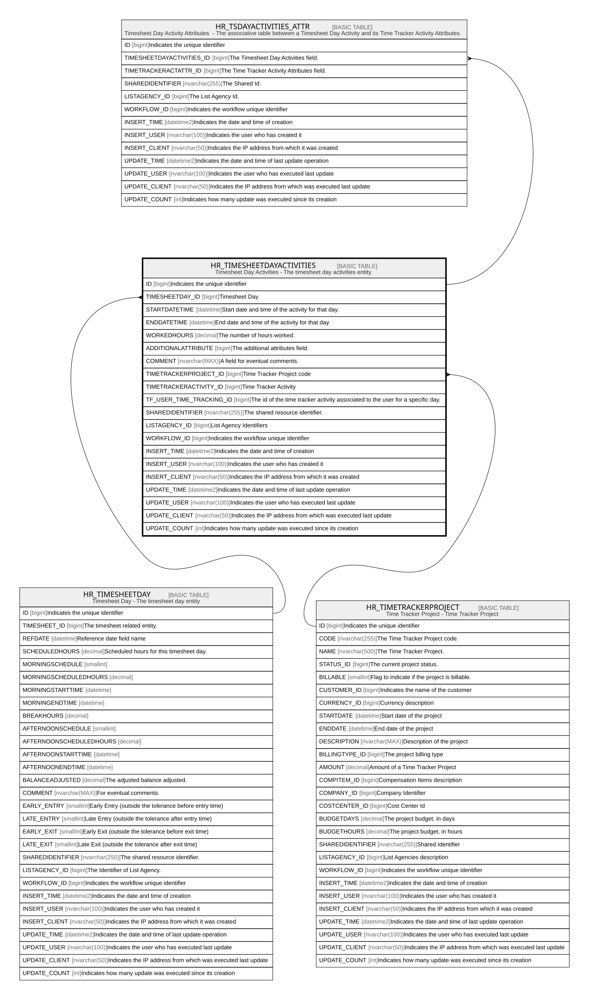

# HR_TIMESHEETDAYACTIVITIES

## Description

Timesheet Day Activities - The timesheet day activities entity.  

## Columns

| Name | Type | Default | Nullable | Children | Parents | Comment |
| ---- | ---- | ------- | -------- | -------- | ------- | ------- |
| ID | bigint |  | false | [HR_TSDAYACTIVITIES_ATTR](HR_TSDAYACTIVITIES_ATTR.md) |  | Indicates the unique identifier |
| TIMESHEETDAY_ID | bigint |  | false |  | [HR_TIMESHEETDAY](HR_TIMESHEETDAY.md) | Timesheet Day |
| STARTDATETIME | datetime |  | true |  |  | Start date and time of the activity for that day. |
| ENDDATETIME | datetime |  | true |  |  | End date and time of the activity for that day. |
| WORKEDHOURS | decimal |  | true |  |  | The number of hours worked. |
| ADDITIONALATTRIBUTE | bigint |  | true |  |  | The additional attributes field. |
| COMMENT | nvarchar(MAX) |  | true |  |  | A field for eventual comments. |
| TIMETRACKERPROJECT_ID | bigint |  | true |  | [HR_TIMETRACKERPROJECT](HR_TIMETRACKERPROJECT.md) | Time Tracker Project code |
| TIMETRACKERACTIVITY_ID | bigint |  | true |  |  | Time Tracker Activity |
| TF_USER_TIME_TRACKING_ID | bigint |  | true |  |  | The id of the time tracker activity associated to the user for a specific day. |
| SHAREDIDENTIFIER | nvarchar(255) |  | true |  |  | The shared resource identifier. |
| LISTAGENCY_ID | bigint |  | true |  |  | List Agency Identifiers |
| WORKFLOW_ID | bigint |  | true |  |  | Indicates the workflow unique identifier |
| INSERT_TIME | datetime2 |  | false |  |  | Indicates the date and time of creation |
| INSERT_USER | nvarchar(100) |  | false |  |  | Indicates the user who has created it |
| INSERT_CLIENT | nvarchar(50) |  | false |  |  | Indicates the IP address from which it was created |
| UPDATE_TIME | datetime2 |  | false |  |  | Indicates the date and time of last update operation |
| UPDATE_USER | nvarchar(100) |  | false |  |  | Indicates the user who has executed last update |
| UPDATE_CLIENT | nvarchar(50) |  | false |  |  | Indicates the IP address from which was executed last update |
| UPDATE_COUNT | int |  | false |  |  | Indicates how many update was executed since its creation |

## Constraints

| Name | Type | Definition |
| ---- | ---- | ---------- |
| PK_HR_TIMESHEETDAYACTIVITIES | PRIMARY KEY | CLUSTERED, unique, part of a PRIMARY KEY constraint, [ ID ] |
| FK_TIMETRPROJ_TIMESHDAYACT | FOREIGN KEY | FOREIGN KEY(TIMETRACKERPROJECT_ID) REFERENCES HR_TIMETRACKERPROJECT(ID) ON UPDATE NO_ACTION ON DELETE CASCADE |
| FK_TMSHEETDAYACT_TMSHEETDAY | FOREIGN KEY | FOREIGN KEY(TIMESHEETDAY_ID) REFERENCES HR_TIMESHEETDAY(ID) ON UPDATE NO_ACTION ON DELETE CASCADE |

## Indexes

| Name | Definition |
| ---- | ---------- |
| PK_HR_TIMESHEETDAYACTIVITIES | CLUSTERED, unique, part of a PRIMARY KEY constraint, [ ID ] |

## Relations

---

> Generated by [tbls](https://github.com/k1LoW/tbls)
