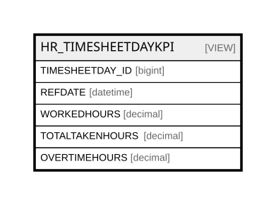

# HR_TIMESHEETDAYKPI

## Description

<details>
<summary><strong>Table Definition</strong></summary>

```sql
-- Talentia Software - All right reserved
-- Type: VIEW                     Name: HR_TIMESHEETDAYKPI
-- Date: 09-04-2026 07:27:59 (UTC)
-- 
-- ChangeLogId: 00000000-0000-0000-0000-000000000000
-- ChangeSetId: 15f3e129-3963-41db-959f-b0f3961a4aac
-- Original file name: C:\repos\Talentia-Software\hcm-core/DB/ProductDB/EDM\Schema\Views\HR_TIMESHEETDAYKPI.xml


CREATE VIEW [HR_TIMESHEETDAYKPI]
 ( TIMESHEETDAY_ID, REFDATE, WORKEDHOURS, TOTALTAKENHOURS, OVERTIMEHOURS ) 
 AS 
( SELECT
					ID,
					REFDATE,
					coalesce((SELECT
					SUM(HR_TIMESHEETDAYACTIVITIES.WORKEDHOURS) AS TOT_WORKEDHOURS
					FROM HR_TIMESHEETDAYACTIVITIES
					WHERE (TD.ID = HR_TIMESHEETDAYACTIVITIES.TIMESHEETDAY_ID) AND HR_TIMESHEETDAYACTIVITIES.TIMETRACKERACTIVITY_ID NOT IN (3090666)
					GROUP BY HR_TIMESHEETDAYACTIVITIES.TIMESHEETDAY_ID),0) as WORKEDHOURS,

					coalesce(
					(select
					SUM(HR_ABSENCEEVENTDETAIL.TOTALTAKENHOURS) AS TOTALTAKENHOURS
					FROM HR_TIMESHEET
					INNER JOIN  HR_TIMESHEETDAY ON (HR_TIMESHEET.ID = HR_TIMESHEETDAY.TIMESHEET_ID)
					INNER JOIN HR_COMPANYRELATIONSHIP ON (HR_COMPANYRELATIONSHIP.ID = HR_TIMESHEET.COMPANYRELATIONSHIP_ID)
					INNER JOIN HR_INDIVIDUALABSALLOWANCE ON (HR_COMPANYRELATIONSHIP.ID = HR_INDIVIDUALABSALLOWANCE.COMPANYRELATIONSHIP_ID)
					INNER JOIN HR_ABSENCEEVENT ON (HR_INDIVIDUALABSALLOWANCE.ID = HR_ABSENCEEVENT.INDIVIDUALABSALLOWANCE_ID AND HR_ABSENCEEVENT.STATUS_ID = 1186796)
					INNER JOIN HR_ABSENCEEVENTDETAIL ON (HR_ABSENCEEVENT.ID = HR_ABSENCEEVENTDETAIL.ABSENCEEVENT_ID AND HR_ABSENCEEVENTDETAIL.REFDATE = HR_TIMESHEETDAY.REFDATE)
					INNER JOIN HR_ABSENCEPLAN ON (HR_INDIVIDUALABSALLOWANCE.PLAN_ID = HR_ABSENCEPLAN.ID)
					INNER JOIN TF_CODES ABSTYPE ON (HR_ABSENCEPLAN.ABSENCETYPE_ID = ABSTYPE.ID AND coalesce(ABSTYPE.GLOBAL_ID, -1) <> 1213053)

					WHERE HR_TIMESHEETDAY.ID = TD.ID
					GROUP BY HR_TIMESHEETDAY.ID)
					,0) as TOTALTAKENHOURS,

					(SELECT ISNULL((SELECT SUM(dbo.HR_OVERTIMEREQUEST.OVERTIMEREQUESTEDHOURS) AS Expr1
					FROM dbo.HR_TIMESHEET AS HR_TIMESHEET_1
					INNER JOIN dbo.HR_TIMESHEETDAY AS HR_TIMESHEETDAY_1 ON HR_TIMESHEET_1.ID = HR_TIMESHEETDAY_1.TIMESHEET_ID
					INNER JOIN dbo.HR_OVERTIMEREQUEST ON dbo.HR_OVERTIMEREQUEST.COMPANYRELATIONSHIP_ID = HR_TIMESHEET_1.COMPANYRELATIONSHIP_ID
					AND dbo.HR_OVERTIMEREQUEST.PERSON_ID = HR_TIMESHEET_1.PERSON_ID AND HR_TIMESHEETDAY_1.REFDATE = dbo.HR_OVERTIMEREQUEST.REFDATE
					WHERE dbo.HR_OVERTIMEREQUEST.STATUS_ID = 1414174 AND HR_TIMESHEETDAY_1.ID = TD.ID
					GROUP BY HR_TIMESHEETDAY_1.ID), 0)) AS OVERTIMEHOURS

					FROM  HR_TIMESHEETDAY TD )

```

</details>

## Columns

| Name | Type | Default | Nullable | Comment |
| ---- | ---- | ------- | -------- | ------- |
| TIMESHEETDAY_ID | bigint |  | false |  |
| REFDATE | datetime |  | true |  |
| WORKEDHOURS | decimal |  | true |  |
| TOTALTAKENHOURS | decimal |  | true |  |
| OVERTIMEHOURS | decimal |  | true |  |

## Referenced Tables

| Name | Columns | Comment | Type |
| ---- | ------- | ------- | ---- |
| [HR_TIMESHEETDAYACTIVITIES](HR_TIMESHEETDAYACTIVITIES.md) | 20 | Timesheet Day Activities - The timesheet day activities entity.<br /> | BASIC TABLE |
| [HR_TIMESHEET](HR_TIMESHEET.md) | 17 | Timesheet - The timesheet entity.<br /> | BASIC TABLE |
| [HR_TIMESHEETDAY](HR_TIMESHEETDAY.md) | 29 | Timesheet Day - The timesheet day entity<br /> | BASIC TABLE |
| [HR_COMPANYRELATIONSHIP](HR_COMPANYRELATIONSHIP.md) | 47 | Company Relationship - Provides key information about an employment contract associated with a staffing assignment or staffing resource.<br /> | BASIC TABLE |
| [HR_INDIVIDUALABSALLOWANCE](HR_INDIVIDUALABSALLOWANCE.md) | 17 | Individual Absence Allowance - Contains the individual absence allowances.<br /> | BASIC TABLE |
| [HR_ABSENCEEVENT](HR_ABSENCEEVENT.md) | 49 | Absence Event - Contains the absence events.<br /> | BASIC TABLE |
| [HR_ABSENCEEVENTDETAIL](HR_ABSENCEEVENTDETAIL.md) | 22 | Absence Event Detail - This entity includes the daily absence details.<br /> | BASIC TABLE |
| [HR_ABSENCEPLAN](HR_ABSENCEPLAN.md) | 64 | Absence Plan - Contains the absence plans.<br /> | BASIC TABLE |
| [TF_CODES](TF_CODES.md) | 87 |  | BASIC TABLE |
| [dbo.HR_TIMESHEET](dbo.HR_TIMESHEET.md) | 0 |  |  |
| [dbo.HR_TIMESHEETDAY](dbo.HR_TIMESHEETDAY.md) | 0 |  |  |
| [dbo.HR_OVERTIMEREQUEST](dbo.HR_OVERTIMEREQUEST.md) | 0 |  |  |

## Relations



---

> Generated by [tbls](https://github.com/k1LoW/tbls)
