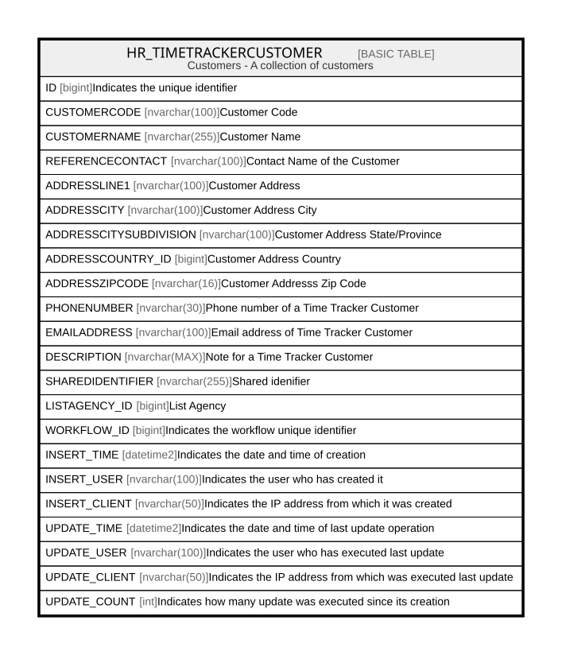

# HR_TIMETRACKERCUSTOMER

## Description

Customers - A collection of customers  

## Columns

| Name | Type | Default | Nullable | Comment |
| ---- | ---- | ------- | -------- | ------- |
| ID | bigint |  | false | Indicates the unique identifier |
| CUSTOMERCODE | nvarchar(100) |  | false | Customer Code |
| CUSTOMERNAME | nvarchar(255) |  | false | Customer Name |
| REFERENCECONTACT | nvarchar(100) |  | true | Contact Name of the Customer |
| ADDRESSLINE1 | nvarchar(100) |  | true | Customer Address |
| ADDRESSCITY | nvarchar(100) |  | true | Customer Address City |
| ADDRESSCITYSUBDIVISION | nvarchar(100) |  | true | Customer Address State/Province |
| ADDRESSCOUNTRY_ID | bigint |  | true | Customer Address Country |
| ADDRESSZIPCODE | nvarchar(16) |  | true | Customer Addresss Zip Code |
| PHONENUMBER | nvarchar(30) |  | true | Phone number of a Time Tracker Customer |
| EMAILADDRESS | nvarchar(100) |  | true | Email address of Time Tracker Customer |
| DESCRIPTION | nvarchar(MAX) |  | true | Note for a Time Tracker Customer |
| SHAREDIDENTIFIER | nvarchar(255) |  | true | Shared idenifier |
| LISTAGENCY_ID | bigint |  | true | List Agency |
| WORKFLOW_ID | bigint |  | true | Indicates the workflow unique identifier |
| INSERT_TIME | datetime2 | (sysutcdatetime()) | false | Indicates the date and time of creation |
| INSERT_USER | nvarchar(100) | (N'MAIN') | false | Indicates the user who has created it |
| INSERT_CLIENT | nvarchar(50) | (N'localhost') | false | Indicates the IP address from which it was created |
| UPDATE_TIME | datetime2 | (sysutcdatetime()) | false | Indicates the date and time of last update operation |
| UPDATE_USER | nvarchar(100) | (N'MAIN') | false | Indicates the user who has executed last update |
| UPDATE_CLIENT | nvarchar(50) | (N'localhost') | false | Indicates the IP address from which was executed last update |
| UPDATE_COUNT | int | ((0)) | false | Indicates how many update was executed since its creation |

## Constraints

| Name | Type | Definition |
| ---- | ---- | ---------- |
| PK_HR_TIMETRACKERCUSTOMER | PRIMARY KEY | CLUSTERED, unique, part of a PRIMARY KEY constraint, [ ID ] |

## Indexes

| Name | Definition |
| ---- | ---------- |
| PK_HR_TIMETRACKERCUSTOMER | CLUSTERED, unique, part of a PRIMARY KEY constraint, [ ID ] |

## Relations

---

> Generated by [tbls](https://github.com/k1LoW/tbls)
