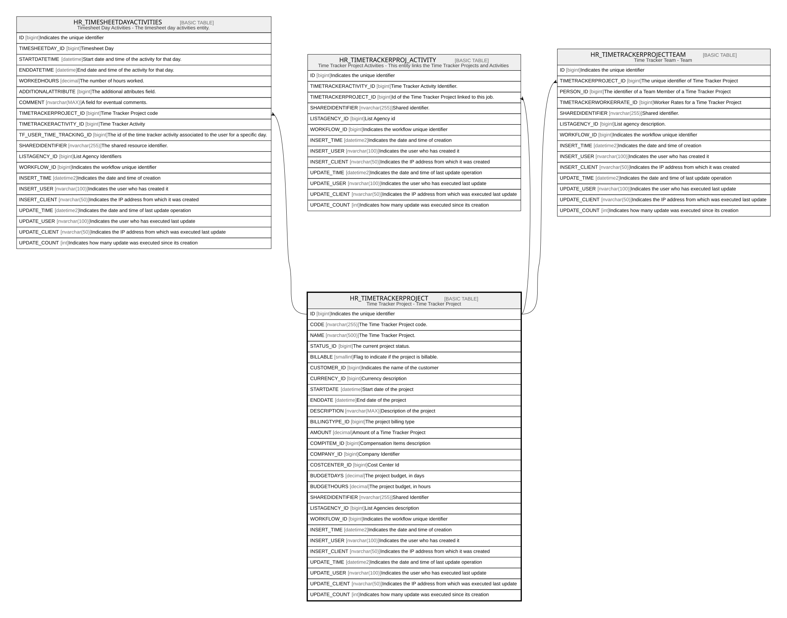

# HR_TIMETRACKERPROJECT

## Description

Time Tracker Project - Time Tracker Project  

## Columns

| Name | Type | Default | Nullable | Children | Comment |
| ---- | ---- | ------- | -------- | -------- | ------- |
| ID | bigint |  | false | [HR_TIMESHEETDAYACTIVITIES](HR_TIMESHEETDAYACTIVITIES.md) [HR_TIMETRACKERPROJ_ACTIVITY](HR_TIMETRACKERPROJ_ACTIVITY.md) [HR_TIMETRACKERPROJECTTEAM](HR_TIMETRACKERPROJECTTEAM.md) | Indicates the unique identifier |
| CODE | nvarchar(255) |  | false |  | The Time Tracker Project code. |
| NAME | nvarchar(500) |  | true |  | The Time Tracker Project. |
| STATUS_ID | bigint |  | true |  | The current project status. |
| BILLABLE | smallint |  | true |  | Flag to indicate if the project is billable. |
| CUSTOMER_ID | bigint |  | true |  | Indicates the name of the customer |
| CURRENCY_ID | bigint |  | true |  | Currency description |
| STARTDATE | datetime |  | true |  | Start date of the project |
| ENDDATE | datetime |  | true |  | End date of the project |
| DESCRIPTION | nvarchar(MAX) |  | true |  | Description of the project |
| BILLINGTYPE_ID | bigint |  | true |  | The project billing type |
| AMOUNT | decimal |  | true |  | Amount of a Time Tracker Project |
| COMPITEM_ID | bigint |  | true |  | Compensation Items description |
| COMPANY_ID | bigint |  | true |  | Company Identifier |
| COSTCENTER_ID | bigint |  | true |  | Cost Center Id |
| BUDGETDAYS | decimal |  | true |  | The project budget, in days |
| BUDGETHOURS | decimal |  | true |  | The project budget, in hours |
| SHAREDIDENTIFIER | nvarchar(255) |  | true |  | Shared Identifier |
| LISTAGENCY_ID | bigint |  | true |  | List Agencies description |
| WORKFLOW_ID | bigint |  | true |  | Indicates the workflow unique identifier |
| INSERT_TIME | datetime2 | (sysutcdatetime()) | false |  | Indicates the date and time of creation |
| INSERT_USER | nvarchar(100) | (N'MAIN') | false |  | Indicates the user who has created it |
| INSERT_CLIENT | nvarchar(50) | (N'localhost') | false |  | Indicates the IP address from which it was created |
| UPDATE_TIME | datetime2 | (sysutcdatetime()) | false |  | Indicates the date and time of last update operation |
| UPDATE_USER | nvarchar(100) | (N'MAIN') | false |  | Indicates the user who has executed last update |
| UPDATE_CLIENT | nvarchar(50) | (N'localhost') | false |  | Indicates the IP address from which was executed last update |
| UPDATE_COUNT | int | ((0)) | false |  | Indicates how many update was executed since its creation |

## Constraints

| Name | Type | Definition |
| ---- | ---- | ---------- |
| PK_HR_TIMETRACKERPROJECT | PRIMARY KEY | CLUSTERED, unique, part of a PRIMARY KEY constraint, [ ID ] |
| UQ_TIMETRACKERPROJECT | UNIQUE | NONCLUSTERED, unique, part of a UNIQUE constraint, [ CODE ] |

## Indexes

| Name | Definition |
| ---- | ---------- |
| PK_HR_TIMETRACKERPROJECT | CLUSTERED, unique, part of a PRIMARY KEY constraint, [ ID ] |
| UQ_TIMETRACKERPROJECT | NONCLUSTERED, unique, part of a UNIQUE constraint, [ CODE ] |

## Relations

---

> Generated by [tbls](https://github.com/k1LoW/tbls)
