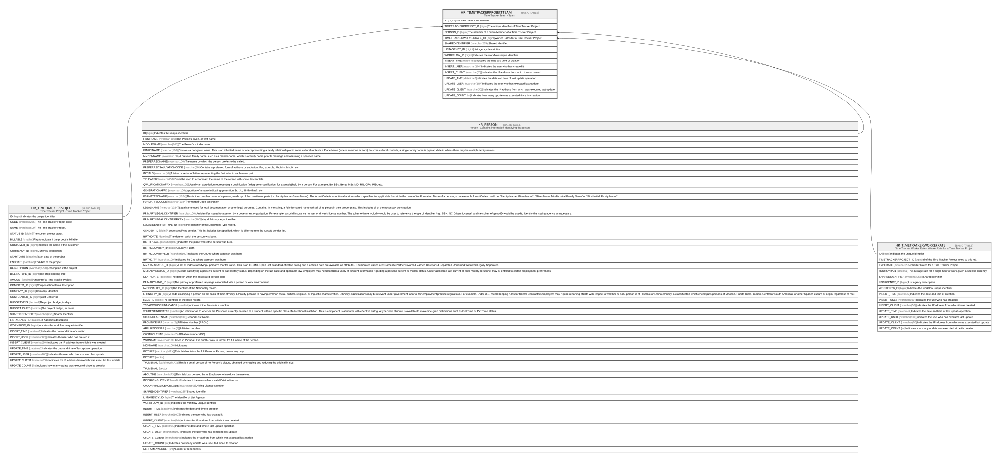

# HR_TIMETRACKERPROJECTTEAM

## Description

Time Tracker Team - Team  

## Columns

| Name | Type | Default | Nullable | Parents | Comment |
| ---- | ---- | ------- | -------- | ------- | ------- |
| ID | bigint |  | false |  | Indicates the unique identifier |
| TIMETRACKERPROJECT_ID | bigint |  | false | [HR_TIMETRACKERPROJECT](HR_TIMETRACKERPROJECT.md) | The unique identifier of Time Tracker Project |
| PERSON_ID | bigint |  | true | [HR_PERSON](HR_PERSON.md) | The identifier of a Team Member of a Time Tracker Project |
| TIMETRACKERWORKERRATE_ID | bigint |  | true | [HR_TIMETRACKERWORKERRATE](HR_TIMETRACKERWORKERRATE.md) | Worker Rates for a Time Tracker Project |
| SHAREDIDENTIFIER | nvarchar(255) |  | true |  | Shared identifier. |
| LISTAGENCY_ID | bigint |  | true |  | List agency description. |
| WORKFLOW_ID | bigint |  | true |  | Indicates the workflow unique identifier |
| INSERT_TIME | datetime2 |  | false |  | Indicates the date and time of creation |
| INSERT_USER | nvarchar(100) |  | false |  | Indicates the user who has created it |
| INSERT_CLIENT | nvarchar(50) |  | false |  | Indicates the IP address from which it was created |
| UPDATE_TIME | datetime2 |  | false |  | Indicates the date and time of last update operation |
| UPDATE_USER | nvarchar(100) |  | false |  | Indicates the user who has executed last update |
| UPDATE_CLIENT | nvarchar(50) |  | false |  | Indicates the IP address from which was executed last update |
| UPDATE_COUNT | int |  | false |  | Indicates how many update was executed since its creation |

## Constraints

| Name | Type | Definition |
| ---- | ---- | ---------- |
| PK_HR_TIMETRACKERPROJECTTEAM | PRIMARY KEY | CLUSTERED, unique, part of a PRIMARY KEY constraint, [ ID ] |
| FK_TIMETRTEAM_TIMETRPROJECT | FOREIGN KEY | FOREIGN KEY(TIMETRACKERPROJECT_ID) REFERENCES HR_TIMETRACKERPROJECT(ID) ON UPDATE NO_ACTION ON DELETE CASCADE |
| FK_TIMETRTEAM_TIMETRWORKER | FOREIGN KEY | FOREIGN KEY(TIMETRACKERWORKERRATE_ID) REFERENCES HR_TIMETRACKERWORKERRATE(ID) ON UPDATE NO_ACTION ON DELETE CASCADE |
| FK_TIMTRACKTEAM_PERSON | FOREIGN KEY | FOREIGN KEY(PERSON_ID) REFERENCES HR_PERSON(ID) ON UPDATE NO_ACTION ON DELETE NO_ACTION |

## Indexes

| Name | Definition |
| ---- | ---------- |
| PK_HR_TIMETRACKERPROJECTTEAM | CLUSTERED, unique, part of a PRIMARY KEY constraint, [ ID ] |

## Relations

---

> Generated by [tbls](https://github.com/k1LoW/tbls)
